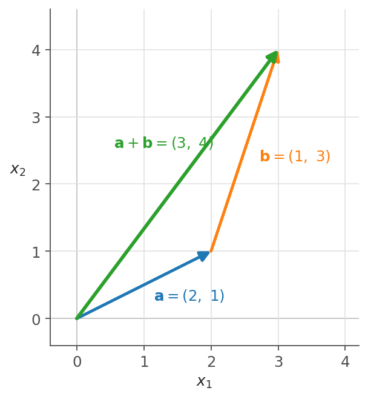
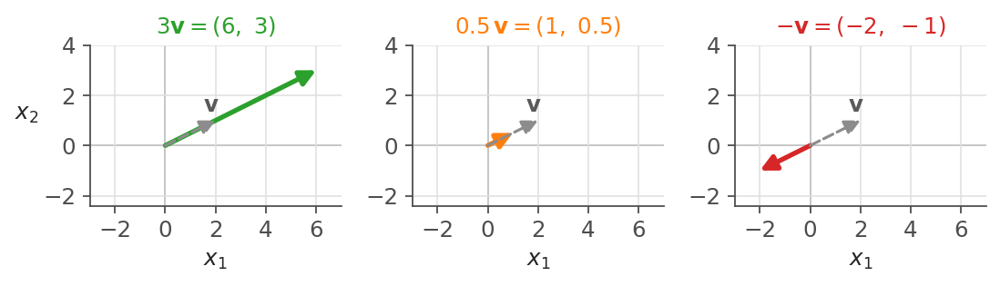

# 第1章 ベクトル — 数を並べると意味が生まれる

> [目次](../TOC.md) ・ [← 前の章](00-prologue.md) ・ [次の章 →](02-dot-product.md)

序章でラスボスの $Q$, $K$, $V$ が「行列」だと予告しました。その行列は「ベクトルを束ねたもの」です(第3章)。すべての部品の根っこにベクトルがあり、ここがシリーズの出発点です。

ただし定義の前に根本的な謎があります。"Attention Is All You Need" は機械翻訳の論文で、入力も出力も**言葉**です。ところがコンピュータが計算できるのは**数**だけです。足し算と掛け算の塊に「言葉の意味」をどう渡すのか——この章はその無茶な問いから始まります。

## 1.1 「単語の意味を数で表す」という無茶な発想

素朴な案から始めます。単語に番号を振ればよい——辞書順に cat は 1番、dog は 2番、elephant は 3番、table は 4番です。これで全単語が数になります。

しかし致命的な欠陥があります。**数の値に意味が乗っていない**のです。cat と dog の差は 1、dog と elephant の差も 1。けれど猫と犬はどちらも身近なペット、犬と象はだいぶ違う生き物。番号の引き算はその感覚を反映しません。番号は「区別」はできても「意味」を運べないのです。

発想を転換します。**1つの数で表そうとするから無理が出る。たくさんの数の組で表せばいい。**

単語を「採点表」にしてみます。項目を「生き物らしさ」「大きさ」「凶暴さ」の3つに決め、それぞれ 0 から 1 で採点します。

| 単語 | 生き物らしさ | 大きさ | 凶暴さ |
|---|---|---|---|
| cat(猫) | 0.9 | 0.2 | 0.3 |
| tiger(虎) | 0.9 | 0.7 | 0.9 |
| table(机) | 0.0 | 0.5 | 0.0 |

cat は $(0.9,\ 0.2,\ 0.3)$、tiger は $(0.9,\ 0.7,\ 0.9)$、table は $(0.0,\ 0.5,\ 0.0)$ です。それぞれが「3つの数の並び」になりました。今度は数に意味が乗っています。cat と tiger は1つめの成分がどちらも 0.9 で揃い、table は 0.0 で大きく離れます。「猫と虎は似ていて、机は仲間はずれ」という感覚が、数の並びの中に現れています。単語の意味を**数の並びの中の「位置」**として表す——これがこの章の、そしてシリーズ全体を支える作戦です。

実際の論文では採点項目がいくつあるのでしょうか。セクション 3.1 と 3.4 に答えがあり、**512個**です。論文ではこの 512 に $d_{model}$ という名前が付いています。Transformer に入る時点で、1単語は 512 個の数の並びに変換されているのです。

もっとも論文の 512 個は、人間が項目を決めて採点したものではなくラベルも付いていません。あの数たちは**学習によって機械が自分で見つけた**もので、その方法は第6巻の主題です。今は「単語 = 数の並び」という**形式**だけ受け取れば十分です。

この主役に正式な名前を与えましょう。数学では**ベクトル**と呼びます。

## 1.2 ベクトルの定義と記法

**ベクトル(vector)**とは、数を順番に並べたものです。

$$\mathbf{v} = (v_1,\ v_2,\ \dots,\ v_n)$$

並んでいる1つ1つの数 $v_1, v_2, \dots$ を**成分(component)**、成分の個数 $n$ を**次元(dimension)**と呼びます。cat のベクトル $(0.9,\ 0.2,\ 0.3)$ は成分が3つなので3次元ベクトルです。

定義の「順番に」は飾りではありません。**並び順を入れ替えたら別のベクトル**です。$(0.2,\ 0.9)$ と $(0.9,\ 0.2)$ は違います。「大きさ 0.2・凶暴さ 0.9」と「大きさ 0.9・凶暴さ 0.2」はまるで別物です。何番目の成分か、には意味が宿っています。

記法を約束しておきます。シリーズ全体で使い続けます。

- ベクトルは**太字の小文字**で書きます: $\mathbf{v}$, $\mathbf{x}$, $\mathbf{a}$。$\vec{v}$ と矢印を乗せる流儀もありますが、本シリーズは太字で通します
- ベクトルでないただの1つの数は細字の小文字で書きます: $a$, $c$。これを次節で**スカラー(scalar)**と呼びます
- 実数(real number)の全体を $\mathbb{R}$、**実数を $n$ 個並べたベクトルの全体**を $\mathbb{R}^n$ と書きます

最後の記号を使うと「$\mathbf{v}$ は3次元ベクトルである」を

$$\mathbf{v} \in \mathbb{R}^3$$

と書けます。$\in$ は「〜の集まりの一員である」という記号で、「$\mathbf{v}$ は実数3つ組の世界 $\mathbb{R}^3$ の住人である」と読みます。論文の単語ベクトルなら、こうです。

$$\mathbf{x} \in \mathbb{R}^{512} \quad (= \mathbb{R}^{d_{model}})$$

512次元と聞いて身構えた人へ。2次元は平面上の点(矢印)、3次元は空間の点として絵に描けますが、512次元は誰にも描けません。それでも困りません。**次元とは「成分の個数」のこと**と機械的に捉えてください。512次元ベクトルとは「数が512個並んだもの」、それだけです。これから定義する計算のルールは2次元でも512次元でもまったく同じ形なので、2次元の絵で直観を作り、それを512次元にそのまま輸出します。

なお成分を横に並べる流儀と縦に並べる流儀がありますが、この区別が効くのは第3章の行列からです。この章では横に並べて書きます。

## 1.3 足し算とスカラー倍 — 幾何的には矢印の継ぎ足しと伸縮

単語をベクトルにしたのは眺めるためではなく**計算するため**です。この節では基本の2つ、足し算とスカラー倍だけを定義します。章末の「意味の算術」は、この2つだけでできています。

### 足し算

2つのベクトルの足し算は、**同じ位置の成分どうしを足す**ことと定めます。

$$(a_1,\ a_2) + (b_1,\ b_2) = (a_1 + b_1,\ a_2 + b_2)$$

たとえば $\mathbf{a} = (2,\ 1)$、$\mathbf{b} = (1,\ 3)$ なら、

$$\mathbf{a} + \mathbf{b} = (2+1,\ 1+3) = (3,\ 4)$$

定義から、**足せるのは次元が同じベクトルどうしだけ**です。3次元と2次元は、何番目の成分どうしを足すのか対応が付かず足せません。「形が合うものしか演算できない」——この注意は、第3章で **shape の規律**という、シリーズ全体を貫く習慣に育ちます。

この足し算は絵にすると意味を持ちます。$(2,\ 1)$ を原点から点 $(2,\ 1)$ へ向かう**矢印**だと思うと、$\mathbf{a} + \mathbf{b}$ は「まず矢印 $\mathbf{a}$ をたどり、その先端から続けて $\mathbf{b}$ をたどった到達点」です。矢印の**継ぎ足し**です。



図1.1: ベクトルの足し算は矢印の継ぎ足し。原点から $\mathbf{a}=(2,1)$ へ進み、そこから $\mathbf{b}=(1,3)$ ぶん進むと、$\mathbf{a}+\mathbf{b}=(3,4)$ に到達する。

「成分ごとに足す」という事務的な定義と「矢印を継ぎ足す」という幾何的な像は、同じ操作の2つの顔です。横方向の移動量どうし($2+1$)、縦方向の移動量どうし($1+3$)を別々に合算している、と考えれば納得できます。

足す順番は結果に影響しません: $\mathbf{a} + \mathbf{b} = \mathbf{b} + \mathbf{a}$。成分ごとがただの数の足し算である以上、当然です。わざわざ書き留めたのは、第4章の行列積では**この当たり前が成り立たない**からです。「演算の順序は、いつでも入れ替えてよいとは限らない」という警戒心の置き場所を、今のうちに作っておいてください。

### スカラー倍

もう1つの演算は、ベクトルを「ただの数」で掛けることです。その数を**スカラー(scalar)**と呼びます。スカラー $c$ を掛けるには、**全成分を一斉に $c$ 倍**します。

$$c \cdot (v_1,\ v_2) = (c\, v_1,\ c\, v_2)$$

たとえば $3 \cdot (2,\ 1) = (6,\ 3)$ です。幾何的にはこれは矢印の**伸縮**です。$3$ 倍すれば向きはそのままで長さが3倍、$0.5$ 倍なら半分に縮み、$-1$ 倍は長さを変えずに**向きを正反対にひっくり返し**ます。



図1.2: スカラー倍は矢印の伸縮。灰色の破線が元のベクトル $\mathbf{v} = (2,\ 1)$。$3$ 倍は同じ向きのまま長さが3倍、$0.5$ 倍は半分に縮み、$-1$ 倍は長さを変えずに向きだけ正反対になる。

$-1$ 倍が手に入ると、引き算はもう新しい演算ではなくなります。

$$\mathbf{a} - \mathbf{b} = \mathbf{a} + (-1)\,\mathbf{b}$$

つまり「$\mathbf{b}$ を逆向きにして継ぎ足す」だけです。成分で書けば同じ位置の成分どうしの引き算です。$(3,\ 4) - (1,\ 3) = (2,\ 1)$。

ベクトルの演算は当面これで全部です。「ベクトルどうしの掛け算はないのか」と思った人はよい勘をしています。あります。しかもそれこそシリーズの心臓部なのですが、例によって**困ってから**導入します(第2章)。残りでは、いま定義した演算をコンピュータの上で動かします。

## 1.4 [コード] NumPy入門 — list と ndarray の違い

ここまでの話を Python に持ち込みます。Python で「数の並び」といえばまず list ですが、1.3 の足し算を list でやると期待は裏切られます。

```python
x_list = [1.0, 2.0, 3.0]
y_list = [10.0, 20.0, 30.0]

print(x_list + y_list)   # [1.0, 2.0, 3.0, 10.0, 20.0, 30.0]
print(x_list * 2)        # [1.0, 2.0, 3.0, 1.0, 2.0, 3.0]
```

期待した $(11,\ 22,\ 33)$ は出ません。`+` は2つの list を**連結**し、`* 2` は list を**2回繰り返し**ます。Python の list は文字列でも辞書でも何でも並べられる「ものの並び」であって、数学のベクトルではないのです。「成分ごとに足す」という約束を知らないのは当然です。

ここで登場するのが **NumPy** です。NumPy の **ndarray**(n-dimensional array、n次元配列)は「数学のベクトルとして振る舞う数の並び」です。`np.array` に list を渡すと作れます。

```python
import numpy as np

x = np.array([1.0, 2.0, 3.0])
y = np.array([10.0, 20.0, 30.0])

print(x + y)    # [11. 22. 33.]
print(2 * x)    # [2. 4. 6.]
print(-1 * x)   # [-1. -2. -3.]
print(x - y)    # [ -9. -18. -27.]
```

`+` は成分ごとの足し算、スカラー `2` との `*` は全成分の2倍。引き算も成分ごと。1.3 で定義したとおりの演算が、定義したとおりの記号で動きます。

ndarray には自分の「形」を答える `shape` という属性があります。

```python
print(x.shape)   # (3,)
```

`(3,)` は「成分が3つ」、つまり3次元ベクトルです(末尾のカンマは「数が1つだけ入った tuple」という Python の記法で、深い意味はありません)。今はただの長さ確認に見えますが、この `shape` こそ第3章以降この本を最後まで貫く背骨です。**わからなくなったら shape を見る**——その最初の一歩です。

1つだけ先回りして注意します。ndarray どうしの `*` も動いてしまいます。

```python
print(x * y)   # [ 10.  40.  90.]
```

これは成分ごとの掛け算で、正当な演算で後の巻でも使いますが、**第2章で学ぶ「内積」とは別物**です。「ベクトルの掛け算」で多くの文脈が意図するのは内積の方なので、`*` を見たら「成分ごとの方だな」と区別する癖をつけてください。

以上を1本にまとめ、`assert` で検算したプログラムを用意しました。`assert` は「条件が成り立たなければその場で停止する」文で、本シリーズでは「実行して何も起きなければ本文の主張はすべて正しい」という検算機として全巻で使います(数値比較には全成分がほぼ等しいかを見る `np.allclose` を使う)。そこに含まれる `np.zeros(512)` は全成分 0 の512次元ベクトルを作ります——中身は空っぽでも shape は論文の単語ベクトルと同じです。あなたはもう、$\mathbb{R}^{512}$ の住人をコードで作れるのです。

全文と動作確認は `code/ch01/numpy_intro.py` です(`python3` で全 assert を通過)。

## 1.5 予告: king − man + woman ≈ queen

章の締めくくりに、この先の旅で出会う光景を1つだけお見せします。

2013年、word2vec という手法が発表されました。大量の文章を機械に読ませて単語ごとのベクトルを学習させる手法です(「学習させる」が何かは第2〜3巻で)。得られたベクトルが奇妙な性質を示しました。king(王)から man(男)を引き、woman(女)を足すと——

$$\mathbf{v}_{king} - \mathbf{v}_{man} + \mathbf{v}_{woman} \approx \mathbf{v}_{queen}$$

**queen(女王)のベクトルのすぐ近くに着地した**のです。誰も教えていないのに、単語の意味の関係が、1.3 のあの2つの演算で計算できてしまったのです。**意味の算術**です。

なぜそんなことが起きうるのか、雰囲気だけなら手作りの採点表でも確かめられます。項目を「王族度・男性度・女性度・人間度」の4つにして採点します。

| 単語 | 王族度 | 男性度 | 女性度 | 人間度 |
|---|---|---|---|---|
| king | 0.9 | 0.9 | 0.1 | 1.0 |
| man | 0.1 | 0.9 | 0.1 | 1.0 |
| woman | 0.1 | 0.1 | 0.9 | 1.0 |
| queen | 0.9 | 0.1 | 0.9 | 1.0 |

$\mathbf{v}_{king} - \mathbf{v}_{man} + \mathbf{v}_{woman}$ を成分ごとに計算すると、

$$(0.9-0.1+0.1,\ \ 0.9-0.9+0.1,\ \ 0.1-0.1+0.9,\ \ 1.0-1.0+1.0) = (0.9,\ 0.1,\ 0.9,\ 1.0)$$

queen の行とぴったり一致します。king − man という引き算が「王族度 +0.8、男性度 0」という**差分**(王と男の違い、すなわち「王族であること」)を取り出し、それを woman に継ぎ足した、と読めます。意味が成分に分かれて宿っているなら、意味の操作が成分の算術になる——作戦どおりです。

ただし白状すべきことが2つあります。

1つ。この採点表は答えから逆算して手で作ったものです。word2vec や Transformer のベクトルは、誰も項目を設計していないのに学習だけからこれに似た構造を獲得します。**どうやってそんなベクトルを手に入れるのか**——この伏線は**第6巻第3章で回収します**。そこまでの5巻ぶんの道具が、文字どおりすべて必要になります。

2つ。冒頭の式は $=$ ではなく $\approx$(ほぼ等しい)でした。計算結果は queen のベクトルに「一番近かった」のであって一致したわけではありません。すると問わざるを得ません。ベクトルとベクトルが「近い」「似ている」とは、何を計算することなのでしょうか? まだこの問いに答える道具がありません。——困ったので、次の章で導入します。それが**内積**、ラスボス $QK^T$ の心臓部です。

## まとめ

- 単語に1つの番号を振っても意味は運べない。**たくさんの数の組の中の「位置」**として表すのが、この論文(と現代のAI)の作戦である。論文では1単語 = 512個の数($d_{model} = 512$)
- **ベクトル**は数を順番に並べたもの。1つ1つの数が**成分**、成分の個数が**次元**。$n$ 次元ベクトルの全体を $\mathbb{R}^n$ と書き、ベクトルは太字小文字 $\mathbf{v}$ で表す
- 足し算は**成分ごと**(幾何的には矢印の継ぎ足し)、スカラー倍は**全成分を一斉に伸縮**(負なら反転)。引き算は $(-1)$ 倍の足し算にすぎない
- Python の list は連結する「ものの並び」、NumPy の **ndarray** は成分ごとに演算する「数学のベクトル」。形は `shape` で確かめる
- king − man + woman ≈ queen という**意味の算術**は、この章の演算だけで書ける。ベクトルの入手法は第6巻第3章で、「≈(近い)」の測り方は次章で

**ラスボスとの距離**: 論文の入力——「1単語 = $d_{model} = 512$ 次元のベクトル」——が読めるようになりました。$Q$, $K$, $V$ は、このベクトルたちから作られます。

## 演習

**問1(手計算)** $\mathbf{a} = (1,\ 2)$、$\mathbf{b} = (3,\ -1)$ とする。次を計算せよ。
(1) $\mathbf{a} + \mathbf{b}$ (2) $2\mathbf{a}$ (3) $\mathbf{a} - 2\mathbf{b}$ (4) ベクトル $(5,\ 0,\ 2,\ -1)$ の次元

<details><summary>略解</summary>

(1) $(1+3,\ 2+(-1)) = (4,\ 1)$ (2) $(2,\ 4)$ (3) $2\mathbf{b} = (6,\ -2)$ なので $(1-6,\ 2-(-2)) = (-5,\ 4)$ (4) 成分が4つなので4次元。

</details>

**問2(NumPy)** 問1の (1)〜(3) を NumPy で計算し、手計算の結果と一致することを `assert` と `np.allclose` で確かめよ。

<details><summary>略解</summary>

```python
import numpy as np
a = np.array([1.0, 2.0])
b = np.array([3.0, -1.0])
assert np.allclose(a + b, [4.0, 1.0])
assert np.allclose(2 * a, [2.0, 4.0])
assert np.allclose(a - 2 * b, [-5.0, 4.0])
```

</details>

**問3(list と ndarray)** 次の4つの式の結果を、実行する**前に**予想せよ。そのあと実行して確かめよ。

```python
[1, 2, 3] + [4, 5, 6]
np.array([1, 2, 3]) + np.array([4, 5, 6])
[1, 2] * 3
np.array([1, 2]) * 3
```

<details><summary>略解</summary>

順に、`[1, 2, 3, 4, 5, 6]`(listの連結)、`[5 7 9]`(成分ごとの足し算)、`[1, 2, 1, 2, 1, 2]`(listの繰り返し)、`[3 6]`(スカラー倍)。list は「ものの並び」、ndarray は「数学のベクトル」として振る舞う。

</details>

**問4(意味の算術)** 1.5 の採点表の4つのベクトルを NumPy で定義し、`king - man + woman` が `queen` と一致することを `np.allclose` で確かめよ。また、4つめの成分(人間度)が計算の前後で 1.0 のまま動かない理由を、引き算の意味から説明せよ。

<details><summary>略解</summary>

```python
import numpy as np
king  = np.array([0.9, 0.9, 0.1, 1.0])
man   = np.array([0.1, 0.9, 0.1, 1.0])
woman = np.array([0.1, 0.1, 0.9, 1.0])
queen = np.array([0.9, 0.1, 0.9, 1.0])
assert np.allclose(king - man + woman, queen)
```

人間度は king も man も 1.0 なので、king − man の時点で差分が 0 になる(王と男は「人間であること」については違いがない)。そこに woman の人間度 1.0 が足されるだけなので、結果も 1.0 のまま。king − man という引き算は「2語の意味の**違い**だけ」を取り出している。

</details>

---

> [目次](../TOC.md) ・ [← 前の章](00-prologue.md) ・ [次の章 →](02-dot-product.md)
