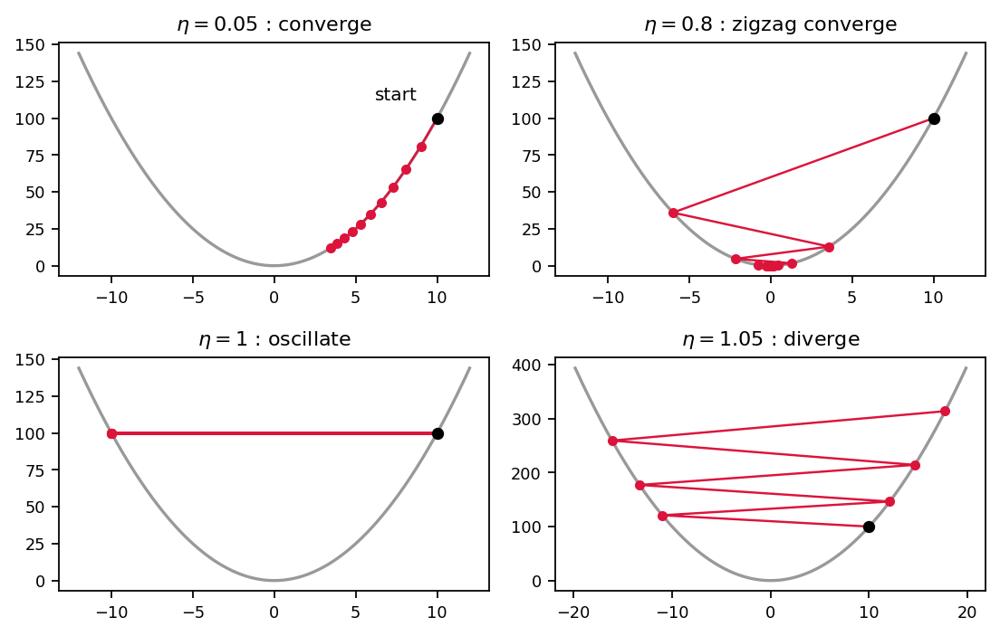

# 第3章 勾配降下法(1変数)— 坂を下るアルゴリズム

> [目次](../TOC.md) ・ [← 前の章](02-minima.md) ・ [次の章 →](04-partial-and-gradient.md)

前章で確認したのは、少し意地の悪い現実でした。最小値では傾きが 0 になる——だが「$f'(x) = 0$ を解けばよい」という素直な作戦は、世の中のほとんどの関数で通用しません。方程式が解けないのです。そこで前章の最後に予告したのが発想の転換でした。**一発で答えを出すことを諦めて、反復で少しずつ近づきます。**

本章では、その「反復」の中身を手に入れます。名前は**勾配降下法(gradient descent)**です。この巻の主役であり、第8巻でTransformerを訓練するその瞬間まで使い続けるアルゴリズムです。本体はコードにして**たった1行**です。本章ではその1行を書き、動かし、「学習率という1つのつまみ」を実験で観察します。

## 3.1 アルゴリズム: x ← x − η・f'(x)。たった1行

状況を整理します。関数 $f(x)$ の最小値を探したいが $f'(x) = 0$ は解けません。手元にあるのは、第1章で手に入れた道具——**任意の地点 $x$ での傾き $f'(x)$ を計算する能力**だけです。

霧の深い山の中にいる、と思ってください。谷底は見えませんが、いま立っている足元が**どちらに傾いているか**だけは確実にわかります。これだけの情報で谷底にたどり着くには、どうすればいいでしょうか。

答えは素朴です。**足元が下っている方へ一歩進む。着いた場所でまた足元を調べ、また一歩進む。** これを繰り返せば、いつかは傾き 0 の点に着くはずです。

式にしましょう。地点 $x$ での傾きは $f'(x)$ です。第1章で見たとおり、$f'(x) > 0$ なら右上がりなので下りたければ**左**(負の方向)へ、$f'(x) < 0$ なら**右**(正の方向)へ動くべきです。どちらも「$f'(x)$ と逆符号の方向へ動く」が正解になっています。そこで更新ルールをこう書きます。

$$x \;\leftarrow\; x - \eta \cdot f'(x)$$

左向き矢印 $\leftarrow$ は「右辺を計算して $x$ を置き換える」の意味です。$\eta$ はギリシャ文字でイータと読み、**学習率(learning rate)**と呼ばれる正の小さな定数です(役割は次節で調べます)。論文5.3節の `lrate` という記号の正体が、この $\eta$ です。

Pythonで書けば、こうです。

```python
x = x - lr * grad(x)
```

これで全部です。初期値を決め、この1行を繰り返します。それだけです。

### 手で1周してみる

定義を信じる前に、手で回してみましょう。$f(x) = x^2$、導関数は第1章のルールで $f'(x) = 2x$。出発点 $x = 3$、$\eta = 0.1$ とします。

| ステップ | $x$ | $f'(x) = 2x$ | 移動量 $-\eta \cdot f'(x)$ | 新しい $x$ | $f(x)$ の変化 |
|---|---|---|---|---|---|
| 1 | $3$ | $6$ | $-0.6$ | $2.4$ | $9 \to 5.76$ |
| 2 | $2.4$ | $4.8$ | $-0.48$ | $1.92$ | $5.76 \to 3.69$ |
| 3 | $1.92$ | $3.84$ | $-0.384$ | $1.536$ | $3.69 \to 2.36$ |

3ステップとも $f(x)$ は減り、最小値 $x = 0$ に向かって着実に進んでいます。

表をよく見てください。**歩幅(移動量)が、ステップごとに勝手に縮んでいる**のです。$0.6 \to 0.48 \to 0.384$。$\eta$ は $0.1$ に固定したまま、何も調整していません。

種明かしは式の形にあります。移動量は $\eta \cdot f'(x)$、つまり**傾きに比例**します。坂が急な場所($|f'(x)|$ が大きい)では大股に、谷底に近づいて坂が緩やかになると自動的に小股になります。「遠いうちは急いで、近づいたら慎重に」が、引き算1つに最初から織り込まれているのです。

この1行の射程を先に宣言しておきます。第6章で学ぶ learning rate の調整も、論文が使う Adam という最適化手法(第8巻)も、すべてこの1行の**変奏**です。ChatGPT のような巨大なモデルの訓練の核心も、この1行(を多変数にしたもの。第4章)の気が遠くなるほどの反復です。第1巻の `X @ W + b` が「計算のすべて」だったように、この1行は「学習のすべて」の原型です。

## 3.2 learning rate η の役割: 小さすぎると遅い、大きすぎると発散

なぜ $\eta$ を掛けるのでしょうか。傾きと逆へ動けばいいのなら $x \leftarrow x - f'(x)$($\eta = 1$)で十分に思えます。わざわざ「歩幅の倍率」を増やしたのには理由があるはずです。

$f(x) = x^2$ なら、この疑問に**計算だけで**完全に答えられます。更新式に $f'(x) = 2x$ を代入します。

$$x_{\text{new}} = x - \eta \cdot 2x = (1 - 2\eta)\, x$$

1ステップごとに $x$ が $(1 - 2\eta)$ **倍される**だけです。$t$ ステップ後の位置は、出発点 $x_0$ を使って

$$x_t = (1 - 2\eta)^t \, x_0$$

と閉じた式で書けてしまいます。同じ数を繰り返し掛けた結果は、倍率の絶対値 $|1 - 2\eta|$ が 1 より小さいか、ちょうど 1 か、大きいかで完全に決まります。つまり $\eta$ の選び方ひとつで、勾配降下法は**3つの運命**のどれかをたどります。

1. **収束(convergence)**: $|1 - 2\eta| < 1$、すなわち $0 < \eta < 1$ のとき。$x_t$ は 0 に向かって縮みます。ただし中身に幅があり、$\eta$ が小さすぎれば倍率が 1 に近く牛歩です。$0.5 < \eta < 1$ では倍率が負になり、$x$ は**谷底を毎回飛び越えて反対側に着地**しながら、それでも振れ幅は縮みます
2. **振動(oscillation)**: $\eta = 1$ のとき。倍率は $-1$。$x$ は $+x_0$ と $-x_0$ を**永遠に往復**し、近づきも遠ざかりもしません
3. **発散(divergence)**: $\eta > 1$ のとき。倍率の絶対値が 1 を超え、$x$ は谷底を飛び越えるたびに**より遠くへ**着地します。$|x|$ は指数的に爆発します

発散の図を頭に描いてください。坂を下ろうとしているのに、一歩が大きすぎて谷の反対側の、さらに高い場所に着地してしまう。そこは前より急なので、次の一歩はさらに大きくなり、さらに高い場所へ——。「下る」アルゴリズムが、$\eta$ の選択ひとつで「登り続ける」アルゴリズムに化けるのです。

倍率 $(1 - 2\eta)$ をちょうど 0 にする $\eta = 0.5$ を選ぶと、**たった1ステップで** $x = 0$ に着地します。魔法のようですが、これは $f$ が完全な放物線だから起きる偶然です(演習2)。

もう1つ見落としてはいけないのは、「境界は $\eta = 1$」という結論が $f(x) = x^2$ という**この関数の性質**だという点です。たとえば $f(x) = 10x^2$ という10倍急な谷では境界は $\eta = 0.1$ まで下がります(演習2)。つまり**安全な $\eta$ の範囲は関数ごとに違います**。実際に最小化したい関数は閉じた式で解析できないのが普通ですから(前章のとおり)、$\eta$ は事前に計算では決められません。だから機械学習の現場では、$\eta$ をいくつか試して**実験で観察する**文化が定着しています。いまからそれをやります。

## 3.3 [コード] 1変数の勾配降下を実装し、η を変えて収束・振動・発散を観察(図で記録)

3つの運命を、自分のコードで目撃しましょう。$f(x) = x^2$、出発点 $x_0 = 10$、ステップ数50で固定し、$\eta$ だけを変えて走らせます。閉じた式という「答え」を持つ関数をあえて選んだのは、実験結果を理論と突き合わせて検算できるからです。

アルゴリズムの本体は、やはり次の1行です。残りは軌跡(通った $x$ の列)を記録しているだけです。

```python
def gradient_descent(grad, x0, lr, n_steps):
    xs = [x0]
    x = x0
    for _ in range(n_steps):
        x = x - lr * grad(x)  # ← アルゴリズムの本体はこの1行
        xs.append(x)
    return np.array(xs)
```

引数 `grad` には導関数を**関数として**渡します。今回は手計算した `grad_f`(= $2x$)を渡しますが、手で微分できない関数に出会ったら第1章の数値微分をここに差し込めば同じように動きます。$\eta$ を変えて50ステップ走らせ、最後の $x$ と各運命を assert で検査するのが完成プログラムです(全文と動作確認は `code/ch03/gradient_descent_1d.py`、`python3` で全 assert 通過)。検算の要点は次の3つです。

```python
# η = 0.1: 最小値に収束し、|x| は毎ステップ単調減少
assert abs(xs_conv[-1]) < 1e-3
assert np.all(np.diff(np.abs(xs_conv)) < 0)
# 閉じた式 x_t = (1 − 2η)^t · x0 と全点一致
t = np.arange(n_steps + 1)
assert np.allclose(xs_conv, x0 * (1.0 - 2.0 * 0.1) ** t)
# η = 1.1: 発散(9万超まで爆発、|x| は毎ステップ単調増加)
assert abs(xs_div[-1]) > 1e4
assert np.all(np.diff(np.abs(xs_div)) > 0)
```

実行結果はこうなります。

```
出発点 x0 = 10.0, f(x) = x^2, 50 ステップ
      lr           x_50
   0.001        9.04747
    0.01         3.6417
     0.1    0.000142725
    0.45          1e-49
     0.8    8.08281e-11
     1.0             10
     1.1        91004.4
すべての assert を通過: 収束・振動・発散を数値で確認できました
```

実測値を運命ごとに整理したのが次の表です。ゴールは $x = 0$、出発点は $x = 10$ でした。

**表3.1: η と50ステップ後の運命(f(x) = x², x₀ = 10 の実測値)**

| $\eta$ | 50ステップ後の $x$ | 運命 |
|---|---|---|
| $0.001$ | $9.047$ | 収束(だが遅すぎる。ほぼその場) |
| $0.01$ | $3.642$ | 収束(遅い。まだ3分の1しか来ていない) |
| $0.1$ | $0.000143$ | 収束 |
| $0.45$ | $10^{-49}$ | 収束(非常に速い) |
| $0.8$ | $8.1 \times 10^{-11}$ | 収束(谷を飛び越えて振動しながら) |
| $1.0$ | $10.0$ | **振動**($\pm 10$ を永遠に往復) |
| $1.1$ | $91{,}004$ | **発散**(出発点の9,000倍の彼方へ) |

この表は前節の理論の言い換えではありません。assert の側に注目してください。$\eta = 0.1$ で「$|x|$ が毎ステップ単調減少」、$\eta = 1.1$ で「毎ステップ単調増加」、$\eta = 1.0$ で「$|x| = 10$ が不変で符号だけ毎回反転」まで、軌跡の全ステップを検査し、さらに $\eta = 0.1$ の軌跡が閉じた式と全点一致することも検算済みです。理論とコードが51点すべてで握手しています。

もう1つ味わってほしいのが、$\eta = 0.001$ と $\eta = 1.1$ の対比です。小さすぎる $\eta$ の失敗は静かです——エラーも出ず、50ステップを浪費して $9.047$ にいる。大きすぎる $\eta$ の失敗は派手です——あっという間に9万の彼方。実務で厄介なのはむしろ前者で、「動いているのに進んでいない」は気づきにくいのです。

### 軌跡を図にする

軌跡を目で見ておきましょう。「谷の断面図の上に、たどった点を順に打つ」図を、4つの $\eta$($0.05, 0.8, 1.0, 1.05$)について描きます。描画コードは `code/ch03/gradient_descent_1d.py` に含めてあります(`matplotlib` で図3.1 を出力)。核心は、谷の断面 `ax.plot(x_curve, f(x_curve))` の上に降下の軌跡 `ax.plot(xs, f(xs), "o-")` を重ねる部分です。



図3.1: $\eta$ による軌跡の違い。灰色の放物線が谷の断面、点列が勾配降下のたどった足跡(線は移動の順序)。

実行すると、4枚のパネルにそれぞれこんな光景が見えます。

- **左上($\eta = 0.05$)**: 点が放物線の右半分の斜面に沿って谷底へちょこちょこ並びます。谷底に近づくほど点の間隔が詰まる——3.1節の「自動で小股になる」が点の密度として見えます
- **右上($\eta = 0.8$)**: 点が放物線の**右と左を交互に**跳びます。谷底を毎回飛び越えているのです。ただし跳ぶたびに振れ幅は小さくなり、ジグザグは谷底に吸い込まれます
- **左下($\eta = 1.0$)**: 点が $x = +10$ と $x = -10$ の**2か所だけ**を往復します。10回動いて景色が一切変わらない、静止画のような図です
- **右下($\eta = 1.05$)**: 右上と同じジグザグですが向きが逆で、跳ぶたびに振れ幅が**広がり**、点列は放物線を駆け**上がって**谷の外へ飛び出します

同じ1行のアルゴリズム、同じ関数、同じ出発点。違うのは $\eta$ だけ。それでこれだけ運命が分かれることを、この4枚は1枚の絵として記憶に焼き付けてくれます。

## 3.4 止めどき: 収束判定、ステップ数

ここまでのコードには1つごまかしがありました。`n_steps = 50` という反復回数を、何の根拠もなく決め打ちしていたのです。本物の問題では、いつ止めればいいのでしょうか。

「$x = 0$ に十分近づいたら」は答えになりません。真の最小値を知らないからこそ探しているのであって、答え合わせはできない前提です。使っていいのは自分で計算できる量だけです。候補は2つあります。

**候補1: 傾きがほぼ 0 になったら止める。** $|f'(x)| < \text{tol}$(tol は許容値、たとえば $10^{-6}$)で停止します。前章の「最小値では傾きが 0」に直接訴える、いちばん筋のよい判定です。

**候補2: $x$ がほとんど動かなくなったら止める。** 1ステップの移動量は $\eta \cdot f'(x)$ なので、$\eta$ が固定なら実は候補1と同じものを測っています。

どちらを使うにしても、**ステップ数の上限(max_steps)という保険を必ず付けます**。$\eta = 1.0$ の振動では傾きの大きさは永遠に $20$ のままですし、発散では大きくなる一方です。収束判定だけのループは、$\eta$ の選択を誤った瞬間に**無限ループ**になります。

判定の本体は次のとおりです(全文と動作確認は `code/ch03/stopping_criteria.py`、`python3` で全 assert 通過)。

```python
def gradient_descent_until(grad, x0, lr, tol, max_steps):
    x = x0
    for step in range(max_steps):
        g = grad(x)
        if abs(g) < tol:
            return x, step  # 谷底とみなして停止
        x = x - lr * g
    return x, max_steps     # 保険発動: 判定を満たさないまま打ち切り
```

完成プログラムは、tol を1桁ずつ厳しくしてステップ数の増え方を表にし、さらに次を検算します。

```python
# tol = 1e-6 なら 76 ステップで止まり、|f'(x)| < tol
assert steps == 76 and abs(grad_f(x)) < 1e-6
# 1桁厳しくするごとの増分はほぼ一定(等比収束。4桁ぶんで41ステップずつ)
assert (s6 - s2) == (s10 - s6) == 41
# 保険が要る理由: η = 1.0(振動)では収束判定が永遠に満たされない
x, steps = gradient_descent_until(grad_f, x0, lr=1.0, tol=1e-6, max_steps=500)
assert steps == 500 and abs(x) == x0   # max_steps で打ち切り、±10 を往復したまま
```

実行結果の表はこうなります。

```
f(x) = x^2, x0 = 10.0, lr = 0.1
     tol      steps              x
   1e-02         35     0.00405648
   1e-04         55    4.67681e-05
   1e-06         76    4.31359e-07
   1e-08         96    4.97323e-09
   1e-10        117      4.587e-11
```

読み取れることが2つあります。第一に、tol を1桁(10分の1)厳しくするごとに必要なステップ数は**ほぼ一定数(約10)ずつ**しか増えません(35 → 55 → 76 → 96 → 117)。毎ステップ $|x|$ が $0.8$ 倍になる等比収束では、「精度をあと1桁」のコストはいつも同じだからです。精度は意外と安い、という感覚は覚えておいて損がありません。第二に、最後の assert ブロックが保険の存在意義そのものです。$\eta = 1.0$ では収束判定は永遠に満たされず、`max_steps = 500` での打ち切りだけがループを止めています。

最後に、現代の機械学習の実情を1つ挙げます。深層学習の訓練では、「収束したら止める」よりも「**ステップ数の予算を最初に決めて、使い切ったら止める**」方が主流です。巨大なモデルでは1ステップが高価で、傾きが tol を下回るまで回し続けるのは計算資源として現実的でないからです。ラスボスの式をもう一度見てください。

$$lrate = d_{model}^{-0.5} \cdot \min(step\_num^{-0.5},\ step\_num \cdot warmup\_steps^{-1.5})$$

$step\_num$——「いま何ステップ目か」という変数が式の中に堂々と組み込まれています。論文の世界では、ステップ数は止めどきの保険であるだけでなく、学習率を変化させる**時計**として使われているのです。なぜ $\eta$ をステップごとに変えたくなるのかは、第6章で体験します。

## まとめ

- 勾配降下法は $x \leftarrow x - \eta \cdot f'(x)$ の**たった1行**。傾きと逆向きに、傾きに比例した歩幅で動く。坂が緩むと歩幅は自動で縮む
- $\eta$(学習率)は歩幅の倍率。$f(x) = x^2$ では更新が「$(1 - 2\eta)$ 倍」になり、$\eta$ の値だけで**収束・振動・発散**の3つの運命が決まる
- 実測(50ステップ、$x_0 = 10$): $\eta = 0.01$ でまだ $3.64$(遅すぎる)、$\eta = 0.1$ で $10^{-4}$(収束)、$\eta = 1.0$ で $\pm 10$ を永遠に往復(振動)、$\eta = 1.1$ で $91{,}004$(発散)
- 安全な $\eta$ は関数ごとに違い、事前には計算できないのが普通。だから実験で観察する
- 止めどきは「$|f'(x)| < \text{tol}$」+「ステップ数上限の保険」。深層学習ではステップ数の予算を決め打ちする流儀が主流で、論文もステップ数を時計として学習率を変えている

**ラスボスとの距離**: 論文5.3の式のうち、$lrate$(= 本章の $\eta$)と $step\_num$ という2つの記号が読めるようになりました。

## 演習

**問1(手で1周)** $f(x) = (x - 3)^2$ を、出発点 $x_0 = 0$、$\eta = 0.25$ で3ステップ降下させてください。各ステップで「最小値 $x = 3$ までの距離」がどう変わるかも記録してください。

<details><summary>略解</summary>

$f'(x) = 2(x - 3)$ なので、更新は $x \leftarrow x - 0.5(x - 3) = 0.5x + 1.5$。

$x$: $0 \to 1.5 \to 2.25 \to 2.625$。距離 $|x - 3|$: $3 \to 1.5 \to 0.75 \to 0.375$ と**毎ステップちょうど半分**になります。3.2節と同じ計算をすると、$(x - 3)$ が毎回 $(1 - 2\eta) = 0.5$ 倍されるからです。最小値が $x = 0$ になくても、理屈は平行移動するだけで同じです。

</details>

**問2($\eta$ の境界)** 3.2節の計算を使って答えてください。

1. $f(x) = x^2$ で、3つの運命の境界になる $\eta$ はいくつですか
2. $f(x) = 10x^2$ ではどうなりますか
3. $f(x) = x^2$ で $\eta = 0.5$ にすると、何ステップで最小値に着きますか。それはなぜですか

<details><summary>略解</summary>

1. $x_{\text{new}} = (1 - 2\eta)x$ なので、$|1 - 2\eta| = 1$ となる $\eta = 1$ が境界。$\eta < 1$ で収束、$\eta = 1$ で振動、$\eta > 1$ で発散
2. $f'(x) = 20x$ から $x_{\text{new}} = (1 - 20\eta)x$。境界は $\eta = 0.1$。**10倍急な谷では、安全な $\eta$ の上限は10分の1**になります。「適切な $\eta$ は関数しだい」の最小の実例です
3. 1ステップ。倍率 $(1 - 2 \times 0.5)$ がちょうど 0 になるからです。ただしこれは $f$ が完全な放物線で、傾きがどこでも「谷底までの距離に正確に比例」しているから成立する偶然で、一般の関数では起きません

</details>

**問3(コード: 凸でない関数で局所解にハマる体験)** 谷が2つある関数 $f(x) = x^4 - 2x^2 + 0.5x$ を考えます。

1. $f'(x)$ を手で求めてください
2. 出発点 $x_0 = -1.5$ と $x_0 = +1.5$ のそれぞれから、$\eta = 0.02$、200ステップで勾配降下を走らせてください
3. 2つの着地点の $x$ と $f(x)$ を比べてください。何が起きましたか

<details><summary>略解</summary>

1. $f'(x) = 4x^3 - 4x + 0.5$

2〜3. 実装と検証(`code/ch03/ex_local_minimum.py`):

```python
def f(x):
    return x ** 4 - 2.0 * x ** 2 + 0.5 * x

def grad_f(x):
    return 4.0 * x ** 3 - 4.0 * x + 0.5

def gradient_descent(grad, x0, lr, n_steps):
    x = x0
    for _ in range(n_steps):
        x = x - lr * grad(x)
    return x

x_left = gradient_descent(grad_f, x0=-1.5, lr=0.02, n_steps=200)
x_right = gradient_descent(grad_f, x0=+1.5, lr=0.02, n_steps=200)

assert abs(grad_f(x_left)) < 1e-6    # どちらも傾きほぼ 0 で停止しているのに
assert abs(grad_f(x_right)) < 1e-6
assert f(x_right) - f(x_left) > 0.9  # 着いた谷の深さは違う
```

実測では、$x_0 = -1.5$ からは $x \approx -1.058$($f \approx -1.515$)に、$x_0 = +1.5$ からは $x \approx 0.930$($f \approx -0.517$)に着地します。**どちらの着地点でも傾きはほぼ 0** ——アルゴリズムはどちらも対等に「谷底に着いた」と報告し、自分が浅い方の谷にいることを知るすべを持ちません。右の谷のような点を**局所解(local minimum)**と呼びます。

勾配降下法は**出発した谷から出られません**。足元の傾きしか見ていないので、いったん谷底に着けば、隣にもっと深い谷があってもそこへ向かう理由がないのです。出発点というたった1つの違いが最終結果を分けました。これが、谷が1つしかない関数(凸な関数)との決定的な差です。

そして不穏な事実を1つ。この先の巻で私たちが最小化する関数は、ほぼすべて凸ではありません。それでも深層学習は勾配降下(の変奏)で動いています。この緊張関係は、いまは解決せずに事実として覚えておいてください。

</details>

**問4(止めどき)** 3.4節の `gradient_descent_until` で、$f(x) = x^2$、$x_0 = 10$、$\eta = 0.1$ のまま、tol を $10^{-2}$、$10^{-6}$、$10^{-10}$ と変えるとステップ数はどうなりますか。実行する前に「桁の増え方」を予想してから、実行して確かめてください。

<details><summary>略解</summary>

実測で $35 \to 76 \to 117$ ステップ。tol を4桁厳しくするごとに、ちょうど41ステップずつの増加です。毎ステップ $|x|$ が $0.8$ 倍になる等比収束では、$0.8^k = 0.1$ となる $k \approx 10.3$ が「1桁稼ぐのに必要なステップ数」で、これがどの精度帯でも一定だからです。「tol を1万倍厳しくしたらステップも1万倍」**ではない**ことが、この問のポイントです。

</details>

---

> [目次](../TOC.md) ・ [← 前の章](02-minima.md) ・ [次の章 →](04-partial-and-gradient.md)
