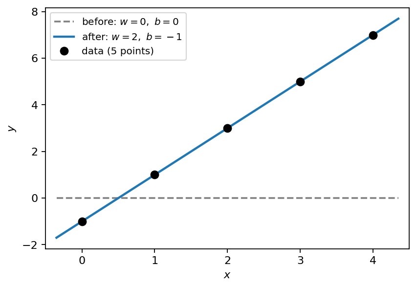
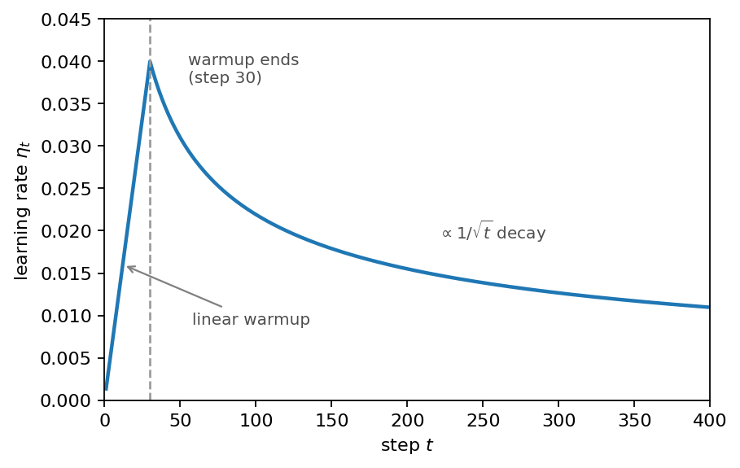

# 第6章 勾配降下法の実践 — パラメータ付き関数を調整する

> [目次](../TOC.md) ・ [← 前の章](05-chain-rule.md) ・ [次の章 →](07-boss-rematch.md)

ここまでで道具は揃いました。微分(第1章)、反復で谷底に近づく発想(第2章)、$x \leftarrow x - \eta f'(x)$ と学習率 $\eta$(第3章)、勾配 $\nabla f$ の逆向きに下る多変数版(第4章)、連鎖律(第5章)です。

ところが振り返ると奇妙です。私たちはずっと「$f(x)$ を最小にする $x$ を探す」練習をしてきましたが、この巻の序章の問いはそういう形ではありませんでした。第1巻第6章で、私たちは全結合層 `X @ W + b` を組み上げ、**$W$ と $\mathbf{b}$ を乱数のまま放置した**のでした。「$W$ の中身をどう賢くするかは第2巻・第3巻の主題です」という約束つきでした。

知りたいのは「良い $x$」ではなく「良い $W$」です。

この章で、その約束の前半を果たします。勾配降下法の矛先を、入力 $x$ からパラメータ $W$ へ向け変える——たった一語の入れ替えに見えますが、ここが**このシリーズ全体で最も重要な一段**です。この一段を上った先の景色は、第8巻でフルサイズの Transformer を訓練する瞬間まで、もう変わりません。

## 6.1 「x を動かす」から「W を動かす」へ: 入力は固定、動かすのはパラメータ

小さなデータから始めましょう。こんな5件の観測データがあるとします。

| $x$ | 0 | 1 | 2 | 3 | 4 |
|---|---|---|---|---|---|
| $y$ | −1 | 1 | 3 | 5 | 7 |

$x$ を入れると $y$ が返ってくる仕組みを観測した記録です。やりたいのは**この対応関係を再現する規則を作ること**です。規則さえあれば、まだ見ていない $x = 10$ も予測できます。

規則の候補を、思い切って1つの形に決めます。

$$\hat{y} = wx + b$$

$\hat{y}$(ワイハット)は「予測した $y$」の意味です。第1巻の背骨 `X @ W + b` の最小のミニチュアです。本来なら行列として大文字 $W$ で書きたいところですが、今日は中身が1個だけのスカラーなので、第1巻第3章の規律(行列は大文字、スカラーは小文字)に従って小文字の $w$ で書きます。この $w$ が行列に育ったものが、あの $W$ です。

$w$ と $b$ をどう選べば「良い規則」になるでしょうか。良し悪しを比べるには、まず良し悪しを**1つの数**にしなければなりません。データ点ごとに予測 $\hat{y}_i$ と正解 $y_i$ の差をとり、足すと打ち消し合うので2乗して符号を消し、全件分足し合わせます。

$$E(w, b) = \sum_{i=1}^{5} \bigl(w x_i + b - y_i\bigr)^2$$

この $E$(Error の頭文字)を、本書ではしばらく**「データとのズレの合計」**と呼びます。この量には機械学習の世界で正式な名前が付いていて、その命名と「なぜ2乗なのか」のもっと深い理由は第3巻で正面から扱います。今は「ズレを符号抜きで足した量。小さいほど良い」とだけ思ってください。

いくつか試し撃ちしてみます。

| $(w, b)$ | $(0, 0)$ | $(1, 0)$ | $(2, 0)$ | $(2, -1)$ |
|---|---|---|---|---|
| $E(w, b)$ | 85 | 15 | 5 | 0 |

$(2, -1)$ でズレが完全に消えました。このデータは $y = 2x - 1$ から作ったので当然です。しかし現実には答えを知りません。当てずっぽうを繰り返すのではなく、**$E$ を最小にする $(w, b)$ を、坂を下って探したい**のです。

ここで、この章の核心の問いです。**$E$ は、何の関数でしょうか。**

式の中には4種類の文字がいます。$w$、$b$、$x_i$、$y_i$。第3章までの目では $x$ が変数に見えます。しかし $x_i$ と $y_i$ は**すでに観測されてしまった数**です。表に書かれた 0, 1, 2, 3, 4 と −1, 1, 3, 5, 7 です。学習の間、この10個の数には指一本触れません。式の中では $3$ や $7$ と同格の、ただの定数です。

動かすべきなのは $w$ と $b$ だけです。つまり、

$$E = E(w, b)$$

**$E$ は、パラメータの関数です。**

この瞬間に景色が反転します。第4章で私たちは、横軸 $x_1$・縦軸 $x_2$ の平面に等高線を描き、勾配の逆向きに下る軌跡を追いました。同じ図の軸のラベルを貼り替えてください。横軸が $w$、縦軸が $b$、等高線は $E$ の高さです。図の形は何ひとつ変わりません。**変わったのは「地形がどの空間に広がっているか」だけです。** $x$ は、地形の形を決める係数として $E$ の式の中に溶け込んでいます。

なぜ $x$ を動かしてはいけないのでしょうか。$x_i$ を都合よく動かしてズレを減らすのは実験データの改ざんと同じです。それに、仮に「この $x$ ならズレが小さい」という $x$ を見つけても、明日には新しい $x$ がやってきて何も持ち帰れません。**持ち帰って使い回せるのは規則の側——$w$ と $b$ だけ**です。だから入力は固定し、パラメータを動かします。

席の入れ替えが済めば、あとは第3〜5章の道具がそのまま流れ込みます。坂を下るには勾配、つまり $E$ の偏微分が要ります。$E$ は「2乗する関数」の中に「$w x_i + b - y_i$ を計算する関数」が入った合成関数なので、第5章の連鎖律の出番です。外の微分($u^2$ の微分は $2u$)に、中の微分($w$ で微分すれば $x_i$、$b$ で微分すれば $1$)を掛けます。

$$\frac{\partial E}{\partial w} = \sum_{i=1}^{5} 2\,(w x_i + b - y_i)\, x_i, \qquad \frac{\partial E}{\partial b} = \sum_{i=1}^{5} 2\,(w x_i + b - y_i)$$

更新則は、第3章のアルゴリズムと一字違いです。

$$w \leftarrow w - \eta \frac{\partial E}{\partial w}, \qquad b \leftarrow b - \eta \frac{\partial E}{\partial b}$$

なぜこの一段が「シリーズ最重要」なのでしょうか。これ以降の巻で起きること——第3巻の線形回帰も、第5巻のニューラルネットも、第8巻の Transformer も——**全部この絵**だからです。違いは軸の本数だけです。今日の地形は軸が2本($w$ と $b$)ですが、論文のモデルでは軸が約6,500万本になります(第1巻第6章の演習で数えた、あの数です)。それでも「データを固定し、パラメータの空間に広がるズレの地形を、勾配の逆向きに下る」という1文は一語も変わりません。

## 6.2 [コード] パラメータ2〜3個の関数をデータに合わせて勾配降下で調整する

導いたものをコードにして、本当に $w = 2,\ b = -1$ を言い当てられるか確かめます。中心は予測・ズレ・勾配の3つの部品で、勾配は第5章で手導出した式をそのまま写したものです。

```python
def gradients(X, y, w, b):
    """E の w, b それぞれによる偏微分(第5章の連鎖律で手導出した式)"""
    diff = predict(X, w, b) - y          # 中の関数の値
    grad_w = np.sum(2 * diff * X)        # 外の微分 2*diff × 中の微分 x_i
    grad_b = np.sum(2 * diff)            # 外の微分 2*diff × 中の微分 1
    return grad_w, grad_b
```

手で導出した勾配の式は書き間違えるものです(私たちも、あなたも)。第1章で作った習慣をここでも使います。**解析的に導いた勾配を、数値微分と突き合わせる**のです。式が合っていることを確かめたら、あとは下るだけです。$(w,b)=(0,0)$ から $\eta=0.01$ で1000ステップ降下します。

```python
w, b = 0.0, 0.0
lr = 0.01
for step in range(1000):
    grad_w, grad_b = gradients(X, y, w, b)
    w -= lr * grad_w
    b -= lr * grad_b

assert np.allclose([w, b], [2.0, -1.0], atol=1e-3)   # データを作った規則を言い当てる
assert error_total(X, y, w, b) < 1e-6
```

全文(データ定義・`predict`・`error_total`・数値微分での検算・`E` の単調減少チェックを含む)と動作確認は `code/ch06/fit_parameters.py`(`python3` で全 assert 通過)です。

中で何が起きたか、最初の1歩だけ追います。出発点 $(w, b) = (0, 0)$ での勾配は $(-100, -30)$。両方とも負——「$w$ も $b$ も増やせばズレが減る」と地形が教えています。$\eta = 0.01$ なので1歩めで $(w, b) = (1.0,\ 0.3)$ に移動し、$E$ は $85$ から $12.45$ まで一気に落ちます。あとは繰り返しで、1000歩後には $E$ が $10^{-26}$ のオーダー、$(w, b)$ は小数点以下4桁まで $(2, -1)$ に一致します。



図6.1: 当てはめの前後。黒い点が5件の観測データ。破線が出発点 $(w, b) = (0, 0)$ の規則(どの $x$ にも $0$ と予測する水平線)、実線が1000ステップ降下したあとの規則 $\hat{y} = 2x - 1$。降下だけで、5点すべてを貫く直線にたどり着いている。

立ち止まる価値のある事実です。このプログラムのどこにも「$y = 2x - 1$」という種明かしは書かれていません。プログラムが見たのは10個の数だけです。それでも、ズレの地形を下っただけで、データを生んだ規則を言い当てました。**これが、世間で「学習」と呼ばれているものの計算上の正体です。** 正確には正体の半分で、残りの半分——「そもそも何を最小化するのが正しいのか」という設計の問題——が第3巻の主題になります。

パラメータが3個になってもレシピは変わりません。規則の候補を $\hat{y} = w_2 x^2 + w_1 x + b$ という2次式にすれば、偏微分が3本に増え、更新則が3行になります。それだけです。3個が100万個になっても同じ——というのが、冒頭で述べた「景色は変わらない」の意味です。

## 6.3 learning rate を途中で変える: 最初は大股、あとは小股

第3章で、学習率 $\eta$ のジレンマを観察しました。小さすぎると遅い、大きすぎると発散します。今回の問題でも同じです。$\eta = 0.002$ の小股では200歩たってもまだ $E = 0.35$。$\eta = 0.04$ の大股にすると $w$ は $4.0 \to -2.56 \to 8.61 \to -10.04$ と振れ幅を広げて発散します。

$\eta$ は最初から最後まで同じ1つの数でなければならない、という決まりはありません。ステップ $t$ ごとに違う $\eta_t$ を使ってよく、ステップ数から学習率を決める規則を**学習率スケジュール**(learning rate schedule)と呼びます。素朴なアイデアは——**最初は大股で一気に谷へ近づき、谷の近くでは小股に切り替えて飛び越えなくする**ことです。 たとえば $\eta_t = \eta_0 / \sqrt{t+1}$ のように歩数の平方根で歩幅を縮めます。

6.2 と同じ問題に、スケジュールを渡せる形の降下ループ `run(lr_of_step, T)` を用意して、3通りを走らせます。

```python
T = 200
_, _, hist_small = run(lambda t: 0.002, T)                   # 小股のまま
_, _, hist_large = run(lambda t: 0.04, T)                    # 大股のまま
_, _, hist_decay = run(lambda t: 0.04 / np.sqrt(t + 1), T)   # 大股から縮める

assert hist_large[-1] > 1e9          # 大股のまま: 発散
assert hist_small[-1] > 0.1          # 小股のまま: 200ステップではまだ遠い
assert hist_decay[-1] < 1e-2         # 同じ 0.04 から出発しても、縮めれば収束する
assert hist_decay[-1] < hist_small[-1]
```

200ステップ後、小股($0.002$ 固定)は $E = 0.35$、大股($0.04$ 固定)は発散です。そして**同じ $0.04$ から出発して縮めたスケジュールは、発散せずに $E = 0.0058$** ——小股の60倍良いところまで来ます。発散するはずの大股を序盤の推進力としてだけ使い、危なくなる前に手放しました。これが「最初は大股、あとは小股」の効果です。歩幅を縮める速さを $1/\sqrt{t}$ にした理由はあとで種を明かします($1/t$ で縮めた場合との比較は演習に回します)。

ここで逆向きの問いです。「最初は大股」と言いましたが、**本当に最初の一歩から大股でいいのでしょうか。**

第1巻第6章でも今日の 6.2 でも、パラメータの初期値は乱数か適当に決めた値でした。つまり出発点は選べません。もし出発点がたまたま地形の**急斜面のド真ん中**だったら? 急斜面では勾配が巨大です。巨大な勾配 × 大股の $\eta$ = 巨大な一歩。最初の一歩で谷を遥かに飛び越して、戻れない場所まで吹き飛ぶかもしれません。

地形だけを取り出した小さな実験で見ます。$E(w) = w^4$ という1変数の地形は、遠くでは2次関数よりずっと急峻な壁、底の近く($|w| < 1$)では2次関数よりずっと平らな床になる、「すり鉢の周りに断崖がある」形です。勾配は $E'(w) = 4w^3$。$w_0 = 2$ から出発し、3通りの歩き方を比べます。

```python
T2 = 300
w_large = run_quartic(lambda t: 0.2, T2)     # 最初から大股
w_small = run_quartic(lambda t: 0.01, T2)    # ずっと小股
w_warmup = run_quartic(lambda t: 0.2 * min(1.0, (t + 1) / 30), T2)  # 30ステップかけて大股へ

assert abs(w_large) > 1e6                    # いきなり大股: 初手の急斜面で発散
assert abs(w_small) > 0.15                   # ずっと小股: 底の平らな区間で足踏み
assert abs(w_warmup) < 0.05                  # 小股で降りてから大股: 生き残り、かつ速い
assert abs(w_warmup) < abs(w_small)
```

3者の運命はこうなります(`run` と `run_quartic` を含む全文は `code/ch06/lr_schedules.py`、`python3` で全 assert 通過)。

- **最初から大股($0.2$ 固定)**: $2 \to -4.4 \to 63.7 \to -20万$。わずか4手で発散。出発点の勾配 $4 \times 2^3 = 32$ が大きすぎ、初手の $0.2 \times 32 = 6.4$ という跳躍が命取りでした
- **ずっと小股($0.01$ 固定)**: 発散はしないものの、底の平らな床では勾配 $4w^3$ がほとんど消えるため、300歩後も $|w| = 0.20$ で足踏み
- **30ステップかけて $0$ から $0.2$ まで歩幅を上げる**: 序盤の小股で急斜面を安全に降り、平らな床に着いてから大股で進む。300歩後 $|w| = 0.046$。生き残った上で、小股の4倍以上先まで進みました

この「最初は様子見の小股、勾配が穏やかになってから大股」という序盤の作戦を**ウォームアップ**(warmup)と呼びます。準備運動、という意味です。

2つの実験を合体させると、スケジュールの全体像が浮かびます。**序盤は歩幅をゼロ近くから直線的に上げ(warmup)、頂点に達したら $1/\sqrt{t}$ で下げていく(decay)**、という形です。 描くとこうなります。

```python
import matplotlib.pyplot as plt

steps = np.arange(1, 401)
warmup = 30
lr = 0.04 * np.minimum(steps / warmup, np.sqrt(warmup / steps))

plt.plot(steps, lr)
plt.xlabel("step")
plt.ylabel("learning rate")
plt.show()
```



図6.2: warmup + decay を組み合わせた学習率スケジュール。横軸がステップ数、縦軸が $\eta_t$。最初の30ステップで $0$ から $0.04$ まで直線的に立ち上がり、頂点を境に $1/\sqrt{t}$ のカーブでゆるやかに減っていく、左が切り立った山形が見えるはずです。

`np.minimum(直線, 1/√t のカーブ)` という書き方に注目してください。2本の曲線の低い方をなぞるだけで、「上げてから下げる」山形が1行で書けています。そして——巻頭に掲げたラスボス、論文 Section 5.3 の式にも、まさに $\min(\cdot,\ \cdot)$ が入っていました。$1/\sqrt{t}$ という縮め方をあらかじめ選んでおいたのも、実はこのためです。種明かしと式の照合は終章で行います。あと数ページです。

## 6.4 勾配降下の弱点メモ: 谷でのジグザグ等

ここまで腕前ばかり見せてきたので、最後に弱点も記録しておきます。後の巻への伏線として、3つです。

**弱点1: 細長い谷でのジグザグ。** 地形が $E(w_1, w_2) = w_1^2 + 25\,w_2^2$ のような細長い谷だったとします。勾配は $(2w_1,\ 50w_2)$。$w_2$ 方向(谷を横切る方向)の成分が25倍も強いので、勾配は谷底の方向をほとんど向かず、**ほぼ真横**を向きます。第4章で「勾配は等高線に垂直」と学びました——細長い楕円の等高線に垂直な向きは、谷に沿う向きとは大きくずれるのです。結果、$\eta$ を大きめにすると $w_2$ が谷の両側の壁を毎ステップ往復してジグザグし、$\eta$ を小さくすればジグザグは消えますが、今度は谷沿いの $w_1$ が亀の歩みになります。どちらに合わせても、どちらかが損をします。

**弱点2: 歩幅を方向ごとに変えられない。** 6.3 のスケジュールは時刻によって $\eta$ を変えますが、その瞬間の $\eta$ は全パラメータ共通です。ジグザグ問題の本当の処方箋は「谷を横切る方向は小股、谷沿いの方向は大股」と**方向ごとに**歩幅を変えることですが、素の勾配降下法にその芸当はできません。

**弱点3: 局所解。** 第3章の演習で体験した通り、凸でない地形では、出発点によっては浅いくぼみに捕まります。

これらの弱点には、すでに処方箋の名前が付いています。直前のステップの動きを「勢い」として引き継ぎ、谷での振動を打ち消す**モーメンタム**(momentum)。そしてパラメータごとに歩幅を自動調整する **Adam**。——そう、巻頭のラスボスの隣に書かれていた "We used the Adam optimizer" の Adam です。中身の式($\beta_1, \beta_2, \epsilon$)を読むのは第8巻の仕事なので、ここでは名前の紹介だけにとどめます。弱点を知った上でなお、勾配降下法(とその改良版)が世界中の巨大モデルを今日も訓練している、という事実だけ覚えて先へ進みましょう。

## まとめ

- **視点の転換(本シリーズ最重要)**: データ $x_i, y_i$ は観測済みの定数、変数はパラメータ $w, b$。「データとのズレの合計」$E(w, b)$ は**パラメータの空間に広がる地形**であり、学習とはその地形を勾配の逆向きに下ること。軸が2本でも6,500万本でも、この絵は変わらない
- $E$ = 予測と正解の差を2乗して全件足した量。この量の正式な名前と設計論は第3巻で
- アルゴリズムは第3章と同一($w \leftarrow w - \eta\, \partial E/\partial w$)。勾配は第5章の連鎖律で導出し、第1章の数値微分で検算する
- $\eta$ は定数でなくてよい。**warmup**(急斜面の出発点では様子見の小股から立ち上げる)+ **decay**($1/\sqrt{t}$ で縮めて谷を飛び越えなくする)の山形スケジュール
- 弱点: 細長い谷でのジグザグ、方向別に歩幅を変えられない、局所解。処方箋はモーメンタムと Adam(第8巻で実装)

**ラスボスとの距離**: 論文 Section 5.3 の $lrate = d_{model}^{-0.5} \cdot \min(step\_num^{-0.5},\ step\_num \cdot warmup\_steps^{-1.5})$ のうち、「warmup で上げてから $1/\sqrt{step}$ で下げる山形」という式の**形**を、自分の手で作れるようになりました。式そのものとの照合は終章で行います。

## 演習

**問1** データ $(x, y) = (1, 1),\ (2, 3),\ (3, 5)$ と規則の候補 $\hat{y} = wx + b$ について、$(w, b) = (0, 0)$ における (a) ズレの合計 $E$、(b) $\partial E/\partial w$ と $\partial E/\partial b$ を手計算してください。(c) $\eta = 0.01$ で1ステップ更新した後の $(w, b)$ を求め、$E$ が減ったことを確かめてください(検算には 6.2 のコードが使えます)。

**問2** 6.3 の実験1で、歩幅の縮め方を $\eta_t = 0.04/(t+1)$($1/t$ 減衰)に変えて200ステップ走らせ、$1/\sqrt{t+1}$ 減衰・定数 $0.002$ と最終的な $E$ を比べてください。実行する前に、結果の順位を予想してから走らせてください。

**問3** 6.3 の実験2(warmup)で、warmup の長さを30から変えてみてください。(a) 長さ1(つまり初手から $\eta = 0.2$)ではどうなりますか。(b) 発散を防げる最小の長さはいくつですか。(c) 30 より長く(たとえば100に)すると、最終的な $|w|$ はどうなりますか。

**問4** 友人が「ズレ $E$ を小さくしたいなら、$w, b$ じゃなくて $x_i$ を勾配降下で動かしてもいいのでは? $E$ を $x_i$ で偏微分することは数学的には可能だし」と言っています。数学的に可能であることは認めた上で、なぜそれが「学習」にならないのかを、6.1 の言葉で説明してください。

<details>
<summary>略解</summary>

**問1** (a) 予測はすべて $0$ なので $E = 1^2 + 3^2 + 5^2 = 35$。(b) $\partial E/\partial w = 2\{(-1)(1) + (-3)(2) + (-5)(3)\} = -44$、$\partial E/\partial b = 2(-1 - 3 - 5) = -18$。(c) $(w, b) = (0.44,\ 0.18)$。新しい予測との差は $(-0.38,\ -1.94,\ -3.50)$ で $E = 0.144 + 3.764 + 12.25 \approx 16.2 < 35$。確かに減った。

**問2** 200ステップ後の $E$ は、$1/\sqrt{t+1}$ 減衰が約 $0.006$、定数 $0.002$ が約 $0.35$、$1/t$ 減衰は約 $0.92$ で**最下位**。$1/t$ は歩幅が縮みすぎて(10歩めで早くも $0.004$、100歩めで $0.0004$)、谷底に着く前に事実上立ち止まってしまう。「だんだん小さく」なら何でもよいわけではなく、**縮める速さ**が問題になる——$1/\sqrt{t}$ はその折衷案。

**問3** (a) 初手の跳躍 $0.2 \times 32 = 6.4$ で $w = -4.4$ へ飛び、4手で発散(6.3 の「最初から大股」と同じ)。(b) この地形では長さ2で既に生き残る(初手が $\eta = 0.1$ になり、$w = 2 - 3.2 = -1.2$ と壁の内側に収まる)。(c) ほとんど変わらないか、わずかに悪くなる(大股に達するのが遅れる分だけ足踏みが増える)。この実験では危険なのは最初の数歩だけだが、現実の巨大モデルでは危険な期間がずっと長く、論文では warmup_steps = 4000 が使われている——終章で確認する。

**問4** $E$ を $x_i$ で偏微分して $x_i$ を動かせば、確かに $E$ は減らせる。しかしそれは観測データの改ざんであり、減ったのは「書き換えた後のデータとのズレ」にすぎない。さらに致命的なのは、得られた成果を持ち帰れないこと。学習の目的は手元の5件への当てはまりではなく、**まだ見ぬ入力に使い回せる規則**($w, b$)を得ることにある。$x_i$ を動かして得た解は、新しい入力が来た瞬間に何の役にも立たない。だから入力は固定し、パラメータを動かす。

</details>

---

> [目次](../TOC.md) ・ [← 前の章](05-chain-rule.md) ・ [次の章 →](07-boss-rematch.md)
