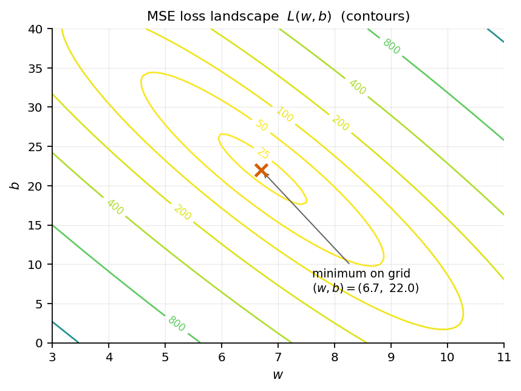
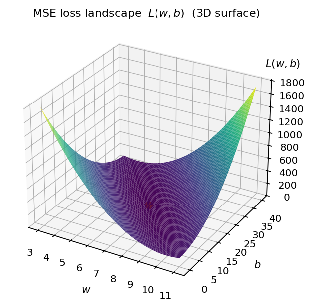

# 第3章 損失関数 — 「悪さ」を1つの数にする

> [目次](../TOC.md) ・ [← 前の章](02-linear-regression.md) ・ [次の章 →](04-training.md)

前章で、あなたは直線を「手で」当てはめ、自分の選んだ $(w, b)$ を記録しました。ところが隣の人と答えが違う。あなたは候補Cの $(7,\ 20)$、隣の人は候補Dの $(6.5,\ 25)$。どちらも散布図では「いい感じ」に見えます。さて、どちらが良い直線でしょうか。

「いい感じ」のままでは口論に決着がつきません。**「いい感じ」を数にする**——直線の「悪さ」を1つの数で表せれば、数の小さい方が勝ち、で済みます。さらに、機械に直線を選ばせることもできます。機械は「いい感じ」を理解しませんが、**数を小さくすること**なら得意だからです(第2巻で道具——勾配降下法——はすでに手に入れています)。

この章で、その「悪さの数」を作ります。実はこの数、第2巻第6章で一度だけ顔を見せ「名前は第3巻で命名します」と予告したもの——その回収がこの章です。

## 3.1 残差: 予測と正解のズレ

まず前章と同じデータを再現します。真の規則 点数 $= 7 \times$ 勉強時間 $+ 20$ にばらつきを乗せた、20人ぶんの合成データです。

```python
import numpy as np

rng = np.random.default_rng(42)
n = 20
X = rng.uniform(0, 9, size=(n, 1))          # 勉強時間 (20, 1)
noise = rng.normal(0, 6.0, size=(n, 1))
y = 7.0 * X + 20.0 + noise                  # 点数 (20, 1)  真の規則: w=7, b=20
assert np.allclose(X[:3].ravel(), [6.96560444, 3.94990596, 7.72738128])  # 第2章と同じ20人
```

最後の `assert` は前章の `make_data()` と同じ20人がいることの照合です。モデルも前章のまま、直線 $\hat{y} = wx + b$ です。帽子($\hat{\ }$)は「予測値」の印です。

悪さを測る最小単位から始めます。$i$ 番めの点の入力が $x_i$、正解が $y_i$、予測が $\hat{y}_i = w x_i + b$ です。この1点の「ズレ」は引き算で書けます。

$$r_i = \hat{y}_i - y_i$$

この $r_i$ を**残差**(residual)と呼びます。散布図上では、点 $i$ から直線まで縦に引いた線分の長さ(に符号を付けたもの)です。予測が大きすぎれば正、小さすぎれば負、ぴったりなら $0$ です。

問題は、点が20個あることです。残差も `(20, 1)` のベクトルになります。欲しいのは「この直線の悪さ」という**たった1つの数**でした。20個をどう1つに潰すのでしょうか。

素朴な案は「平均する」です。しかしこの案には致命的な穴があります。**残差には符号がある**ため、正のズレと負のズレが平均の中で打ち消し合うのです。極端な例で確かめます。すべての点に $y$ の平均値だけを返す「水平線」——傾きを無視した明らかにひどい予測ですが、この残差の平均は(平均からのズレの和なので)**厳密に $0$** になります。

```python
y_pred_flat = np.full_like(y, y.mean())     # 全予測を y の平均で固定した「水平線」
residual = y_pred_flat - y                  # (20, 1)
assert np.isclose(residual.mean(), 0.0)     # 残差の平均は厳密に 0(符号が打ち消し合う)
```

残差の平均で測ると、このひどい水平線が「悪さゼロ」と判定されます。私たちが測りたいのは「ズレの大きさ」であって「ズレの収支」ではありません。符号を消す必要があります。

## 3.2 MSE(平均二乗誤差): なぜ二乗か

符号を消す方法はすぐ2つ思いつきます。絶対値 $|r_i|$ か、二乗 $r_i^2$ かです。機械学習が標準に選んだのは二乗です。残差を全部二乗してから平均します。

$$L = \frac{1}{N} \sum_{i=1}^{N} (\hat{y}_i - y_i)^2$$

この量を**平均二乗誤差**(mean squared error)、略して **MSE** と呼びます。名前がそのまま作り方です。コードは1行です。

```python
def mse(y_pred, y):
    """平均二乗誤差: (N, 1), (N, 1) -> スカラー"""
    return np.mean((y_pred - y) ** 2)
```

性質を2つ手で確かめます。予測が完璧なら $0$ になること、水平線がちゃんと「悪い」と判定されることです。

```python
assert mse(y, y) == 0.0                     # ズレゼロなら損失ゼロ
assert mse(y_pred_flat, y) > 250.0          # 水平線の MSE はおよそ 302.6。悪い予測は悪いと言える
```

二乗はゼロ以上の数しか作らないので、MSE は必ず $0$ 以上、$0$ になるのは全点を撃ち抜いたときだけです。「小さいほど良く、最小値は完璧」——欲しかった性質が揃いました。

では、なぜ絶対値ではなく二乗なのでしょうか。理由は3つです。

第一に、**大きく外した点を不釣り合いに重く罰する**ことです。残差 $1$ の二乗は $1$、残差 $4$ の二乗は $16$ です。ズレが4倍で罰は16倍です。

```python
r1 = np.array([[1.0], [1.0], [1.0], [1.0]])  # 全員が 1 ずつ外す
r2 = np.array([[0.0], [0.0], [0.0], [4.0]])  # 1人だけ 4 外す(絶対値の合計は同じ 4)
assert np.isclose(np.abs(r1).mean(), np.abs(r2).mean())  # 平均絶対誤差では同点
assert np.mean(r2**2) == 4 * np.mean(r1**2)              # MSE は大外れを 4 倍重く罰する
```

絶対値で測れば同点のこの2つを、MSE は「1人だけ大きく外す」方を4倍悪いと判定します。つまり MSE で選ばれる直線は、**1点の大失敗を嫌い、全点をそこそこ近くに保とうとする**直線です。

第二に、**微分しやすい**ことです。次章でこの $L$ を微分します(坂を下るには傾きが要る)。二乗 $r^2$ はどこでも滑らかで、微分すると $2r$ という素直な形になります。一方 $|r|$ は $r=0$ の折れ目で微分が定義できません。坂を下る道具で攻めるなら地面は滑らかな方がいいのです。

ここまでが、この巻で語れる「なぜ二乗か」です。正直に言うと、これは「二乗は都合がいい」という説明であって「二乗が**正しい**」という説明ではありません。実は MSE には、確率の言葉による「この状況ではこれが正しい損失だ」という正当化が存在します。しかしそれには尤度(ゆうど)という道具が要ります。**この問いは第4巻で回収します。** いまは「符号を消せて、大外れを嫌い、微分しやすい」で前に進みます。

さて、約束の命名です。MSE のように、モデルの悪さを1つの数にする関数を**損失関数**(loss function)、その値を**損失**(loss)と呼びます。第2巻第6章でパラメータ調整の的にした「データとのズレの合計」、あれの正式名がこれでした。覚えるべき語感はひとつ——**損失は小さいほど良い。学習の目的語は、常に損失です。**

## 3.3 損失は W の関数である: L(w, b) の地形

この節がこの章の核心です。ここまでの話を、視点を90度回して見直します。

MSE の式に $\hat{y}_i = w x_i + b$ を代入します。

$$L(w, b) = \frac{1}{N} \sum_{i=1}^{N} \bigl( (w x_i + b) - y_i \bigr)^2$$

この式には $x_i$、$y_i$、$w$、$b$ の4種類の文字があります。**$L$ は、何の関数でしょうか。**

つい「$x$ の関数」と答えたくなります。しかし損失の立場では景色が逆転します。データ $x_i, y_i$ は集め終わって手元にある——**変わらない定数**。$w$ と $b$ は、これから選ぶ——**自由に動かせる変数**。だから、

$$L\ は\ (w, b)\ の関数です。$$

左辺をわざわざ $L(w, b)$ と書いたのはそのためです。$w, b$ を1組決めるたび悪さが1つの数で返り、データはその計算に焼き込まれた定数にすぎません。

この転換、第2巻第6章6.1で一度やっています。「動かすのは入力 $x$ ではなくパラメータ $W$ の方だ」——あの転換が、いま損失関数という正式な舞台で再演されています。モデルにとってデータは入力ですが、**学習にとってはパラメータが入力**です。

そしてこの見方が新しい風景を開きます。$L(w, b)$ は2変数関数です。横軸 $w$、縦軸 $b$ の平面の各点に高さ $L$ が決まる——つまり $L(w, b)$ は**地形**です。第2巻第4章の等高線が、ここで再登場します。地形の言葉に翻訳すると、登場人物は全員、地図の上に居場所を持ちます。

- $(w, b)$ 平面の**1点** = 直線1本(モデルの候補1つ)
- その点の**標高** = その直線の悪さ(損失)
- **良い直線を選ぶ** = 地形の低いところを探す

あなたが前章で記録した $(w, b)$ も、隣の人の答えも、この地図上の1点です。どちらが良いかは標高を比べれば決着します。「最良の直線を探す」は「**この地形の谷底はどこか**」に化けました。谷底を探す道具なら持っています——第2巻の勾配降下法です。それは次章の仕事です。まずはこの地形の形を自分の目で見ておきましょう。

## 3.4 [コード] (w, b) 平面上に MSE の地形を描く — 椀型であることを観察

地形を描く手順は素朴です。$(w, b)$ 平面に格子を切り、格子点1つ1つで損失を計算して標高表を作ります。まず損失関数を「$(w, b)$ を受け取る関数」としてコードに写します。3.3 の主張をそのまま形にしたものです。

```python
def L(w, b):
    """データ (X, y) を固定し、(w, b) を入力とする損失関数。スカラー -> スカラー"""
    return mse(w * X + b, y)

assert L(7.0, 20.0) < L(0.0, 50.0) < L(0.0, 0.0)  # 真の規則に近いほど損失は小さい
```

関数の中で `X` と `y` を外から掴み、引数は `w` と `b` だけです。「データは定数、パラメータが変数」という3.3の視点がシグネチャに現れています。3点ほど標高を測ると、真の規則 $(7, 20)$ で約 $22$、全員に50点を返す水平線 $(0, 50)$ で約 $349$、原点 $(0, 0)$ で約 $3530$ です。正解に近いほど低くなります。

次に格子を切って標高表を作り、等高線図に描きます。$w$ を $3$〜$11$、$b$ を $0$〜$40$ の範囲で $81 \times 81 = 6561$ 点です。核心は、二重ループで格子点ごとに `L(w, b)` を評価し `landscape` に詰める部分です。

```python
ws = np.linspace(3.0, 11.0, 81)             # (81,) 刻み幅 0.1
bs = np.linspace(0.0, 40.0, 81)             # (81,) 刻み幅 0.5
landscape = np.empty((len(bs), len(ws)))    # (81, 81)  行が b、列が w
for i, b in enumerate(bs):
    for j, w in enumerate(ws):
        landscape[i, j] = L(w, b)
```

この `landscape` を `matplotlib` の `ax.contour` で等高線図にします(描画部分は実行検証の対象外)。全文と動作確認は `code/ch03/mse_landscape.py`(`python3` で全 assert 通過)を参照してください。



図3.1: $(w, b)$ 平面上の MSE の等高線。等高線は入れ子の閉曲線で、中心の1点に向かって標高が下がっていく。

何が見えるはずか、言葉にしておきます。等高線は中心を共有する**入れ子の輪**です。輪の中心がただ1つの谷底で、そこから離れるほどどの方向に進んでも標高は上がる一方です。第二の谷も丘も平らな棚もありません。立体で想像するなら**椀**(ボウル)です。$L$ は $w$ についても $b$ についても二乗の式なので、断面はどこで切っても放物線——それを2方向に組み合わせた滑らかな椀型です。



図3.2: 同じ地形を3Dサーフェスで見たもの。想像ではなく実物の椀です。等高線の中心にあたる最深部(赤い点。図3.1の谷底 $(6.7,\ 22.0)$)がただ1つのくぼみで、第二の谷も丘も棚もありません。

目で見たことを、目分量で終わらせず assert で固定します。図に見えるはずの性質を3つ検証します。

```python
# 性質1: 地形のどこを見ても損失は正(ばらつきがあるので 0 にはならない)
assert landscape.min() > 0.0

# 性質2: 谷底は真の規則 (w, b) = (7.0, 20.0) のすぐそば
i_min, j_min = np.unravel_index(landscape.argmin(), landscape.shape)
w_best, b_best = ws[j_min], bs[i_min]
assert abs(w_best - 7.0) <= 0.5
assert abs(b_best - 20.0) <= 3.0

# 性質3: 椀型 — どの行(b 固定)も、どの列(w 固定)も「下って、上る」一回きり。
# 途中に別のくぼみ(局所的な谷)は一つもない。
def is_valley(values):
    """1次元配列が「単調に下って、単調に上る」形かを判定する"""
    k = values.argmin()
    return np.all(np.diff(values[: k + 1]) < 0) and np.all(np.diff(values[k:]) > 0)

for i in range(len(bs)):
    assert is_valley(landscape[i, :])       # 横方向に切っても谷は1つ
for j in range(len(ws)):
    assert is_valley(landscape[:, j])       # 縦方向に切っても谷は1つ
```

3つの性質を一言ずつ補足します。

**性質1** ——谷底ですら標高 $0$ ではありません(実測でおよそ $21.2$)。データにばらつきが乗っているので、どんな直線も全点は撃ち抜けません。損失 $0$ は目標ではない、という感覚はこの先ずっと大事です(第6章で「訓練データで損失を下げきること自体が罠になる」話をします)。

**性質2** ——格子上の谷底は $(w, b) = (6.7,\ 22.0)$ です。正解 $(7,\ 20)$ の**すぐそばですが、ぴったりではありません**。これもばらつきの仕業で、手持ちの20人に対する最良の直線は真の規則と少しだけずれます。第2章の演習3で予告した「この20人にとっての最良は真の規則から少しずれる」の正体がこれです(意味は第6章で再訪)。

**性質3** ——これがこの節の主役です。地形を縦横どこで輪切りにしても谷は1つです。第2巻第3章で、凸でない関数の勾配降下が**局所解**——本当の谷底ではないくぼみ——に捕まる体験をしました。この地形にはそのくぼみが存在しません。**どこから坂を下り始めても、たどり着く先は同じ谷底**です。線形回帰 + MSE は勾配降下の練習場として、これ以上ないほど安全な地形です(この安全さは線形回帰の特権です。後の巻でニューラルネットの地形に踏み込むと、くぼみだらけの世界に戻ります)。

地形は見え、谷底の座標も格子の総当たりで見つかりました。しかし総当たりは力技です。格子を細かくすれば計算は爆発し、パラメータが100万個になれば格子は宇宙の原子より多くなります。坂の傾きだけを頼りに、総当たりなしで谷底へ歩いて下りる——次章、いよいよ学習です。

## まとめ

- **残差** $r_i = \hat{y}_i - y_i$ は1点ごとのズレ。ただし符号があるので、平均すると打ち消し合い、ひどい予測が「悪さゼロ」に化けることがある
- **MSE** $L = \frac{1}{N}\sum (\hat{y}_i - y_i)^2$ は残差を二乗して平均した「悪さの数」。二乗の理由は、符号が消える・大外れを重く罰する・微分が滑らか。**「なぜ正しいか」の確率論的な正当化は第4巻で回収する**
- モデルの悪さを1つの数にする関数が**損失関数**。学習の目的語は常に損失(第2巻第6章で伏せていた名前の回収)
- **損失はパラメータの関数** $L(w, b)$。データは定数、パラメータが変数。$(w, b)$ 平面の1点 = 直線1本、標高 = 悪さ、良い直線探し = 谷底探し(第2巻第4章の等高線の再登場)
- 線形回帰 + MSE の地形は**椀型**: 谷はただ1つで、局所解がない。どこから下りても同じ谷底に着く

**ラスボスとの距離**: 論文 Section 5 の "training" という営みの目的語——**何を**最小化するのか——が手に入りました。残るは「どうやって」(次章)と「どのデータで」(第5・6章)です。

## 演習

**問1** あるモデルの5点に対する残差が $(+3, +1, 0, -1, -3)$ でした。(a) 残差の平均はいくつですか。(b) MSE はいくつですか。(c) この2つの数のうち、モデルの悪さを表しているのはどちらですか。

**問2** 残差が $(2, 2, 2, 2)$ のモデルAと、残差 $(0, 0, 0, 8)$ のモデルBがあります。平均絶対誤差(絶対値の平均)と MSE のそれぞれで、AとBの優劣を判定してください。判定が食い違う場合、MSE がBを嫌う理由を一言で説明してください。

**問3**(本章の仕上げ)第2章の候補A〜Dと、あなた自身の手動フィットを、損失地形の上にプロットしてください。3.4 のコードに続けて、

```python
for name, w_c, b_c in [("A", 10, 0), ("B", 4, 40), ("C", 7, 20), ("D", 6.5, 25)]:
    print(name, round(L(w_c, b_c), 1))
    ax.plot(w_c, b_c, "o")                  # 等高線図に重ねる
w_hand, b_hand = 6.7, 23.0                  # 第2章で記録した自分の値に置き換える
assert L(w_hand, b_hand) > landscape.min()  # 手動フィットは谷底ではない
ax.plot(w_hand, b_hand, "o")
ax.plot(w_best, b_best, "x")                # 谷底(グリッド上)
```

を実行し、(a) 前章で決着のつかなかった候補Cと候補Dの優劣、(b) 自分の損失と谷底の損失の比はいくつか、を確認してください。

**問4** 3.4 の格子は、$w$ を $3$〜$11$(幅8)、$b$ を $0$〜$40$(幅40)と、$b$ 側だけ5倍も広く取りました。実はこうしないと等高線が $b$ 方向に間延びしすぎて図に収まりません。つまりこの地形は、$w$ 方向には急で、$b$ 方向には緩い。データ $x$ が $0$〜$9$ の範囲にあることから、理由を説明してください。ヒント: $w$ を $0.5$ 増やすと予測 $\hat{y}_i$ はいくつ動きますか。$b$ を $0.5$ 増やすと?

<details>
<summary>略解</summary>

**問1** (a) $(3+1+0-1-3)/5 = 0$。(b) $(9+1+0+1+9)/5 = 4$。(c) MSE。残差の平均は符号の打ち消しで $0$ になっており、ズレの大きさを表していない。

**問2** 平均絶対誤差: Aは $2$、Bは $8/4 = 2$ で同点。MSE: Aは $4$、Bは $64/4 = 16$ でAの勝ち。MSE は二乗のせいで大外れ($8$)を不釣り合いに重く罰するため、1点の大失敗を抱えるBを嫌う。

**問3** (a) 損失は候補Aが約 $114.7$、Bが約 $82.1$ で、この2本は問題外。前章で目視では決められなかったCとDは、$L(7,\ 20) = 22.0$、$L(6.5,\ 25) = 24.5$ で**候補Cの勝ち**です。Cには $+12.8$ の大物が1人いましたが、Dの「±5超えが8人」のほうが二乗の合計では重かった——目で割れた論争が、数を測れば一瞬で終わります。(b) 筆者の記録 $(6.7,\ 23)$ なら損失は約 $21.8$ で、谷底(グリッド上の約 $21.2$)の約 $1.03$ 倍。等高線で見ると、自分の点を通る輪と谷底の間に何本の輪があるかで「あと何段下れるか」が読める。

**問4** $w$ を $0.5$ 増やすと、予測は各点で $0.5 x_i$ 動く——$x_i$ が最大 $8.8$ なので最大 $4.4$ も動き、二乗でさらに増幅される。一方 $b$ を $0.5$ 増やしても、予測は全点一律 $0.5$ しか動かない。同じ距離でも $w$ 方向の移動は損失を激しく変えるため、等高線は $w$ 方向に詰まり、$b$ 方向に間延びする。(この「方向によって坂の急さが違う」地形は、第2巻6.4で見たジグザグの原因そのものです。次章では、$b$ の収束の遅さとして顔を出します。)

</details>

---

> [目次](../TOC.md) ・ [← 前の章](02-linear-regression.md) ・ [次の章 →](04-training.md)
