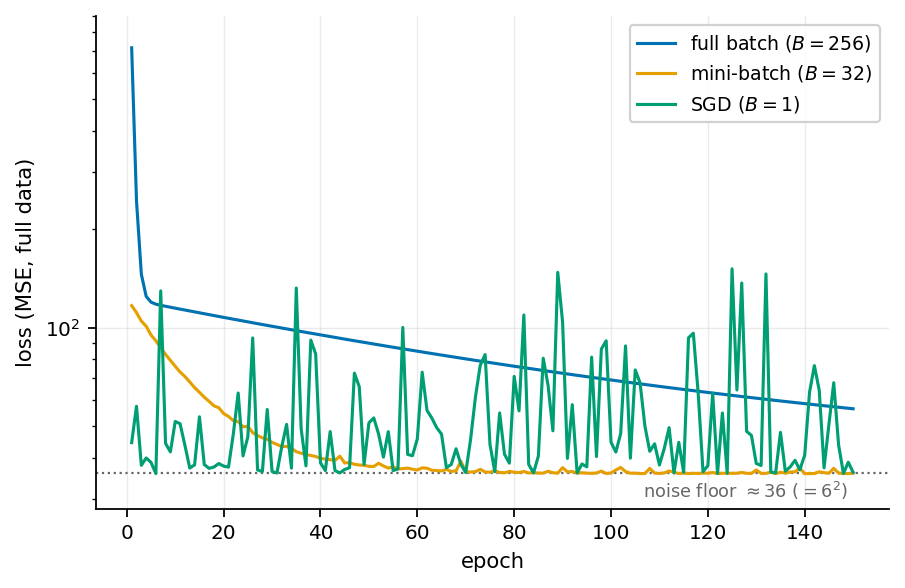

# 第5章 ミニバッチ — データを少しずつ食べる

> [目次](../TOC.md) ・ [← 前の章](04-training.md) ・ [次の章 →](06-generalization.md)

前章で学習が動きました。forward → loss → gradient → update の4拍子を回すと直線が自分でデータに合っていく——このループは第8巻の Transformer まで続く骨格です。

そのループには、まだ誰も疑問を向けていない1行があります。勾配を計算する行です。私たちは毎回、**手持ちのデータ全件**で勾配を計算していました。数百件なら問題ありませんが、論文が訓練に使ったのは**約450万の文ペア**です(Section 5.1)。パラメータを1歩動かすたびに450万件すべてを読み直すなら、勾配降下の1歩が途方もなく高くつきます。

この章のテーマは「1歩のコスト」です。答えはタイトルにあります。全部いっぺんに食べるのをやめて、**少しずつ食べる**のです。

## 5.1 全データで勾配 vs 1件ずつ vs ミニバッチ: 三つの流儀

勾配の計算にデータを何件使うのでしょうか。選択肢は3つあります。

**流儀1: 全データを使う。** これまでの私たちのやり方です。手持ちの $N$ 件すべてで勾配を計算します。名前は**バッチ勾配降下法**(batch gradient descent)です。「バッチ」は第1巻第6章で出会った、データをまとめて1つの行列にする単位です。勾配は正確ですが、データを1周してようやく1歩しか進めません。

**流儀2: 1件ずつ使う。** 正反対の極端です。1件だけ取り出して勾配を計算し、すぐ1歩動く。次の1件でまた1歩。名前は**確率的勾配降下法**(stochastic gradient descent)、略して **SGD** です。1周で $N$ 歩進めますが、1件から計算した勾配はその1件の都合しか反映せず、外れ値をつかめば見当違いの方向を指します。

**流儀3: 中間を取る。** 数十〜数百件の小さな束で勾配を計算します。この束を**ミニバッチ**(mini-batch)、束の件数を**バッチサイズ**(batch size)と呼びます。

一部のデータだけで計算した勾配を「正しい勾配」と呼べるのでしょうか。呼べる根拠があります。MSE の損失は、1件ごとの二乗誤差の**平均**でした。

$$L = \frac{1}{N} \sum_{i=1}^{N} \ell_i, \qquad \ell_i = (\hat{y}_i - y_i)^2$$

微分は和(と定数倍)を素通りしますから(第2巻)、勾配もまた平均になります。

$$\frac{\partial L}{\partial w} = \frac{1}{N} \sum_{i=1}^{N} \frac{\partial \ell_i}{\partial w}$$

つまり、**全データの勾配とは「1件ごとの勾配の平均値」のこと**です。鍋のスープの味を知るのに、鍋を飲み干す必要はありません。よくかき混ぜて、ひと匙すくえば足りる——ミニバッチの勾配はこのひと匙です。$B$ 件の勾配の平均は、$N$ 件の勾配の平均の**推定値**になっています。ぴったり一致はしませんが、だいたい合っています。

shape の言葉で言えば、全データ $X$ `(N, 1)` から $B$ 行を取り出した $X[\mathrm{batch}]$ `(B, 1)` を前章の勾配の式にそのまま流すだけです。式の形は変わらず、変わるのは行数だけです。

## 5.2 ミニバッチSGD: ノイズはあるが速くて十分(以後シリーズの標準)

流儀3でパラメータを更新していく方法を**ミニバッチSGD**(mini-batch SGD)と呼びます。深層学習の標準はこれです。そして**本章以降、このシリーズの訓練はすべてミニバッチSGDで行います**。第8巻の Transformer の訓練も同じです(実務で「SGD」と言えば、たいていこれです)。

なぜ中間が勝つのでしょうか。両端の弱点を整理すると見えてきます。

全データ流儀の弱点は過剰品質です。1歩のために全件分の計算を支払って得られるのは「正確な勾配」だけです。しかし勾配降下法は1歩進むたびに勾配を**計算し直す**のでした(第2巻)。どうせ次の地点で測り直すのですから、今の1歩は「だいたい下り方向」で充分です。

1件ずつ流儀の弱点は遅さです。計算が**1件ずつの forループ**になります。第1巻第4章のベンチマークの通り、NumPy は(第8巻で使う GPU はさらに極端に)、小さな計算を $N$ 回するより大きな塊の計算1回が圧倒的に得意です。1件ずつは一斉計算を捨てた最も遅い形で、おまけに勾配のノイズも最大です。

ミニバッチは、この2つの弱点のすき間に収まります。

- 勾配は $B$ 件の平均なので、1件ずつよりノイズが小さい
- データ1周あたり $N/B$ 回更新でき、全データ流儀より歩数が多い
- 1歩の計算は `(B, 1)` の行列演算の塊で、ハードウェアの得意な形

**ノイズはあるが、速くて、十分。** ただしミニバッチの学習曲線は全データのときのような滑らかな単調減少にはならず、loss は小刻みに揺れながら下がります。この揺れは故障ではなく正常な姿です。揺れてもなお到達は速い——それを 5.4 で数字にします。

## 5.3 epoch、step、shuffle という語彙の整備

ミニバッチを採用すると、「訓練がどれだけ進んだか」の数え方が2通りに分かれます。語彙を3つ整備します。**以後の巻では、この3語は断りなしに使います。**

**ステップ(step)** — パラメータを1回更新すること(4拍子のループ1回)。イテレーション(iteration)とも呼びますが、本シリーズではステップで統一します。

**エポック(epoch)** — 訓練データ全体をちょうど1周すること。$N$ 件をバッチサイズ $B$ で食べていくと、

$$1 \text{ エポック} = \lceil N / B \rceil \text{ ステップ}$$

です($\lceil \cdot \rceil$ は切り上げ。$N$ が $B$ で割り切れないときは、最後に端数の小さいバッチが1つできます)。全データ流儀は $B = N$、1件ずつ流儀は $B = 1$ の特別な場合——三つの流儀は、実は**バッチサイズという1つのつまみの両端と中間**にすぎません。

**シャッフル(shuffle)** — エポックの先頭でデータの順番を混ぜ直すこと。混ぜてから先頭順に $B$ 件ずつ切り出せば、毎エポック違う組み合わせのミニバッチができます。混ぜるのは順番だけで、1エポックに全データをちょうど1回ずつ使うことは変わりません。

なぜ混ぜるのでしょうか。**かき混ぜずにすくったひと匙は、推定値として信用できない**からです。現実のデータセットは収集した順(日付順、カテゴリ順)に並んでいることが珍しくなく、並び順に意味が残ったまま先頭から切り出すと、偏ったミニバッチの列が毎エポック同じ形で繰り返されます。シャッフルはこれを断ち切る、ほぼ無料の保険です(効く場面と効かない場面は問3で実験します)。

## 5.4 [コード] バッチサイズを変えて学習曲線のノイズと速度を観察

三つの流儀を同じ土俵で走らせます。全文と動作確認は `code/ch05/minibatch_sgd.py`(`python3` で全 assert 通過)です。データは第2章と同じレシピ(真の規則 $y = 7x + 20$ に標準偏差6のノイズ、seed 42)ですが、つまみを回す余地を作るため**256人分**に増えた設定とします。予測・損失・勾配の3関数は第4章の再掲です。

訓練ループは1つだけです。流儀の違いは `batch_size` のつまみだけだからです。二重ループの外側が**エポック**、内側の1周が**ステップ**、エポックの先頭が**シャッフル**——5.3 の語彙がそのままコードの構造になっています。

```python
def train(batch_size, n_epochs, lr, shuffle=True, seed=0):
    rng_shuffle = np.random.default_rng(seed)
    w = np.zeros((1, 1)); b = 0.0
    history = []; n_steps = 0
    for epoch in range(n_epochs):
        idx = np.arange(N)
        if shuffle:
            idx = rng_shuffle.permutation(N)   # エポックごとに順番を混ぜる
        for start in range(0, N, batch_size):
            batch = idx[start:start + batch_size]  # 端数が出たら小さいバッチ
            grad_w, grad_b = gradients(X[batch], y[batch], w, b)
            w = w - lr * grad_w
            b = b - lr * grad_b
            n_steps += 1
        history.append(mse(predict(X, w, b), y))   # 各エポック終了時の loss
    return w, b, history, n_steps
```

`gradients` は件数 `n` をデータから読み取るので、256行渡せば全データの勾配、32行ならミニバッチ、1行なら1件の勾配が同じ関数から出てきます。`history` に積むのは各エポック終了時の loss——学習曲線(第4章)の点列です。

5.1 の主張「全データの勾配は1件ごとの勾配の平均」は assert で確かめます。中身が近いが一致しないこと(推定値であること)も含めて検証しています。

```python
grad_w_full, grad_b_full = gradients(X, y, w0, b0)
per_sample = [gradients(X[i:i + 1], y[i:i + 1], w0, b0) for i in range(N)]
assert np.allclose(grad_w_full, np.mean([gw for gw, gb in per_sample], axis=0))
# ミニバッチ(32件)の勾配は形は同じ、中身は近いが一致しない=推定値
batch = np.arange(32)
grad_w_mb, grad_b_mb = gradients(X[batch], y[batch], w0, b0)
assert grad_w_mb.shape == grad_w_full.shape
assert not np.allclose(grad_w_mb, grad_w_full)
```

5.3 の語彙の会計も assert で確認します(`N=256, batch_size=32` なら 1エポック = 8 ステップ、5エポックで 40 ステップ。`permutation` は順番を混ぜるだけで全件を1回ずつ使う)。

本番の実験です。公平を期すため、**全員に同じ「データ1周」**(= 1エポック)を与え、どこまで loss が下がるかを比べます。違うのは同じ256件を何口に分けて食べたかだけです。

```python
for batch_size in [256, 32, 1]:
    _, _, history, n_steps = train(batch_size=batch_size, n_epochs=1, lr=0.01)
    print(f"batch_size={batch_size:>3}  steps={n_steps:>3}  loss={history[-1]:.3f}")
# 同じ「データ1周」でも、更新回数が多いほど loss が下がる
assert results_1epoch[1] < results_1epoch[32] < results_1epoch[256]
```

実行結果です。

```
batch_size=256  steps=  1  loss=718.182
batch_size= 32  steps=  8  loss=116.884
batch_size=  1  steps=256  loss=44.534
```

差は歴然です。出発点の loss はおよそ3,000です(`w=0, b=0` 始まり。点数の2乗のスケール)。同じ256件を読んだのに、全データ流儀は1歩しか動けず 718 で立ち尽くし、ミニバッチは8歩で 117 まで降り、1件ずつは256歩で 44.5——標準偏差6のノイズを足したので MSE は約 36($= 6^2$)が床——その床のすぐ近くに到達しています。**1歩の正確さより、歩数。** これがこの章の中心的な観察です。

ならば1件ずつが優勝かというと、そうではありません。長く走らせると(150エポック)もうひとつの顔が見えます。`batch_size=32` は 35.92、`batch_size=1` は 36.16 で、どちらも床(約36)にぴたりと着き、パラメータも正解 $(w, b) = (7, 20)$ のすぐそばです。ただし1件ずつは床に着いた後もいつまでも小さく跳ね続けます。勾配のノイズが大きく、谷底でも1件ごとの都合で揺さぶられるからです。全データは同じ150エポックでもまだ 56.5——滑らかですが、歩数が足りません。

```python
for batch_size in [32, 1]:
    w, b, history = final[batch_size]
    assert history[-1] < 38.0                  # 実測: 32 -> 35.92, 1 -> 36.16
    assert np.allclose(w, 7.0, atol=0.2)       # 正解 w=7 のすぐそば
    assert abs(b - 20.0) < 0.6                 # 正解 b=20 のすぐそば
assert final[256][2][-1] > 50.0                # 全データは150更新ではまだ途中(約56.5)
```

学習曲線の描画コード(matplotlib が必要)も `code/ch05/minibatch_sgd.py` に含めています。



図5.1: バッチサイズ別の学習曲線(縦軸は対数)。全データの曲線は完全に滑らかだが、降りるのが圧倒的に遅い。ミニバッチ(32)は数エポックで急降下し、わずかな揺らぎとともに床に張り付く。1件ずつ(SGD)は降下は速いが、床に着いた後もギザギザと震え続け、床の少し上に浮いたままになる——という3本の対比が見えるはずです。

5.2 の宣言「ノイズはあるが速くて十分」が数字で読めました。揺らぎ(ノイズ)は床への到達を妨げず(十分)、到達の速さは全データ流儀の比ではありません(速い)。

## 5.5 ここで論文 5.1 を覗き見: "batched together by approximate sequence length" — batch という言葉がもう読める

この巻のラスボス、Section 5 の一節を先に覗いてみましょう。巻頭では呪文にしか見えなかった文です。

> *"Sentence pairs were batched together by approximate sequence length. Each training batch contained a set of sentence pairs containing approximately 25000 source tokens and 25000 target tokens."*
> — Vaswani et al., "Attention Is All You Need", Section 5.1
>
> 訳: 文ペアは、おおよその系列長ごとにまとめてバッチ化された。各訓練バッチには、約25,000のソーストークンと約25,000のターゲットトークンからなる文ペアの集合が含まれていた。

**"batched together"、"training batch"——この章の言葉です。** 著者たちが何をしたのか、もう説明できます。450万の文ペアをミニバッチに分け、1ステップの勾配を1つのミニバッチから推定し、それを大量のステップで回した——私たちが256件の直線フィットでやったことと、営みとしては同一です。「batch」は未知の専門用語ではなく、**訓練ループの内側のループのこと**だと、コードの行レベルで指させるようになりました。

正直な線引きもしておきます。"sentence pairs" と "tokens"(文をどう数の行列にするか)は第6巻の主題で、まだ読めません。「なぜ**似た長さ**でまとめるのか」も深入りしませんが、第1巻の知識だけで推測はできます。問4で考えてみてください。

## まとめ

- 勾配計算に使うデータ量で3つの流儀がある: **全データ**(正確だが1周1歩)、**1件ずつ(SGD)**(1周 $N$ 歩だがノイズ最大・計算も遅い)、**ミニバッチ**(中間)。違いはバッチサイズ $B$ という1つのつまみだけ
- MSE の勾配は「1件ごとの勾配の**平均**」なので、ミニバッチの勾配は全データの勾配の**推定値**。形は同じ、中身は近いが一致しない
- ミニバッチSGDは**ノイズはあるが速くて十分**。1歩の正確さより歩数が効く。**以後、本シリーズの訓練はすべてミニバッチSGD**
- **ステップ** = パラメータ更新1回、**エポック** = 全データ1周($\lceil N/B \rceil$ ステップ)、**シャッフル** = エポックごとに順番を混ぜる保険。以後の巻で断りなく使う

**ラスボスとの距離**: 論文 Section 5.1 の "batched together"・"training batch" が、訓練ループの内側のループのこととして読めるようになりました。

## 演習

**問1** データが $N = 10{,}000$ 件、バッチサイズ $B = 32$ で10エポック訓練します。(a) 1エポックは何ステップですか(端数バッチがあればその件数も)。(b) 全体では何ステップですか。

**問2**(この章の主実験)バッチサイズ $B \in \{1, 32, 256\}$ と学習率 $\mathrm{lr} \in \{0.001, 0.005, 0.02, 0.03\}$ の全組み合わせを各30エポック訓練し、最終 loss の表を作ってください(コードは `code/ch05/ex_batchsize_lr.py` にもあります)。「ちょうどいい組み合わせ」にどんな関係があるか、1〜2文にまとめてください。

**問3** `train` を `shuffle=False` にすると、この章の実験結果はどれくらい変わるでしょうか。さらに、データを `X` の昇順に並べ替えてから `shuffle=False` で訓練したら? 予想を立ててから実験してください。

**問4** 論文はなぜ文ペアを「おおよその系列長ごとに(by approximate sequence length)」まとめたのでしょうか。ヒント: ミニバッチは1つの行列として一斉に計算したい。第1巻第3章の通り、行列は長方形です。そして文の長さはまちまちです。

<details>
<summary>略解</summary>

**問1** (a) $\lceil 10000 / 32 \rceil = 313$ ステップ。最後のバッチは $10000 - 312 \times 32 = 16$ 件の端数。(b) $313 \times 10 = 3{,}130$ ステップ。

**問2** 実測の表(30エポック後の loss。床は約36):

| lr | B=1 | B=32 | B=256 |
|---|---|---|---|
| 0.001 | **36.117** | 104.942 | 220.011 |
| 0.005 | 38.043 | 63.440 | 111.123 |
| 0.02 | 64.368 | 36.741 | 84.725 |
| 0.03 | 発散 | **35.921** | **72.432** |

良い組み合わせは対角線上に並ぶ: **小さいバッチには小さい lr、大きいバッチには大きい lr**。$B=1$ は lr=0.001 で床に着くのに、lr を上げるほど悪化し 0.03 で発散する——勾配の揺れが大股で増幅されるからです。逆に $B=256$ は勾配が安定しているので、表の中では大きい lr ほど良い(それでも30エポック=30更新では床に届いていません。更新回数の少なさは lr では完全には買い戻せない、という5.4の教訓の再確認でもあります)。バッチサイズと学習率は独立なつまみではなく、**ペアで調整するもの**。

**問3** 意外かもしれませんが、この章の実験では**ほとんど変わりません**(昇順に並べ替えても最終 loss はほぼ同じ値に収束します)。損失地形が椀型(第3章)なので、多少バッチが偏っても同じ谷底に吸い込まれるからです。それでもシャッフルを入れるのは、現実のデータは収集順に意味が残っていることが多く、地形も椀型とは限らないからです。そのリスクは、1行の `permutation` で消せるのです。

**問4** ミニバッチを1つの行列 `(B, 文の長さ)` として一斉に計算したいが、行列は長方形なので、バッチ内の文は同じ長さに揃える必要がある。長さがバラバラだと、短い文を最長の文に合わせて埋め草で水増しすることになり、計算の多くが埋め草に費やされる。**似た長さの文同士でまとめれば、水増しがほとんど要らない**——計算を無駄にしないための工夫と推測できる。

</details>

---

> [目次](../TOC.md) ・ [← 前の章](04-training.md) ・ [次の章 →](06-generalization.md)
