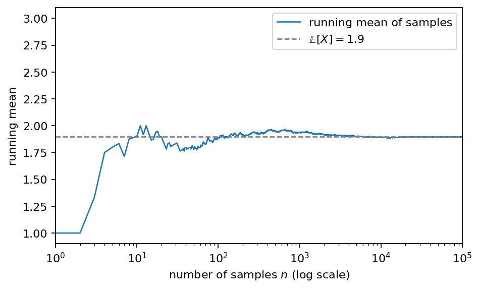

# 第2章 期待値と分散 — 分布を2つの数で要約する

> [目次](../TOC.md) ・ [← 前の章](01-probability.md) ・ [次の章 →](03-likelihood.md)

前の章で、私たちは不確かさを数にする言葉——確率変数と分布——を手に入れ、「明日の天気は」に続く単語のような「まだ決まっていないもの」を、とり得る値と確率の表として書けるようになりました。ところが論文は、分布を表では語りません。序章で掲げた脚注をもう一度見てください。

> *"To illustrate why the dot products get large, assume that the components of q and k are independent random variables with mean 0 and variance 1. Then their dot product, $q \cdot k = \sum_{i=1}^{d_k} q_i k_i$, has mean 0 and variance $d_k$."*
> — Vaswani et al., "Attention Is All You Need", Section 3.2.1, 脚注4
>
> 訳: 内積が大きくなりがちな理由を示すため、$q$ と $k$ の各成分が、平均 0・分散 1 の独立な確率変数だと仮定する。すると両者の内積 $q \cdot k = \sum_{i=1}^{d_k} q_i k_i$ は、平均 0・分散 $d_k$ を持つ。

論文は確率変数の素性を、たった2つの数で言い切っています。「だいたいどのあたりの値か」と「どれくらい散らばるか」です。この**平均(mean)**と**分散(variance)**が、この章の主役です。さらに脚注は、分散 1 の成分を $d_k$ 個集めて内積を作ると分散が $d_k$ に**育つ**とも言っています。1 がなぜ $d_k$ になるのでしょうか。その仕掛けの骨格も、この章で手に入れます。

## 2.1 期待値: 確率で重みづけた平均

前の章の単語当てゲームを続けます。「明日の天気は」に続く単語を、あるモデルがこう予想しているとします。

| 次の単語 | 確率 | 文字数 |
|---|---|---|
| 晴れ | 0.5 | 2 |
| 雨 | 0.3 | 1 |
| くもり | 0.2 | 3 |

確率変数 $X$ を「次に来る単語の**文字数**」とし(確率変数とは結果に数を割り当てたものでした)、「次の単語はだいたい何文字か」を1つの数で知りたいとします。

素朴な平均 $(2 + 1 + 3) / 3 = 2$ 文字は、3つの単語を**同じ重みで**数えています。実際には「晴れ」が半分の確率で出るのですから、2文字という結果は他より多く数えられるべきです。そこで、**各値を、その値が出る確率で重みづけて足し合わせます**。

$$2 \times 0.5 + 1 \times 0.3 + 3 \times 0.2 = 1.0 + 0.3 + 0.6 = 1.9$$

答えは 1.9 文字です。これが**期待値(expected value)**です。形式化すると、確率変数 $X$ がとり得る値を $x_1, \ldots, x_m$、それぞれの確率を $p(x_1), \ldots, p(x_m)$ として、

$$\mathbb{E}[X] = \sum_{i=1}^{m} x_i \, p(x_i)$$

読み方は「値 × 確率を、全部の値について足す」です。確率がすべて等しい($p = 1/m$)特別な場合に、ふつうの平均と一致します。期待値は重みつきの平均なので**平均(mean)**とも呼び、論文の "mean 0" の mean はこれです。

初学者が必ず引っかかる点を先回りしておきます。期待値 1.9 文字の単語は表のどこにもありません。期待値は「最も出やすい値」でも「実際に出る値」でもなく、**何度も引いたときの平均的な水準**を指す数です。これが本当に正しいことは、2.4節でコードを使って確かめます。

もうひとつ、後で使う小さな性質を拾っておきます。定数倍の期待値は $\mathbb{E}[aX] = a\,\mathbb{E}[X]$ です。文字数を2倍に数えれば平均文字数も2倍になる、というだけのことです。

## 2.2 分散と標準偏差: ばらつきの量

期待値だけでは分布の個性を語りきれません。次の2つのモデル(どちらも「次の単語の文字数」の予想)を比べてください。

- **モデルA**: 2文字の単語に確率 1.0(「晴れ」しか言わない)
- **モデルB**: 1文字に確率 0.5、3文字に確率 0.5(「雨」か「くもり」のどちらか)

期待値はどちらも 2 です(Bは $1 \times 0.5 + 3 \times 0.5 = 2$)。しかしAは毎回ぴったり2文字、Bは2文字ちょうどには決してならず期待値のまわりを行き来します。この**期待値からの散らばり具合**を測る2つめの数が欲しくなります。

測りたいのは「各値が期待値からどれだけ離れているか」です。期待値を $\mu = \mathbb{E}[X]$ と書くと、離れ具合は $X - \mu$——これを**偏差(deviation)**と呼びます。ただし偏差の期待値をとっても散らばりは測れません。モデルBで試すと $(1-2) \times 0.5 + (3-2) \times 0.5 = -0.5 + 0.5 = 0$ です。正と負の偏差が打ち消し合い、必ず 0 になるからです。

打ち消しを防ぐため、**偏差を2乗してから期待値をとります**。

$$\mathrm{Var}(X) = \mathbb{E}\big[(X - \mu)^2\big] = \sum_{i} (x_i - \mu)^2 \, p(x_i)$$

これが**分散(variance)**で、論文の "variance 1" の variance がこれです。モデルAの分散は 0(偏差が常に0)、モデルBの分散は $(-1)^2 \times 0.5 + 1^2 \times 0.5 = 1$ です。「Aはばらつかない、Bはばらつく」が、0 と 1 の差になりました。

2.1節の天気の分布でも計算しておきます。$\mu = 1.9$ なので、

$$\mathrm{Var}(X) = (2-1.9)^2 \times 0.5 + (1-1.9)^2 \times 0.3 + (3-1.9)^2 \times 0.2 = 0.005 + 0.243 + 0.242 = 0.49$$

気になるのは単位です。偏差を2乗したので、分散 0.49 の単位は「文字数の2乗」という奇妙なものです。もとの単位に戻すには平方根をとります。

$$\sigma = \sqrt{\mathrm{Var}(X)}$$

これを**標準偏差(standard deviation)**と呼びます。天気の例なら $\sigma = \sqrt{0.49} = 0.7$ 文字です。「次の単語は平均 1.9 文字、ばらつきは ±0.7 文字くらい」と、分布の輪郭が2つの数から浮かび上がります。

符号を消すだけなら絶対値 $|X - \mu|$ でもよかったはずです。なぜ2乗でしょうか。答えはこの章の後半、**2乗で定義した分散だけが持つ便利な性質**——次節の主題にあります。

最後に、定数倍の影響です。$X$ を $a$ 倍すると偏差も $a$ 倍になり、その2乗は $a^2$ 倍になります。

$$\mathrm{Var}(aX) = a^2 \, \mathrm{Var}(X)$$

検算: 値が $1$ か $3$(等確率)なら $\mu = 2$、分散 1 です。値を2倍して $2$ か $6$ にすると $\mu = 4$、偏差は $\mp 2$、分散は 4——確かに $2^2$ 倍です。逆に言えば、**$X$ を $\sqrt{c}$ で割ると、分散は $c$ 分の 1 になります**。この「平方根で割ると分散を割り算できる」関係——$\sqrt{d_k}$ の予感がしないでしょうか。まだ謎のままですが、道具は揃い始めています。

## 2.3 和の期待値・和の分散: 独立なら足せる

この章の山場です。脚注4の内積 $q \cdot k = \sum_{i=1}^{d_k} q_i k_i$ は、$d_k$ 個の項の**和**でした。**確率変数を足し合わせると、期待値と分散はどうなるのか**——これが論文を読むために避けて通れない問いです。

実験台には、$+1$ か $-1$ を等確率(0.5ずつ)でとる変数 $X$ を使います。脚注4の登場人物「平均 0・分散 1 の確率変数」の最小の見本だからです。検算すると、

$$\mathbb{E}[X] = 1 \times 0.5 + (-1) \times 0.5 = 0, \qquad \mathrm{Var}(X) = (1-0)^2 \times 0.5 + (-1-0)^2 \times 0.5 = 1$$

確かに平均 0、分散 1 です。

同じ分布に従う**独立な**2つの変数 $X$、$Y$ を足します。独立とは、一方の結果を知っても他方の出方が変わらないことです(第1章の言葉では $P(X, Y) = P(X)\,P(Y)$)。2枚のコインを別々に投げるところを想像すれば十分です。和 $X + Y$ のとり得る値は、組み合わせの表で全部わかります。

| $X$ | $Y$ | $X+Y$ | 確率 |
|---|---|---|---|
| $+1$ | $+1$ | $+2$ | $0.25$ |
| $+1$ | $-1$ | $0$ | $0.25$ |
| $-1$ | $+1$ | $0$ | $0.25$ |
| $-1$ | $-1$ | $-2$ | $0.25$ |

つまり $X+Y$ は「$+2$ が確率 $0.25$、$0$ が確率 $0.5$、$-2$ が確率 $0.25$」という分布です。定義どおり計算すると、

$$\mathbb{E}[X+Y] = 2 \times 0.25 + 0 \times 0.5 + (-2) \times 0.25 = 0$$
$$\mathrm{Var}(X+Y) = 2^2 \times 0.25 + 0^2 \times 0.5 + (-2)^2 \times 0.25 = 1 + 0 + 1 = 2$$

期待値は $0 + 0 = 0$、分散は $1 + 1 = 2$ です。**どちらも、1個ずつの値の足し算になっています。**これは偶然ではなく、一般に成り立つ法則です。

$$\mathbb{E}[X + Y] = \mathbb{E}[X] + \mathbb{E}[Y] \qquad \text{(いつでも成り立つ)}$$
$$\mathrm{Var}(X + Y) = \mathrm{Var}(X) + \mathrm{Var}(Y) \qquad \text{(独立なら成り立つ)}$$

2つの式の但し書きの違いに注意してください。期待値は無条件で、$X$ と $Y$ がどんなに絡み合っても成り立ちます。一方、**分散の加法性には「独立なら」という条件がつきます**。条件が本物であることは、わざと独立でない例で確かめられます。$Y$ に $X$ と**同じコインの結果**を使うと $X + Y = 2X$ で、前節の性質から分散は $4\,\mathrm{Var}(X) = 4$——足し算の答え 2 になりません。逆に $Y = -X$(常に逆の目)なら和は常に 0 で分散も 0 です。つまり連動の仕方しだいで和の分散は 0 から 4 まで動き、**連動が一切ない(独立な)ときにちょうど中間の $1+1=2$ に落ち着く**のです。独立とは、そういう「示し合わせのなさ」でした。

厳密な証明はしません(この本の流儀です)。代わりに2.4節でシミュレーションで検証します。いまは手計算の表が示した $1 + 1 = 2$ を信じて先へ進みましょう。

足す数を増やしても法則は繰り返し使えます。平均 0・分散 1 の独立な変数を $d$ 個足した和 $S = X_1 + X_2 + \cdots + X_d$ は、

$$\mathbb{E}[S] = 0, \qquad \mathrm{Var}(S) = \underbrace{1 + 1 + \cdots + 1}_{d \text{ 個}} = d, \qquad \sigma_S = \sqrt{d}$$

分散は $d$ に育ち、標準偏差は $\sqrt{d}$ です。ついに平方根つきの $d$ が私たちの計算から自然に出てきました。しかも前節の最後で見たとおり、$S$ を $\sqrt{d}$ で割れば $\mathrm{Var}(S/\sqrt{d}) = d / d = 1$ となり、**分散はちょうど 1 に戻ります**。

ここではっきり予告します。いま手に入れた「**独立なら分散は足せる**(だから $d$ 個足すと分散は $d$ 倍に育ち、$\sqrt{d}$ で割れば元に戻る)」という性質こそ、**第7章で $\sqrt{d_k}$ の謎——なぜ論文は内積を $\sqrt{d_k}$ で割るのか——を解く鍵になります**。脚注4の "mean 0 and variance 1" の成分を $d_k$ 個束ねると "mean 0 and variance $d_k$" になるという主張は、この節の $\mathrm{Var}(S) = d$ と同じ形です。残る隙間はひとつです。内積の各項は $q_i k_i$ という**積**であって $X_i$ そのものではありません。「平均 0・分散 1 の変数同士の積も、また平均 0・分散 1 になる」という最後のピースをはめる作業は第7章でやります。骨格は、もうあなたの手の中にあります。

## 2.4 [コード] サンプリングで期待値・分散を体感(大数の法則を図で)

手計算で出した 1.9 や 0.49 は、本当に「何度も引いたときの平均的な振る舞い」を言い当てているのでしょうか。検算機は**サンプリング(sampling)**です。分布から実際に何万回も値を引き、出てきた標本の平均・分散を手計算の値と突き合わせます。

最初のスクリプトは、2.1節の天気の分布で手計算を再現し、サンプリングがそこへ近づくことを確認します。核心は、分布の表 `lengths`/`probs` から定義どおり期待値・分散を出し、`rng.choice` で実際に引いた標本と照合する部分です。

```python
# 手計算の再現: 定義どおりに期待値と分散を出す
E_X = np.sum(lengths * probs)                 # 期待値: 値 × 確率 の総和
Var_X = np.sum((lengths - E_X) ** 2 * probs)  # 分散: 偏差の2乗の期待値

# サンプリング: この分布から実際に単語を引いてみる
for n in [10, 1_000, 100_000]:
    samples = rng.choice(lengths, size=n, p=probs)  # (n,)
    print(f"n={n:7d}  標本平均 {samples.mean():.4f}  標本分散 {samples.var():.4f}")
```

`rng.choice(lengths, size=n, p=probs)` は「値の候補 `lengths` から、確率 `p` に従って `n` 回引く」関数で、分布の表がそのままシミュレータになります。標本の平均と分散は `samples.mean()` と `samples.var()` で出ます。全文と動作確認は `code/ch02/sampling_lln.py` です(`python3` で全 assert 通過)。実行するとこうなります。

```
期待値(手計算): 1.90
分散  (手計算): 0.49
n=     10  標本平均 1.8000  標本分散 0.5600
n=   1000  標本平均 1.8980  標本分散 0.4836
n= 100000  標本平均 1.8961  標本分散 0.4922
ok: 標本平均 → 期待値、標本分散 → 分散 への接近を確認しました
```

10回ではまだ粗いです(1.80)。1000回で小数2桁が合い始め、10万回で 1.896——手計算の 1.9 にぴたりと寄ります。分散も同じ道をたどって 0.49 へ近づきます。この「標本を増やすほど標本平均が期待値に近づく」現象には**大数の法則(law of large numbers)**という名前がついています。2.1節で「期待値とは何度も引いたときの平均的な水準だ」と言ったのは、この法則の前借りでした。

近づいていく**過程**は、1回引くごとに「ここまでの平均」を計算し直して推移を描くと一目でわかります(図を描くコードは掲載のみ、写経しなくても先へ進めます)。`running_mean = np.cumsum(samples) / np.arange(1, n + 1)` が要で、横軸を対数目盛にして `E_X = 1.9` の破線と重ねます。全文は `code/ch02/sampling_lln.py` と同じ流儀で matplotlib を使えば再現できます。



**図2.1**: ここまでの標本平均(青い線)の推移と、期待値 1.9(灰色の破線)。横軸はサンプル数(対数目盛)。

見えるはずのものはこうです。左端(最初の数回)では青い線は 1 と 3 の間を乱暴に跳ね回ります。それが $n$ の増加とともに振幅を狭め、右へ行くほど破線 1.9 に巻きついて離れなくなります。期待値とは、この線が落ち着く先のことです。

2本目のスクリプトは、2.3節の主張——**独立な変数を $d$ 個足すと分散は $d$ 倍に育つ**——のシミュレーション版です。±1 の成分を $d$ 個束ねた和を10万回作り、その分散を測ります。核心は次の部分です。

```python
for d in [1, 4, 16, 64]:
    parts = rng.choice([-1.0, 1.0], size=(n, d))  # 平均0・分散1の独立な成分 (n, d)
    S = parts.sum(axis=1)                         # d 個の和を n 回分 (n,)

    assert np.allclose(S.var(), d, rtol=0.05)         # 分散は d 倍に育つ
    scaled = S / np.sqrt(d)                            # √d で割ると……
    assert np.allclose(scaled.var(), 1.0, atol=0.05)  # 分散1に戻る
```

`parts` は形 `(n, d)` の行列で、1行が「$d$ 個の独立な成分の1セット」、それが10万行。`sum(axis=1)` で行ごとに足せば和 $S$ の標本が10万個できます(axis の使い方は第1巻3章のとおり)。全文と動作確認は `code/ch02/sum_of_components.py` です(`python3` で全 assert 通過)。実行結果はこうなります。

```
 d     平均      分散  (理論値)  標準偏差  (√d)
  1  +0.0018     1.000  (  1)      1.000  (1.000)
  4  +0.0028     3.994  (  4)      1.999  (2.000)
 16  -0.0037    16.086  ( 16)      4.011  (4.000)
 64  -0.0143    64.120  ( 64)      8.007  (8.000)
```

読みどころは3つです。第一に、**平均はどの $d$ でもほぼ 0** です($0$ を何個足しても $0$)。第二に、**分散はほぼ正確に $d$**——$1 \to 4 \to 16 \to 64$ と足した個数のとおりに育ち、手計算で確かめた $d=2$ の先、$d=64$ でも法則は揺るぎません。第三に、標準偏差は $\sqrt{d}$ の列とぴたり一致し、**和を $\sqrt{d}$ で割れば分散は 1 に戻ります**。$d_k$ 次元の内積を $\sqrt{d_k}$ で割る——論文のあの操作と同じ形のリハーサルが、いまここで成功したのです。本番(積の和への適用)は第7章です。

## まとめ

- 期待値 $\mathbb{E}[X] = \sum_i x_i\,p(x_i)$ は「値 × 確率」の総和、すなわち確率で重みづけた平均。論文の mean はこれ
- 分散 $\mathrm{Var}(X) = \mathbb{E}[(X-\mu)^2]$ は偏差の2乗の期待値で、ばらつきの量。平方根をとった標準偏差 $\sigma$ はもとの単位に戻る。論文の variance はこれ
- 定数倍は $\mathrm{Var}(aX) = a^2\,\mathrm{Var}(X)$。とくに $\sqrt{c}$ で割ると分散は $c$ 分の 1
- 和の期待値はいつでも足せる。**和の分散は独立なら足せる**。平均 0・分散 1 の独立な変数を $d$ 個足すと、平均 0・分散 $d$・標準偏差 $\sqrt{d}$ になり、$\sqrt{d}$ で割れば分散 1 に戻る——第7章で $\sqrt{d_k}$ の謎を解く鍵
- 標本平均は、標本を増やすほど期待値に近づく(大数の法則)。サンプリングは手計算の検算機として、この巻でずっと使う

**ラスボスとの距離**: 脚注4の "mean 0 and variance 1" と "has mean 0 and variance $d_k$" が、語彙としても理屈の形としても読めるようになりました。残るは各項が積 $q_i k_i$ であることの処理(第7章)です。

## 演習

**演習1** 天気のモデルが改訂され、「明日の天気は」に続く単語の分布が次のようになりました。文字数 $X$ の期待値・分散・標準偏差を手計算してください。

| 次の単語 | 確率 | 文字数 |
|---|---|---|
| 雨 | 0.5 | 1 |
| 晴れ | 0.25 | 2 |
| かみなり | 0.25 | 4 |

<details><summary>略解</summary>

$\mathbb{E}[X] = 1 \times 0.5 + 2 \times 0.25 + 4 \times 0.25 = 0.5 + 0.5 + 1.0 = 2.0$。
$\mathrm{Var}(X) = (1-2)^2 \times 0.5 + (2-2)^2 \times 0.25 + (4-2)^2 \times 0.25 = 0.5 + 0 + 1.0 = 1.5$。
$\sigma = \sqrt{1.5} \approx 1.22$ 文字。

</details>

**演習2** 演習1の手計算を、サンプリングで一致確認するコードを書いてください。100万回サンプリングし、標本平均・標本分散が手計算の値と(`atol=0.01` で)一致することを `assert` で確かめること。

<details><summary>略解</summary>

```python
# 第4巻 第2章 演習2 略解: 演習1の手計算をサンプリングで一致確認する
import numpy as np

rng = np.random.default_rng(42)

# 「明日の天気は」の改訂版: 雨 / 晴れ / かみなり
lengths = np.array([1.0, 2.0, 4.0])   # 単語の文字数
probs = np.array([0.5, 0.25, 0.25])   # それぞれの確率

# 手計算(演習1)の値
E_X = np.sum(lengths * probs)
Var_X = np.sum((lengths - E_X) ** 2 * probs)
assert np.allclose(E_X, 2.0)
assert np.allclose(Var_X, 1.5)

# サンプリングで一致確認
samples = rng.choice(lengths, size=1_000_000, p=probs)  # (1000000,)
print(f"標本平均 {samples.mean():.4f}  (手計算 {E_X:.1f})")
print(f"標本分散 {samples.var():.4f}  (手計算 {Var_X:.1f})")

assert np.allclose(samples.mean(), E_X, atol=0.01)
assert np.allclose(samples.var(), Var_X, atol=0.01)
print("ok: 手計算とシミュレーションが一致しました")
```

実行すると標本平均 2.0000、標本分散 1.5006 となり、一致が確認できます(`code/ch02/ex02_check_by_sampling.py`)。

</details>

**演習3** $X$ を「$+1$ か $-1$ を等確率でとる変数」とします。(a) $X$ と独立な同分布の変数 $Y$ について $\mathrm{Var}(X+Y)$、(b) $\mathrm{Var}(2X)$ をそれぞれ手計算し、値が食い違う理由を「独立」という言葉を使って説明してください。

<details><summary>略解</summary>

(a) 独立なので分散は足せて $\mathrm{Var}(X+Y) = 1 + 1 = 2$(2.3節の表のとおり)。(b) $\mathrm{Var}(2X) = 2^2 \times 1 = 4$。$2X = X + X$ は「自分自身との和」で、2つの項が完全に連動しており独立ではありません。独立なら半々の確率で起きる打ち消し合い($+1$ と $-1$ の組)が決して起きず、揺れが常に同じ方向に重なるため、分散が加法の答え 2 を超えて 4 まで膨らみます。

</details>

**演習4** 平均 0・分散 1 の独立な確率変数を 100 個足した和 $S$ について、(a) $\mathbb{E}[S]$、(b) $\mathrm{Var}(S)$、(c) 標準偏差、(d) $S$ を何で割れば分散 1 に戻るか、を答えてください。余力があれば、`sum_of_components.py` の `d` のリストに 100 を加えて、シミュレーションでも確認してください。

<details><summary>略解</summary>

(a) $0$(期待値はいつでも足せる)。(b) 独立なので $1 \times 100 = 100$。(c) $\sqrt{100} = 10$。(d) $\sqrt{100} = 10$ で割れば $\mathrm{Var}(S/10) = 100/100 = 1$。シミュレーションでも、分散がほぼ 100、$S/10$ の分散がほぼ 1 になることが確認できます。これが第7章で $d_k$ 次元の内積に対して行うことの予行演習です。

</details>

---

> [目次](../TOC.md) ・ [← 前の章](01-probability.md) ・ [次の章 →](03-likelihood.md)
