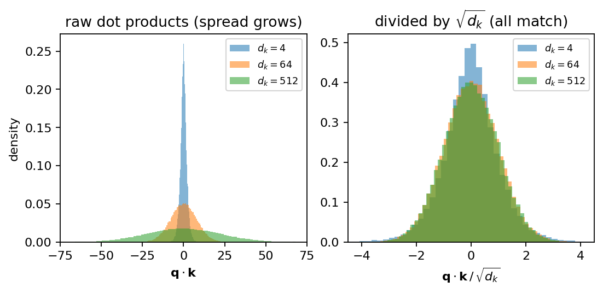

# 第7章 内積の分散と √d_k — 伏線回収

> [目次](../TOC.md) ・ [← 前の章](06-softmax.md) ・ [次の章 →](08-boss-rematch.md)

ラスボスの式(1)

$$\mathrm{Attention}(Q, K, V) = \mathrm{softmax}\!\left(\frac{QK^T}{\sqrt{d_k}}\right)V$$

のうち、読めない記号は $\sqrt{d_k}$ ただ1つになりました。第1巻序章で「確率の道具が必要だ」と白状して以来持ち越されてきた、シリーズ最古の宿題です。この章は同時に伏線回収の章でもあります。第2章で「独立な和の分散は足せる」を学んだとき**この性質が終盤で効く**と予告しました。その終盤がここです。

この章が倒すのは論文の脚注4です。原文を見ます。

> *"To illustrate why the dot products get large, assume that the components of q and k are independent random variables with mean 0 and variance 1. Then their dot product, $q \cdot k = \sum_{i=1}^{d_k} q_i k_i$, has mean 0 and variance $d_k$."*
> — Vaswani et al., "Attention Is All You Need", Section 3.2.1, 脚注4
>
> 訳: なぜ内積が大きくなるかを示すために、$q$ と $k$ の成分が、平均0・分散1の独立な確率変数だと仮定しよう。すると両者の内積 $q \cdot k = \sum_{i=1}^{d_k} q_i k_i$ は、平均0・分散 $d_k$ を持つ。

巻頭でこの文を見たとき、mean も variance も independent も読めない単語でした。いまは全部、第1章・第2章で手に入れた言葉です。章末の演習では、この脚注を自分の言葉で書き直してもらいます。

## 7.1 問い: 次元 d_k のベクトル同士の内積は、どれくらいの大きさになるか

式(1)の $QK^T$ は、第1巻第4章で読めるようになった「内積の総当たり表」でした。その1マスは、クエリ $\mathbf{q}$ `(d_k,)` とキー $\mathbf{k}$ `(d_k,)` の内積 $\mathbf{q} \cdot \mathbf{k}$ です。$d_k$ はベクトルの次元で、論文では 64 です。この内積——「スコア」と呼びます——が第6章の softmax に入力されます。

問いはこうです。**次元 $d_k$ のベクトル同士の内積は、どれくらいの大きさになるか。**

内積の定義(第1巻第2章)は、

$$\mathbf{q} \cdot \mathbf{k} = q_1 k_1 + q_2 k_2 + \cdots + q_{d_k} k_{d_k}$$

掛けて足すだけです。注目すべきは**足される項が $d_k$ 個ある**ことです。項が増えれば合計も大きくなりそうですが、符号がばらばらなら正負が打ち消し合って案外大きくならないかもしれません。「なりそう/ならないかも」では進みません。成分を**確率変数**(第1章)とみなし、内積という確率変数の**平均と分散**(第2章)を求めます。

仮定は脚注4が指定済みです。$\mathbf{q}$ と $\mathbf{k}$ の各成分は**平均0・分散1で、互いに独立**です。厳密なモデルではなく規模の見積もりのための仮定ですが(平均0の乱数で初期化されたパラメータを通った直後のベクトル成分はだいたいこんな顔をしています)、見積もりとして驚くほどよく当たることを 7.4 で確かめます。

## 7.2 第2章の道具で計算: 成分が平均0・分散1で独立なら、内積の分散は d_k(脚注4の再現)

内積は $d_k$ 個の項の和です。和の平均と分散なら第2章に道具があります。**独立なら、和の期待値も分散も足せます**。だから**1項** $q_i k_i$ の平均と分散がわかれば、あとは $d_k$ 個分足すだけです。

ここで第2章の「和」を「積」へ延長する小さな補題が要ります。**独立な確率変数では、積の期待値は期待値の積です**:

$$\mathbb{E}[q_i k_i] = \mathbb{E}[q_i]\,\mathbb{E}[k_i]$$

直観はこうです。独立とは「$q_i$ の値を知っても $k_i$ の出方は変わらない」ことです(第1章)。だから $q_i$ がどんな値でも、掛かる $k_i$ の平均値はいつも $\mathbb{E}[k_i]$ のままです。結局、積の平均は「$q_i$ の平均 × $k_i$ の平均」に落ち着きます。独立でないと成り立たない点には注意してください。

この補題で1項の**平均**はすぐ出ます。

$$\mathbb{E}[q_i k_i] = \mathbb{E}[q_i]\,\mathbb{E}[k_i] = 0 \times 0 = 0$$

次に1項の**分散**です。第2章の計算用の形 $\mathrm{Var}(X) = \mathbb{E}[X^2] - (\mathbb{E}[X])^2$ を使います。$\mathbb{E}[q_i k_i] = 0$ なので第2項が消え、

$$\mathrm{Var}(q_i k_i) = \mathbb{E}[(q_i k_i)^2] = \mathbb{E}[q_i^2 \, k_i^2] = \mathbb{E}[q_i^2]\,\mathbb{E}[k_i^2]$$

最後の等号は、$q_i, k_i$ が独立なら $q_i^2, k_i^2$ も独立(2乗しても連動は生まれない)なので、補題がそのまま使えるためです。同じ計算用の形を逆向きに使えば $\mathbb{E}[q_i^2] = \mathrm{Var}(q_i) + (\mathbb{E}[q_i])^2 = 1 + 0 = 1$。$k_i$ も同様。よって、

$$\mathrm{Var}(q_i k_i) = 1 \times 1 = 1$$

1項は平均0・分散1です。あとは仕上げです。内積はこの項を $d_k$ 個足したもので、各項は独立です。**独立な和の期待値と分散は足せる**(第2章2.3)ので、

$$\mathbb{E}[\mathbf{q} \cdot \mathbf{k}] = 0 + \cdots + 0 = 0, \qquad \mathrm{Var}(\mathbf{q} \cdot \mathbf{k}) = 1 + \cdots + 1 = d_k$$

> 平均0・分散1の独立な成分を持つベクトル同士の内積は、**平均0・分散 $d_k$** を持つ。

これが脚注4の全文です。読めました。論文が2文で済ませた計算の中身は、第2章の道具に積の補題を1つ足しただけでした。

数の感覚に直します。ばらつきの「ものさし」は分散の平方根、標準偏差でした(第2章)。内積の標準偏差は $\sqrt{d_k}$。$d_k = 4$ なら2、$d_k = 64$(論文の値)なら8、$d_k = 512$ なら約22.6。次元を増やすほど、スコアは $\sqrt{d_k}$ のペースで典型的に大きくなります。

治療法もすでに第2章にあります。確率変数を $a$ 倍すると分散は $a^2$ 倍です。内積を $\sqrt{d_k}$ で割れば、分散は

$$d_k \times \left(\frac{1}{\sqrt{d_k}}\right)^2 = 1$$

次元が4でも512でも、割った後のスコアの分散は必ず1に戻ります。**式(1)の $\sqrt{d_k}$ の割り算は、内積の分散を次元によらず1に揃える正規化**だったのです。

——と種明かしを急ぎましたが、肝心の問いが残っています。スコアの分散が大きいと**何が困る**のでしょうか。分散1に戻したい理由がなければ、割る理由もありません。

## 7.3 大きすぎるスコアを softmax に入れると何が起きるか: 分布が尖り、勾配が死ぬ(第3巻エピローグと同じ病気)

論文は困る理由をこう書きます(式(1)の直後、脚注4が付いている当の文)。

> *"We suspect that for large values of d_k, the dot products grow large in magnitude, pushing the softmax function into regions where it has extremely small gradients. To counteract this effect, we scale the dot products by 1/√d_k."*
> — Vaswani et al., "Attention Is All You Need", Section 3.2.1
>
> 訳: $d_k$ が大きいとき、内積の値が大きくなり、softmax 関数を**勾配が極端に小さい領域へ押し込んでしまう**のではないかと我々は疑っている。この効果を打ち消すため、内積を $1/\sqrt{d_k}$ 倍する。

「勾配が極端に小さい領域」——この巻の読者なら嫌な記憶がよみがえるはずです。順に見ます。

スコアが大きいと softmax がどうなるでしょうか。これは第6章6.5の**温度**そのものです。softmax 前にスコアを $c$ 倍するのは温度を $1/c$ に下げるのと同じでした。スコアの標準偏差は $\sqrt{d_k}$ でした。つまり**割り算をサボると、標準偏差1のスコアを温度 $1/\sqrt{d_k}$ で焚いたのと同じ**です。$d_k = 512$ なら温度0.044——第6章の感覚でほぼ argmax です。出てくるのは1つのキーに確率をほぼ全部注ぎ込んだ、one-hot すれすれの尖った分布です。

尖ること自体は罪ではありません。問題は**学習**です。

softmax の出力が入力にどう反応するかを勾配で見ます。softmax は $n$ 個のスコアから $n$ 個の確率を返すので、勾配は「スコア $z_j$ を動かしたら確率 $p_i$ がどれだけ動くか」を全組み合わせで並べた $n \times n$ の表になります。これを**ヤコビ行列**(Jacobian matrix)と呼びます。softmax のヤコビ行列はきれいな形になることが知られています:

$$\frac{\partial p_i}{\partial z_j} = p_i (\delta_{ij} - p_j) \qquad (\delta_{ij} \text{ は } i = j \text{ のとき1、それ以外0})$$

導出はしません(7.4 のコードで第2巻第1章の数値微分と突き合わせて検算します)。代わりに**尖った分布を代入**してみてください。$p_1 \approx 1$、残りすべて $p_i \approx 0$ とします。

- $p_i \approx 0$ の行: 先頭に $p_i$ が掛かるので行ごとほぼ0
- $p_1 \approx 1$ の行: 対角成分は $p_1(1 - p_1) \approx 1 \times 0 = 0$、非対角成分は $-p_1 p_j \approx 0$

**全成分がほぼゼロです。**スコアをどう動かしても出力分布はほとんど動きません。この softmax を通り抜けようとする勾配は、ここでほぼ全滅します。

この光景には見覚えがあります。**第3巻エピローグと同じ病気です。**あのとき、シグモイドの出力が0や1の端に振り切れ「ほぼ最悪の場所なのに足元は実測でほぼ真っ平ら」という平原を観測しました。自信を持って間違えている点ほど勾配が小さい——いちばん反省すべき点がいちばん黙っている。あれです。シグモイドは softmax の2クラス版ですから、同じ病気が出るのは当然で、病巣も同じです。$e^z$ は出力が端に張り付くと入力の変化にほとんど反応しなくなります。**飽和**(saturation)です。

ただし**処方箋は違います**。第4章で同じ病気を治した薬は損失関数の交換でした。MSE を捨てて負の対数尤度にすると、損失の $\log$ が出力の $\exp$ を打ち消し、勾配が $(y - t)$ のきれいな形に戻る(第6章6.3で softmax + cross-entropy でも同じ形を見ました)。ところが式(1)の softmax にはこの薬が使えません。softmax の出力は損失に直行せず $V$ に掛かります。この softmax は計算の**途中**に挟まる部品で(なぜそこに挟まるかは第7巻)、出口で $\log$ に打ち消してもらえる立場にないのです。

出口で治せないなら**入口で治す**——スコアが大きすぎて飽和するなら、softmax に渡す前に分散を1に戻せばいいのです。そのために割るべき数こそ、7.2 で求めた $\sqrt{d_k}$ です。

$$\mathrm{softmax}\!\left(\frac{\mathbf{q} \cdot \mathbf{k}}{\sqrt{d_k}}\right)$$

同じ病気、別の処方箋です。論文の "Scaled Dot-Product Attention" の **scaled** は、この1回の割り算を指しています。

## 7.4 [コード] d_k を変えて内積のヒストグラム → softmax 後の分布 → 勾配の大きさ、を観察 — √d_k で割ると治る

ここまでは仮定の上の見積もりでした。第3巻エピローグの流儀で**実測**します。観測したいことは3つです。

1. **内積のばらつき**: 標準偏差は本当に $\sqrt{d_k}$ に比例するか(脚注4の再現)
2. **softmax 後の分布の尖り**: $d_k$ が大きいほど尖るか。尖りはエントロピー(第5章)で測ります
3. **勾配の大きさ**: $d_k$ が大きいほど勾配が死ぬか。ヤコビ行列の全成分の二乗和の平方根(フロベニウスノルム)で「勾配の通り道の太さ」を測ります

$d_k \in \{4, 64, 512\}$ で比較します。64は論文の値、512は「ヘッド分割をせず $d_{model}$ のままやったら」に相当します。各 $d_k$ でクエリ1本とキー64本を平均0・分散1の正規乱数で作り、内積64本を softmax に通す——これを1000回繰り返します。核心は、検算済みの3つの道具(softmax・エントロピー・ヤコビ行列)です。

```python
def softmax_jacobian(p):
    """softmax の勾配(ヤコビ行列): J[i, j] = p_i (δ_ij − p_j)。(n, n)"""
    return np.diag(p) - np.outer(p, p)
```

7.3 で導出抜きに掲げた式 $p_i(\delta_{ij} - p_j)$ は、コード内で数値微分(第2巻第1章の中心差分)と突き合わせ `assert np.allclose(...)` で一致を確認しています。本体ループは各 $d_k$ で内積を作り、割らない／$\sqrt{d_k}$ で割るの両方を softmax に通します(softmax 後の観測量は1000試行の**中央値**で報告。平均だと接戦になった少数試行に引きずられ、典型的な1回の姿が見えにくいため)。

```python
scores = (K * q).sum(axis=1)         # 内積64本 (n_keys,)。K @ q と同じ(第1巻第4章)
p_raw = softmax(scores)                       # そのまま softmax(割らない)
p_scaled = softmax(scores / np.sqrt(d_k))     # √d_k で割ってから softmax
```

全文と動作確認は `code/ch07/sqrt_dk_experiment.py` です(`python3` で全 assert 通過)。実行すると、こんな表が出ます。

```
設定: キー 64 本, 試行 1000 回, 成分は平均0・分散1の正規乱数
エントロピーと勾配ノルムは試行の中央値(典型的な1回の試行の姿)で報告する

d_k   | 内積のstd   √d_k  | エントロピー 生/÷√d_k | 勾配ノルム 生/÷√d_k
--------------------------------------------------------------------------
    4 |     1.96   2.00 |  2.959 /  3.798   | 0.2564 / 0.1693
   64 |     7.98   8.00 |  0.563 /  3.719   | 0.2202 / 0.1778
  512 |    22.60  22.63 |  0.017 /  3.710   | 0.0043 / 0.1788
```

列を順に読みます。

**観測1(内積のばらつき)**: 実測の標準偏差は 1.96、7.98、22.60。理論値 $\sqrt{d_k}$ = 2.00、8.00、22.63 とほぼぴったり。7.2 の机上計算が実測と3桁一致しました。脚注4、数値でも再現です。

**観測2(分布の尖り)**: 「生」の列(割らずに softmax へ)を縦に見ます。エントロピーは 2.959 → 0.563 → 0.017 と急落します。64択の分布のエントロピー上限は $\ln 64 \approx 4.16$ ナットですから、$d_k = 512$ の 0.017 は「64の選択肢があるのに不確かさがほぼゼロ」という尖り切った状態です。

**観測3(勾配)**: 勾配ノルムは 0.2564 → 0.2202 → 0.0043 です。$d_k = 512$ では $d_k = 4$ のときの**60分の1**まで痩せ細っています。第3巻エピローグの平原が softmax でも再現されました。

最後に「÷√d_k」側(割ってから softmax へ)を縦に見ます。エントロピーは 3.798 / 3.719 / 3.710、勾配ノルムは 0.1693 / 0.1778 / 0.1788 です。**どちらも $d_k$ にほとんど依存しません。**次元を4から512まで128倍に振っても、softmax から見える景色は変わりません。割り算1回で治りました。

コードはこの観測を assert で固定しています(内積の平均≈0かつ標準偏差/√d_k≈1、割らないと $d_k$ とともにエントロピーと勾配ノルムが単調減少、割れば両者が $d_k$ によらずほぼ一定)。全 assert 通過後に要約がプリントされます。

内積の分布そのものも目で見ておくと記憶に残ります(描画コードは `code/ch07/sqrt_dk_experiment.py` 参照)。



図7.1: 内積のヒストグラム。左(割る前)は、$d_k$ が大きいほど釣鐘が横に広がり、$d_k = 512$ の釣鐘は $\pm 60$ あたりまで裾を引きます。右($\sqrt{d_k}$ で割った後)は、3つの釣鐘がほぼ同じ幅(標準偏差1)にぴたりと重なります。

## 7.5 perplexity: エントロピーの指数。言語モデルの「平均分岐数」

最後にこの巻の在庫一掃です。巻頭のラスボスには未読の単語がもう1つ残っていました。論文 Section 5.4 の **perplexity** です。部品はすべて揃っていて、定義は1行で書けます。

エントロピー $H(p)$ は分布の不確かさの量でした(第5章)。便利ですが「3.71ナット」と言われても不確かさの**程度**が直観に響きません。そこでエントロピーを指数の肩に乗せ返します:

$$\mathrm{perplexity}(p) = e^{H(p)}$$

これだけです。嬉しさは一様分布で見えます。$K$ 択の一様分布のエントロピーは $\ln K$(第5章)。だから perplexity は $e^{\ln K} = K$。つまり perplexity は**「この分布の迷いは実質何択ぶんか」**を答える量です。対数の世界の住人であるエントロピーを、「選択肢の個数」という人間の感覚へ戻したもの——**平均分岐数**(average branching factor)とも呼ばれます。

7.4 の数字で味わいます。$\sqrt{d_k}$ で割った後の softmax のエントロピーは約3.71。perplexity は $e^{3.71} \approx 41$。キーは64本なので「64択のうち実質41択ぶん迷っている」、ほどよく開かれた分布です。割らなかった $d_k = 512$ ではエントロピー0.017、perplexity は $e^{0.017} \approx 1.02$。**実質1択**、迷いゼロの決め打ち。同じ64本のキーを前に、片や41択、片や1択——割り算1回の差を、この2つの数字がよく語っています。

予告です。perplexity の本格的な出番は**第6巻**です。言語モデルとは「次の単語」の確率分布を出す機械で、その良し悪しは「次の単語を実質何択まで絞り込めているか」で測れます。perplexity はその標準の物差しとして言語モデルの評価に本格登場します。論文 Section 5.4 の "This hurts perplexity"(label smoothing は perplexity を悪化させる)という一文は、終章で再読します。

## まとめ

- 成分が平均0・分散1で独立なベクトル同士の内積は、**平均0・分散 $d_k$**(標準偏差 $\sqrt{d_k}$)。第2章の「独立な和の分散は足せる」に「独立な積の期待値は期待値の積」を足すだけで導けました——論文の脚注4の再現です
- ばらつき $\sqrt{d_k}$ のスコアをそのまま softmax に入れると、温度 $1/\sqrt{d_k}$ で焚いたのと同じになり、分布が尖って**勾配が死にます**。シグモイドの飽和で学習が止まった**第3巻エピローグと同じ病気**です
- ただし処方箋は違います。式(1)の softmax は計算の途中に挟まる部品で、log loss に打ち消してもらえないため、**入口でスコアを $\sqrt{d_k}$ で割って分散を1に戻します**。これが "scaled" dot-product の正体です
- 実験でも、内積の標準偏差は $\sqrt{d_k}$ と一致し、割らなければ尖りと勾配死が進行し、割れば観測量が $d_k$ に依存しなくなることを assert で固定しました
- **perplexity はエントロピーの指数 $e^{H}$**。分布の迷いを「実質何択か」(平均分岐数)で言い直した量で、第6巻で言語モデルの評価指標として本格登場します

**ラスボスとの距離**: 式(1)の最後の未読記号 $\sqrt{d_k}$ が読めました。$Q, K, V, K^T$(第1巻)、softmax(第6章)、$\sqrt{d_k}$(本章)——役者は揃いました。終章で、式(1)に再戦します。

## 演習

**問1** 成分が平均0・**分散 $\sigma^2$** の独立な確率変数であるベクトル $\mathbf{q}, \mathbf{k}$ `(d_k,)` について、内積 $\mathbf{q} \cdot \mathbf{k}$ の平均と分散を求めてください。スコアの標準偏差を1に揃えるには、何で割ればよいですか。

<details><summary>略解</summary>

1項 $q_i k_i$ の平均は $\mathbb{E}[q_i]\mathbb{E}[k_i] = 0$。分散は $\mathbb{E}[q_i^2]\mathbb{E}[k_i^2] = \sigma^2 \cdot \sigma^2 = \sigma^4$。独立な $d_k$ 項の和なので、内積の平均は0、分散は $d_k \sigma^4$、標準偏差は $\sigma^2 \sqrt{d_k}$。割るべき数は $\sigma^2 \sqrt{d_k}$ です。$\sigma = 1$ のときだけ論文の $\sqrt{d_k}$ に一致します(論文の割り算が「成分の分散が1程度」という前提に寄りかかっていることがわかります)。

</details>

**問2** 3択の分布 $p = (1/2,\ 1/4,\ 1/4)$ のエントロピー(ナット)と perplexity を手で計算してください。出てきた perplexity を「平均分岐数」として解釈すると、どんな文になりますか。

<details><summary>略解</summary>

$H(p) = \frac{1}{2}\ln 2 + \frac{1}{4}\ln 4 + \frac{1}{4}\ln 4 = \frac{3}{2}\ln 2 \approx 1.04$ ナット。perplexity は $e^{\frac{3}{2}\ln 2} = 2^{3/2} = 2\sqrt{2} \approx 2.83$。「選択肢は3つあるが、迷いは実質2.83択ぶん」。一様な3択($=3$)よりわずかに迷いが少なく、確実な1択($=1$)よりずっと迷っている、中間の状態です。

</details>

**問3** 論文の脚注4(本章冒頭に掲げた英文)を、この巻の言葉だけを使って、自分の言葉で書き直してください。「確率変数」「独立」「期待値」「分散」を正しく使うこと。なぜこの脚注が $\sqrt{d_k}$ で割る理由になるのかまで、1〜2文で続けられれば完璧です。

<details><summary>略解(模範解答例)</summary>

書き直しの一例です(一字一句この通りである必要はありません)。

「クエリ $\mathbf{q}$ とキー $\mathbf{k}$ の各成分を、平均0・分散1の互いに独立な確率変数とみなす。内積 $\mathbf{q} \cdot \mathbf{k}$ は積 $q_i k_i$ を $d_k$ 個足した和である。独立性から各項の期待値は $0 \times 0 = 0$、分散は $1 \times 1 = 1$ であり、独立な和の期待値と分散はそれぞれ足せるから、内積は平均0・分散 $d_k$ を持つ。つまり内積の典型的な大きさ(標準偏差)は $\sqrt{d_k}$ で、次元を増やすほどスコアは大きくなる。大きすぎるスコアは softmax を飽和させ勾配を消すので、あらかじめ $\sqrt{d_k}$ で割って分散を1に戻してから softmax に渡す。」

チェックポイントは3つ。(1) 「独立」を期待値の分解(積→積、和→和)の根拠として使えているか。(2) 分散 $d_k$ から「典型的な大きさは $\sqrt{d_k}$」へ、分散と標準偏差を区別して言えているか。(3) 「だから割る」の理由が、分散の議論(7.2)と勾配の議論(7.3)の**両方**につながっているか。脚注4自体は (1)(2) しか述べておらず、論文本文の "extremely small gradients" の一文とセットで初めて割り算の理由になります。

</details>

---

> [目次](../TOC.md) ・ [← 前の章](06-softmax.md) ・ [次の章 →](08-boss-rematch.md)
