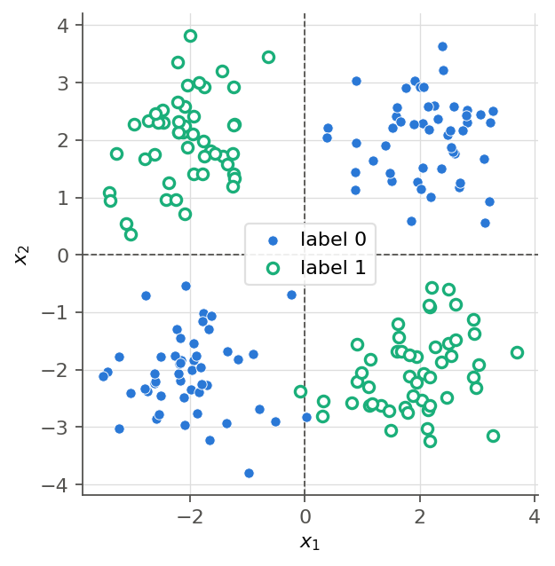
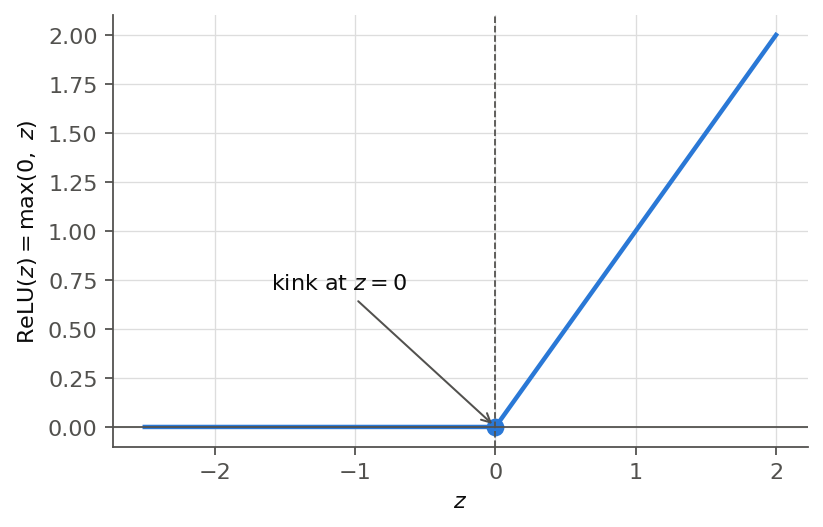
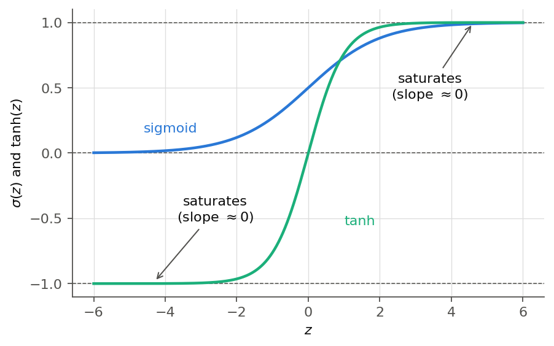
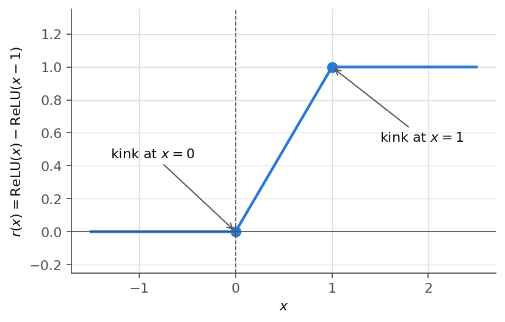

# 第1章 線形の限界と活性化関数

> [目次](../TOC.md) ・ [← 前の章](00-prologue.md) ・ [次の章 →](02-mlp.md)

第4巻までで、直線を当てはめる回帰(第3巻)から、シグモイドで「自信」を出すロジスティック回帰、softmax で多クラスに広げた分類(第4巻)まで来ました。損失は cross-entropy として導出され、学習は forward → loss → gradient → update の4拍子(第3巻第4章)で回ります。論文の式(1)は、すべての記号が読める状態です。

ところが、この巻のラスボスである式(2)には、見慣れない景色があります。

> *"This consists of two linear transformations with a ReLU activation in between."*
> $$\mathrm{FFN}(x) = \max(0,\ xW_1 + b_1)W_2 + b_2$$
> — Vaswani et al., "Attention Is All You Need", Section 3.3, 式(2)
>
> 訳: これは2つの線形変換と、その間に挟まれた1つの ReLU 活性化から成る。

$xW_1 + b_1$ は第1巻からの顔なじみですが、$W$ が2枚あり、間に $\max(0,\cdot)$ が挟まっています。なぜ1枚では足りないのでしょうか。2枚掛けたいだけなら、なぜ素直に $xW_1W_2$ と書かないのでしょうか。

この章はこの2つの問いに、順番を守って答えます。まず $W$ 1枚のモデル——第4巻までの全モデル——が**原理的に**負けるデータを目撃し(1.1)、「$W$ を2枚にすれば」という期待が第1巻の定理に打ち砕かれるのを見ます(1.2)。残された道は、線形でない何かを間に挟むことです(1.3)。その代表が $\max(0,\cdot)$、すなわち ReLU です(1.4)。

## 1.1 [コード] 線形モデルで解けないデータ(XOR的な配置)— 直線では割れない

ロジスティック回帰のモデルは、入力 $\mathbf{x}$ `(2,)`、パラメータ $\mathbf{w}$ `(2,)` と $b$ で

$$p = \sigma(\mathbf{x} \cdot \mathbf{w} + b)$$

判定が「クラス1」に切り替わるのは $p \geq 0.5$、つまりシグモイドの入力がちょうど 0 になる場所です。

$$w_1 x_1 + w_2 x_2 + b = 0$$

これは平面上の**直線**の方程式です。第4巻第4章の演習で描いた決定境界がいつも1本の直線だったのは偶然ではありません。シグモイドはスコアを自信の度合いに換算するだけで、境界線の**形**には手を出していません。ロジスティック回帰に引ける境界は直線だけです(softmax 回帰も、直線の組み合わせまで)。

では、直線で割れないようにデータを置いたらどうなるでしょうか。4つの塊を市松模様に置いてみます。



図1.1: XOR的な配置(本文コードのデータB)。● がラベル0(右上と左下)、○ がラベル1(左上と右下)。同じラベルの塊が対角に向かい合っている。どこにどんな直線を1本引いても、必ずどちらかの側に ● と ○ が混ざって残る。

規則は、座標の符号が同じ(右上・左下)ならラベル0、異なる(左上・右下)ならラベル1です。プログラミングの排他的論理和 XOR(2つの入力の片方だけが真のとき真)と同じ規則なので、これを **XOR的な配置**と呼びます。

このデータに、第4巻のロジスティック回帰をそのままぶつけます。「道具が壊れていた」疑いを残さないため、まず直線で割れる2クラスタの対照データ(第3巻エピローグと同じ配置)で同じ道具が満点を取ることを確かめてから本題に入ります。核心は4つの実験です。実験1は対照データで 100%、実験2は XOR的なデータで訓練、実験3は初期値を10通り変えての再訓練、実験4は4つの中心を分ける直線の総当たり探索です。

```python
# データA(対照): 2つの塊。直線で割れる配置
X_A = np.vstack([blob(-2.0, -2.0), blob(2.0, 2.0)])      # (100, 2)
y_A = np.concatenate([np.zeros(n), np.ones(n)])

# データB(本題): 4つの塊を市松模様に(XOR的な配置)。対角どうしが同じラベル
X_B = np.vstack([blob(-2.0, -2.0), blob(2.0, 2.0),       # ラベル0(左下・右上)
                 blob(-2.0, 2.0), blob(2.0, -2.0)])      # ラベル1(左上・右下)
y_B = np.concatenate([np.zeros(2 * n), np.ones(2 * n)])  # (200,)
```

モデル・損失・勾配は第4巻第4章のロジスティック回帰、訓練ループは第3巻第4章の4拍子をそのまま流用します(勾配は第4巻4.3で手導出した $(p-y)$ の式なので数値微分は不要)。全文と動作確認は `code/ch01/xor_limit.py`(`python3 xor_limit.py` で全 assert 通過)を参照してください。実行結果は次のとおりです。

```
実験1(対照: 2つの塊):
  loss: 0.6931 -> 0.0001   正解率: 100.0%
実験2(本題: 4つの塊の市松模様):
  loss: 0.6931 -> 0.6928   正解率: 51.0%
  (参考)log 2 = 0.6931 = 全員に「自信0.5」と答えるときの損失
実験3(初期値を10通り):
  正解率: 最小 51.0% / 最大 51.0%
実験4(総当たり):
  4つの中心を完全に分けられた直線: 0 / 100000 本
```

**実験1。** 対照データでは正解率 100% です。第3〜4巻で作ったモデル・損失・訓練ループはそのまま完璧に働きます。道具は壊れていません。

**実験2。** ところが同じ道具・同じ手順が、配置を市松模様に変えただけで 51%——コイン投げ——で止まりました。損失に注目してください。0.6931 から 0.6928 へ、2万ステップかけてほとんど動いていません。$\log 2 \approx 0.693$ は「全データに自信 0.5 と答える」ときの損失、つまり完全な無知の値です。モデルは学習をサボったのではなく、この地形では**全員に 0.5 と答えるのがほぼ最善だと正しく学習した**のです。

**実験3。** 「初期値が悪くて局所的な谷にはまっただけでは?」(第2巻第2章)というよい疑いに答えるため、初期値を10通り変えて訓練し直しました。結果は全員 51.0% です。どこから出発しても同じ谷に落ちます。初期値の事故ではありません。

**実験4。** とどめに、学習を忘れて、4つの塊の中心 $(\pm 2, \pm 2)$ を分けられる直線を10万本で総当たりに探しました。**1本もありません。**

実は2行で証明できます。直線のスコアを $s(\mathbf{x}) = w_1 x_1 + w_2 x_2 + b$ とし、ラベル0の中心でスコアが負、ラベル1の中心で正になったと仮定します(逆の割り当ても同様)。

- ラベル0側: $s(2, 2) = 2w_1 + 2w_2 + b < 0$ と $s(-2, -2) = -2w_1 - 2w_2 + b < 0$。**2式を足すと $2b < 0$。**
- ラベル1側: $s(-2, 2) = -2w_1 + 2w_2 + b > 0$ と $s(2, -2) = 2w_1 - 2w_2 + b > 0$。**2式を足すと $2b > 0$。**

$b$ は負かつ正でなければなりません。矛盾です。4つの中心を完全に分ける直線は**存在しません**。データを増やしても、学習率を変えても、ステップ数を10倍にしても、この壁は動きません。

補足すると、精度だけを物差しにするなら、右上の塊だけを切り離して 75% を取る直線はあります。しかし学習が最小化しているのは精度ではなく log loss です。その直線は反対側の奥にいる同じラベルの塊(左下)を**自信満々に間違え続ける**ため、損失の物差しでは「全員に 0.5」に負けます。だから勾配降下はそこへ向かわず、仮に向かっても 100% には原理的に届きません。

これが**線形の限界**です。探し方の問題ではなく、引ける境界が直線しかないという**表現力**の問題です。直線がだめなら、境界を曲げるしかありません。

## 1.2 層を重ねても無駄: 線形 ∘ 線形 = 線形

最初に思いつく対策はおそらくこれです。「$W$ を1枚で足りないなら、2枚掛ければいい。」

$$\mathbf{y} = (\mathbf{x} W_1 + \mathbf{b}_1) W_2 + \mathbf{b}_2$$

式(2)から $\max(0, \cdot)$ を抜き取った形そのものです。パラメータは増えました。

ところがこの期待は、第1巻5.3で証明済みの事実——**変換の合成 = 行列積**——に打ち砕かれます。あのとき $(\mathbf{x} W_1) W_2 = \mathbf{x}(W_1 W_2)$、つまり「2段階の線形変換は1つの行列に畳み込まれる」ことを見ました。バイアス付きでも結論は変わりません。$\mathbf{x}$ `(d,)`、$W_1$ `(d, h)`、$\mathbf{b}_1$ `(h,)`、$W_2$ `(h, k)`、$\mathbf{b}_2$ `(k,)` として、分配法則(第1巻第4章)で開くだけです。

$$(\mathbf{x} W_1 + \mathbf{b}_1) W_2 + \mathbf{b}_2 = \mathbf{x} (W_1 W_2) + (\mathbf{b}_1 W_2 + \mathbf{b}_2) = \mathbf{x} W' + \mathbf{b}'$$

ここで $W' = W_1 W_2$ `(d, k)`、$\mathbf{b}' = \mathbf{b}_1 W_2 + \mathbf{b}_2$ `(k,)`。右辺は $W$ 1枚のモデルと**完全に同じ形**です。

小さな数値例で確かめます。$W_1 = \begin{pmatrix} 1 & 2 \\ 0 & 1 \end{pmatrix}$ `(2, 2)`、$\mathbf{b}_1 = (1, -1)$、$W_2 = \begin{pmatrix} 3 \\ 1 \end{pmatrix}$ `(2, 1)`、$\mathbf{b}_2 = (2)$、入力 $\mathbf{x} = (1, 2)$ とします。

- **2段階で計算**: $\mathbf{x} W_1 + \mathbf{b}_1 = (1, 4) + (1, -1) = (2, 3)$。続けて $(2, 3) W_2 + \mathbf{b}_2 = (2 \cdot 3 + 3 \cdot 1) + 2 = 11$
- **1枚に潰してから計算**: $W' = W_1 W_2 = \begin{pmatrix} 5 \\ 1 \end{pmatrix}$、$\mathbf{b}' = \mathbf{b}_1 W_2 + \mathbf{b}_2 = (3 - 1) + 2 = 4$。よって $\mathbf{x} W' + \mathbf{b}' = (1 \cdot 5 + 2 \cdot 1) + 4 = 11$

一致しました。どんな入力でも、2層の線形は1層の線形と寸分違わず同じ答えを返します。3枚でも100枚でも同じで、隣り合う2枚を1枚に潰す操作を繰り返せば、最後には必ず1枚の $W'$ と1本の $\mathbf{b}'$ が残ります。

結論は手厳しいものです。**線形の層は、何枚重ねても1枚に潰れます。** 決定境界は相変わらず $\mathbf{x} W' + \mathbf{b}' = 0$ の直線で、市松模様の前では 51% のままです。線形の層を積むだけでは、深さは**まやかし**です。見かけのパラメータが何倍に増えようと、表現力は1枚分から一歩も出ません。

だからこそ、式(2)をもう一度見てほしいのです。$\max(0, \cdot)$ が、よりによって $W_1$ と $W_2$ の**間**に挟まっています。あれは飾りではなく、2枚が1枚に潰れるのを防ぐつっかえ棒なのです。

## 1.3 間に非線形を挟む: 活性化関数

潰れる原因は「線形と線形の合成は、行列積として計算できてしまう」からでした。処方箋は明快です。**行列では書けない関数**を間に挟めば、潰しようがありません。

この、線形層の出力に施す非線形関数を**活性化関数(activation function)**と呼びます。名前は神経細胞が「活性化(発火)する」様子の名残ですが、本書では「合成を潰されないための非線形の壁」と理解すれば十分です。

主役は **ReLU(Rectified Linear Unit)**です。

$$\mathrm{ReLU}(z) = \max(0, z)$$

入力が正ならそのまま通し、負なら 0 に切り上げます。それだけです。



図1.2: ReLU のグラフ。$z < 0$ では高さ 0 でぴったり地面を這い、$z > 0$ では傾き 1 の直線。原点で1回だけ「折れて」いる。

これが章の冒頭で読めなかった記号の正体です。**論文の式(2)の $\max(0, xW_1 + b_1)$ に現れる $\max(0, \cdot)$ は、この ReLU そのもの**です。冒頭の英文も読み返してください——"with a **ReLU** activation in between"。論文自身が名指ししています。

ベクトルや行列に適用するときは、成分ごと(elementwise)に作用させます。shape は変わりません。

$$\mathrm{ReLU}\big((2, -1, 0.5, -3)\big) = (2,\ 0,\ 0.5,\ 0)$$

ReLU は本当に「行列では書けない」のでしょうか。第1巻5.1で学んだ線形変換の2条件——足し算を保つ、定数倍を保つ——は、どちらも反例ひとつで破れます。

- 足し算: $\mathrm{ReLU}(3 + (-1)) = 2$ だが、$\mathrm{ReLU}(3) + \mathrm{ReLU}(-1) = 3 + 0 = 3$。一致しない
- 定数倍: $\mathrm{ReLU}((-1) \cdot 3) = 0$ だが、$(-1) \cdot \mathrm{ReLU}(3) = -3$。一致しない

よって ReLU は線形変換ではなく、どんな行列でも表せません。したがって合成

$$\mathrm{ReLU}(\mathbf{x} W_1 + \mathbf{b}_1)\, W_2 + \mathbf{b}_2$$

の括弧はもう外せません。$W_1$ と $W_2$ は別々の仕事を持つ2枚として生き残ります。1.2 の悲劇は、関数1つ挟むだけで回避できるのです。

旧友とも再会しておきましょう。**シグモイド**です。第3巻エピローグで「出力を 0〜1 に潰す応急処置」として現れ、第4巻第4章で「確率」として正当化されたあの関数も、活性化関数として使えます。歴史的にはむしろこちらが主役でした。ただし弱点も実測済みです。シグモイドは両端で平らになる——この性質を**飽和(saturation)**と呼びます——ため、そこでは勾配がほぼ 0 でした(第3巻エピローグの「勾配が死ぬ」観測がこれ)。中間の層として何枚も挟むとこの弱点は増幅されます。その惨状は第6章で「勾配消失」として観測します。

もうひとり、**tanh**(双曲線正接、hyperbolic tangent)も紹介します。

$$\tanh(z) = \frac{e^z - e^{-z}}{e^z + e^{-z}}$$

値域は $(-1, 1)$ です。実はシグモイドの親戚で、$\tanh(z) = 2\sigma(2z) - 1$ という関係があります。出力が 0 を挟んで対称な分シグモイドより扱いやすい場面が多いのですが、両端で飽和する体質は同じです。

| 活性化関数 | 式 | 値域 | 端の振る舞い |
|---|---|---|---|
| ReLU | $\max(0, z)$ | $[0, \infty)$ | 正の側は傾き 1 のまま飽和しない(負の側は 0) |
| シグモイド | $1/(1+e^{-z})$ | $(0, 1)$ | 両端で飽和(平らになる) |
| tanh | $2\sigma(2z)-1$ | $(-1, 1)$ | 両端で飽和(平らになる) |

表1.1: 3つの活性化関数。いずれも非線形なので「つっかえ棒」の役は果たせるが、端の振る舞いが違う。



図1.3: シグモイドと tanh のグラフ。どちらも入力の絶対値が大きい領域で平らになる(飽和)。平らな場所では傾き——勾配——がほぼ 0 になる。図1.2の ReLU の正側と見比べてほしい。

論文が選んだのは ReLU でした。理由は表から読み取れます。第一に、計算が「0 と比べて大きい方を取る」だけで、exp すら要りません。第二に、正の側ではどこまで行っても傾き 1 のまま、決して飽和しません。坂が平らにならないことが学習にとってどれほど大事かは、第3巻エピローグで痛感したとおりです(この「傾きが 0 か 1 しかない」単純さは、第3章で勾配を逆向きに流すときにもう一度効いてきます)。

負の側を完全に 0 で切り捨てる潔さには「そんなに乱暴に情報を捨てて大丈夫なのか?」という不安が残るかもしれません。その不安に答えるため、ReLU の気持ちをもう少し覗いてみましょう。

## 1.4 ReLU の気持ち: 折れ線で何でも近似する

ReLU 1個の働きは一言で言えます。**折れ目を1つ作る**ことです。係数と平行移動を付ければ、折れ目は自由に配置できます。

$$g(x) = a \cdot \mathrm{ReLU}(x - c)$$

は「位置 $c$ までは 0、そこから先は傾き $a$」という関数で、$c$ で折れ目の場所を、$a$ で折れたあとの傾きを選べます。

部品は足し算で組み合わせられます。たとえば2個の ReLU で次の関数を作ります。

$$r(x) = \mathrm{ReLU}(x) - \mathrm{ReLU}(x - 1)$$

| $x$ | $-1$ | $0$ | $0.5$ | $1$ | $1.5$ | $2$ |
|---|---|---|---|---|---|---|
| $r(x)$ | $0$ | $0$ | $0.5$ | $1$ | $1$ | $1$ |



図1.4: $r(x) = \mathrm{ReLU}(x) - \mathrm{ReLU}(x-1)$ のグラフ。$x \leq 0$ では平ら、$0 \leq x \leq 1$ では傾き 1 の坂、$x \geq 1$ では2つ目の ReLU(傾き $-1$)が坂を打ち消して再び平らになる。階段の1段のような形。

平ら、坂、平らです。折れ目が2つある**折れ線**ができました。$x = 1$ を過ぎた瞬間に2つ目の ReLU が「傾き $-1$」を足し始め、1つ目の坂を打ち消すのです。ReLU を $n$ 個足し合わせれば、折れ目が $n$ 箇所ある折れ線が作れます。折れ目の位置も各区間の傾きも、係数で自由自在です。

折れ線で何ができるでしょうか。**曲線の近似**です。小さな例として、$f(x) = x^2$ を区間 $[0, 2]$ で、折れ目1つの折れ線 $g(x) = \mathrm{ReLU}(x) + 2\,\mathrm{ReLU}(x - 1)$ で真似てみます。

| $x$ | $0$ | $0.5$ | $1$ | $1.5$ | $2$ |
|---|---|---|---|---|---|
| $x^2$ | $0$ | $0.25$ | $1$ | $2.25$ | $4$ |
| $g(x)$ | $0$ | $0.5$ | $1$ | $2.5$ | $4$ |
| 誤差 | $0$ | $0.25$ | $0$ | $0.25$ | $0$ |

折れ目の位置($x = 0, 1, 2$)では曲線とぴったり一致し、間でも誤差は最大 0.25 です。折れ目を 0.5 刻みの4個に増やすと、最大誤差は 0.0625 まで縮みます。折れ目の数を倍にするたび、誤差はおよそ4分の1になります。この調子で増やしていけば、滑らかな曲線を**好きな精度で**折れ線で覆えると想像できると思います。

この直観を定理にしたものが**万能近似定理(universal approximation theorem)**です——ReLU(やシグモイド)を十分たくさん足し合わせれば、任意の連続関数を好きな精度で近似できます。本書では証明しませんし、定理として使う場面も来ません。持ち帰ってほしいのは直観だけです。**ReLU は折れ目の製造機であり、折れ線は何にでも化けます。**

ここまでは入力が1次元の話でした。入力が2次元になると、折れ目は「点」ではなく「線」になります。$\mathrm{ReLU}(\mathbf{x}\mathbf{w} + b)$ は、直線 $\mathbf{x}\mathbf{w} + b = 0$ を折り目として平面の片側を平らに倒す操作です。第1巻第5章で線形変換は「格子を平行四辺形に保つ」変換でしたが、ReLU はこの掟を破り、平面を**折ります**。そして 1.1 の市松模様も、対角の折り目で平面をうまく折れば、ラベル0の2つの塊を重ねてしまえる——そうなれば、あとは直線1本で割れます。これを実際にやってみせるのが第2章です。

最後に正直な注意がひとつあります。「うまく近似する折れ線が**存在する**」ことと、「その係数を学習で**見つけられる**」ことは別の問題です。この章で手に入れたのは部品の表現力だけで、何百・何千個の ReLU の係数をどう調整するのかには、まだ何ひとつ答えていません。その答え——誤差逆伝播と自動微分——こそ、この巻の残り全部の主題です。

## まとめ

- ロジスティック回帰(と softmax 回帰)の決定境界は直線(の組み合わせ)だけ。XOR的な市松模様の配置は**原理的に**解けず、学習は損失 $\log 2$・正解率50%台で止まる(コードで観測し、2行の不等式で証明した)
- **線形 ∘ 線形 = 線形**: $(\mathbf{x}W_1 + \mathbf{b}_1)W_2 + \mathbf{b}_2 = \mathbf{x}W' + \mathbf{b}'$(第1巻5.3「変換の合成 = 行列積」の帰結)。線形の層は何枚重ねても1枚に潰れ、表現力は増えない
- 潰れを防ぐには、線形層の間に**活性化関数**(非線形の壁)を挟む。主役は $\mathrm{ReLU}(z) = \max(0, z)$。シグモイド・tanh も活性化関数だが、両端で飽和する(ReLU の正側は飽和しない)
- 論文の式(2)の $\max(0, \cdot)$ は ReLU のこと。$W_1$ と $W_2$ の**間**に挟まっているのは、2枚が1枚に潰れるのを防ぐためだった
- ReLU は折れ目の製造機。足し合わせれば折れ線になり、折れ目を増やせば曲線を好きな精度で近似できる(万能近似定理の直観。証明はしない)。ただし「近似できる」と「学習で見つけられる」は別問題で、後者がこの巻の残りの主題

**ラスボスとの距離**: 式(2) $\max(0, xW_1 + b_1)W_2 + b_2$ のうち、$\max(0, \cdot)$ が読めるようになり、それが2枚の $W$ の間に挟まっている理由もわかりました。残るは、この形のネットワークを実際に組んで動かすこと——第2章です。

## 演習

**問1**(手計算)$W_1 = \begin{pmatrix} 2 & 0 \\ 0 & 1 \end{pmatrix}$ `(2, 2)`、$\mathbf{b}_1 = (1, 1)$、$W_2 = \begin{pmatrix} 1 \\ -1 \end{pmatrix}$ `(2, 1)`、$\mathbf{b}_2 = (5)$ とします。2層の線形 $(\mathbf{x}W_1 + \mathbf{b}_1)W_2 + \mathbf{b}_2$ を1枚に潰した $W'$ と $\mathbf{b}'$ を求め、$\mathbf{x} = (1, 1)$ で両方の計算経路が同じ値になることを確かめてください。

**問2**(手計算)シグモイド $\sigma(z) = 1/(1+e^{-z})$ が線形変換の2条件(第1巻5.1: 足し算を保つ・定数倍を保つ)を満たさないことを、反例で示してください。$\sigma(0) = 0.5$ という値だけで片づける方法もあります。

**問3**(本題: ReLU 2個で「山」を作る)2つの ReLU の重みつき和だけで、$x = 0$ から登り始め、$x = 1$ で頂点(高さ1)に達し、$x = 2$ で地面(高さ0)に戻る「山」を作ってください。$x > 2$ での振る舞いは問いません。作った関数の値を $x = 0, 0.5, 1, 1.5, 2$ で計算して、山になっていることを確認してください。

**問4**(コード)`xor_limit.py` のデータBを、XOR的な市松模様の代わりに**同心円状の配置**(半径1の円盤がラベル0、それを囲む半径2.5〜3.5のリングがラベル1)に差し替えて、ロジスティック回帰がやはり50%台で止まることを確認してください。なぜ100%を取れる直線が存在しないのか、言葉でも説明してください。

<details>
<summary>略解</summary>

**問1** $W' = W_1 W_2 = \begin{pmatrix} 2 \cdot 1 + 0 \cdot (-1) \\ 0 \cdot 1 + 1 \cdot (-1) \end{pmatrix} = \begin{pmatrix} 2 \\ -1 \end{pmatrix}$、$\mathbf{b}' = \mathbf{b}_1 W_2 + \mathbf{b}_2 = (1 \cdot 1 + 1 \cdot (-1)) + 5 = 5$。検算: 2段階では $\mathbf{x}W_1 + \mathbf{b}_1 = (2, 1) + (1, 1) = (3, 2)$、続けて $(3, 2)W_2 + \mathbf{b}_2 = (3 - 2) + 5 = 6$。1枚では $\mathbf{x}W' + \mathbf{b}' = (1 \cdot 2 + 1 \cdot (-1)) + 5 = 6$。一致します。

**問2** 足し算の反例: $\sigma(0 + 0) = \sigma(0) = 0.5$ ですが、$\sigma(0) + \sigma(0) = 1$。一致しません。定数倍の反例: $\sigma(0 \cdot z) = 0.5$ ですが、$0 \cdot \sigma(z) = 0$。そもそも線形変換は必ず $f(\mathbf{0}) = \mathbf{0}$ を満たします(第1巻5.1の定数倍の条件で $c = 0$ とおく)が、$\sigma(0) = 0.5 \neq 0$ なので、この1点だけでも線形でないと言えます。

**問3** $f(x) = \mathrm{ReLU}(x) - 2\,\mathrm{ReLU}(x - 1)$ が答えのひとつです。$x = 1$ を過ぎると2つ目の ReLU が傾き $-2$ を足し始め、登り(傾き $+1$)が下り(傾き $1 - 2 = -1$)に転じます。

| $x$ | $0$ | $0.5$ | $1$ | $1.5$ | $2$ |
|---|---|---|---|---|---|
| $f(x)$ | $0$ | $0.5$ | $1$ | $0.5$ | $0$ |

なお $x > 2$ では $f$ は地面を突き抜けて負になり続けます($f(3) = -1$)。ReLU をもう1個、$+\mathrm{ReLU}(x-2)$ を足すと下りの傾きが打ち消されて、$x \geq 2$ でちょうど高さ0に止まります。3個あれば裾まで完璧な山です。試してみてください。

**問4** データBの定義部分を次のように差し替えます(モデル・訓練はそのまま使えます)。

```python
m = 100
r_in = np.sqrt(rng.uniform(0.0, 1.0, size=m))        # 半径1の円盤に一様にばらまく
t_in = rng.uniform(0.0, 2 * np.pi, size=m)
r_out = rng.uniform(2.5, 3.5, size=m)                # 半径2.5〜3.5のリング
t_out = rng.uniform(0.0, 2 * np.pi, size=m)
X_C = np.vstack([np.c_[r_in * np.cos(t_in), r_in * np.sin(t_in)],
                 np.c_[r_out * np.cos(t_out), r_out * np.sin(t_out)]])  # (200, 2)
y_C = np.concatenate([np.zeros(m), np.ones(m)])      # (200,)

w_C, b_C, hist_C = train(X_C, y_C, w0=[0.0, 0.0], b0=0.0, steps=20000)
print(hist_C[0], "->", hist_C[-1], accuracy(X_C, y_C, w_C, b_C))
```

筆者の環境では損失 0.6931 → 0.6928、正解率 55% でした。市松模様と同じく、損失は $\log 2$ に張りついたままです。100% の直線が存在しない理由: リングは円盤を全方向から囲んでいるので、どんな直線を引いても、円盤のある側に必ずリングの一部が残ります。両クラスを直線1本で完全に分けることはできません。境界として必要なのは直線ではなく「円」——線形モデルには引けない形です。

</details>

---

本文1.1のコードは `code/ch01/xor_limit.py` にあり、`python3 xor_limit.py` で assert により検算できます(演習の問4も同じファイルの関数をそのまま流用できます)。

---

> [目次](../TOC.md) ・ [← 前の章](00-prologue.md) ・ [次の章 →](02-mlp.md)
