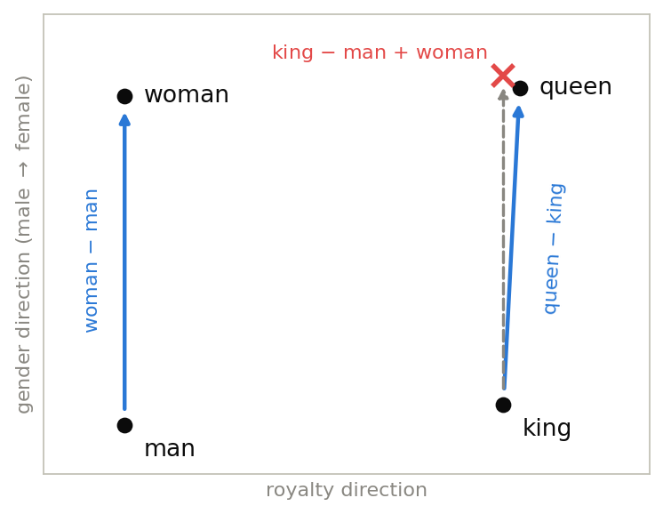

# 第3章 埋め込み — トークンをベクトルにする

> [目次](../TOC.md) ・ [← 前の章](02-tokenization.md) ・ [次の章 →](04-ngram.md)

前の章で、文章をトークンの列に切れるようになりました。BPE が育てた語彙を使えば、どんな文章も整数 ID の列になります。第1章の問題設定と合わせれば、やりたいことは明確です——ID の列を受け取り、次の ID の確率分布を出すことです。

ところが、ここで手が止まります。第1巻から第5巻で組み上げてきた部品——`X @ W + b`、活性化関数、autograd——はすべて、入力が**数値ベクトル** $\mathbf{x}$ であることを前提にしていました。トークン ID も数値ではありますが、ID の「12」は「3」の4倍大きい単語ではありません。語彙表の並び順はたまたまで、ID の大小も差も意味とは無関係です。この無関係な大小を食わせれば、モデルは存在しない構造を学ぼうとしてしまいます。

この問いには第1巻で予告を打ってあります。第1巻1.5——king − man + woman ≈ queen という「意味の算術」を紹介した節で、**どうやってそんなベクトルを手に入れるのか、この伏線は第6巻第3章で回収します**と約束しました。この章がその第6巻第3章です。約束どおり、5巻ぶんの道具を全部使って回収します。

## 3.1 one-hot ベクトル — すべての単語が等しく無関係

まずは素朴な方法からです。ID の大小が嘘の意味を運ぶのが問題なら、大小が発生しない表現にすればよいのです。

語彙サイズを $V$ とします。単語 ID $i$ を、**$V$ 次元のベクトルで、第 $i$ 成分だけが 1、残りすべてが 0** のものに対応させます。これを **one-hot ベクトル(one-hot vector)** と呼びます。「熱い(hot)成分が1つだけ」という意味です。

$$\text{ID } 2 \ \longmapsto\ \mathbf{x} = (0,\ 0,\ 1,\ 0,\ 0) \quad \text{(} V = 5 \text{ の場合。shape は } (V,) \text{)}$$

どの単語も「長さ1で、自分専用の軸を向いたベクトル」になるので、大小関係は消えます。

```python
def one_hot(i, V):
    v = np.zeros(V)
    v[i] = 1.0
    return v

cat, dog, king = one_hot(0, V), one_hot(1, V), one_hot(2, V)
# どの2語を選んでも、内積は 0
assert np.dot(cat, dog) == 0.0
assert np.dot(cat, king) == 0.0
```

最後の行が、この表現の致命傷です。第1巻第2章で内積は「似ている度合い」を測る道具でした。one-hot ベクトルどうしの内積は、**異なる単語である限り必ず 0** です。1が立っている位置が違うので、掛けて足すとすべての項が消えます。コサイン類似度でも同じく 0 です。

つまり one-hot の世界では、cat と dog の類似度も、cat と the の類似度も等しく 0 です。**すべての単語が、他のすべての単語と等しく無関係**なのです。第1巻1.5で見た「意味が成分に分かれて宿る」ベクトルとは正反対の、意味を運ぶ余地が構造的に存在しない表現です。king − man + woman を計算しても queen には決して着地しません(king の位置が 1、man が −1、woman が 1 という「3語のメモ」ができるだけです)。おまけに語彙が3万語なら3万次元、その99.99%が 0 です。

ただし、捨てるのは早計です。「意味を運ぶ」道具としては失格でも、「**どの単語かを指し示す**」道具としては完璧だからです。この能力が次の節で効いてきます。

## 3.2 埋め込み行列 — lookup はただの行列積

では、内積が意味を語れるベクトルはどんな形でしょうか。中身の数値は後回しにして、まず入れ物の形を決めます。

欲しいのは、単語ごとの、$V$ よりずっと小さい $d$ 次元の(0 だらけではない)ベクトルです。$V$ 個の $d$ 次元ベクトル——ここで第1巻第3章の見方の出番です。**行列とは行ベクトルの束**でした。$V$ 本のベクトルを行として積み上げれば、1枚の行列になります。

$$E \in \mathbb{R}^{V \times d} \quad \text{shape } (V, d) \text{: 第 } i \text{ 行が、単語 } i \text{ のベクトル}$$

この $E$ を**埋め込み行列(embedding matrix)**、その行を**埋め込み(embedding)**と呼びます。$V$ 次元の one-hot の世界から $d$ 次元の世界へ単語を「埋め込む」という名前です。

単語 $i$ のベクトルが欲しければ $E$ の第 $i$ 行を取り出せばよい——この取り出し(lookup)は、前節の one-hot との**行列積そのもの**です。one-hot $\mathbf{x}$ `(V,)` を左から掛けてみます。

$$(\mathbf{x} E)_j = \sum_{i=0}^{V-1} x_i E_{ij}$$

$x_i$ は $i = 2$ のときだけ 1 です。和の中で生き残るのは $E_{2j}$ の項だけで、$\mathbf{x} E$ は $E$ の第2行そのものです。

```python
x = np.zeros(V)
x[2] = 1.0                         # 単語 ID 2 の one-hot (V,)
assert np.allclose(x @ E, E[2])    # one-hot @ E = E の第2行の取り出し
```

「行を取り出すだけなら `E[2]` で済むのに、なぜ行列積として見るのか」。御利益は2つです。

1つ。**埋め込み層は、バイアスなしの線形層 `X @ W` と同じ形**だとわかります(第1巻第6章)。トークン列 $n$ 個ぶんの one-hot を積んだ $X$ `(n, V)` に対して、$XE$ は `(n, V) @ (V, d) = (n, d)`。新しい部品は何も要りません。

2つ。行列積なら、**第5巻の autograd がそのまま微分を運んでくれます**。第5巻5章の `Tensor` は `@` の backward をすでに知っています。$E$ に勾配を流す仕組みは、もう書き終わっているのです。

なお、実務のライブラリは $V$ が数万になるため、行列積を計算せず添字で直接行を取り出します(結果は同一で、速いだけです)。それでも「数学的な正体は行列積」という見方が、この後ずっと効きます。

## 3.3 E も学習されるパラメータである

入れ物の形は決まりました。残る問いは——$E$ の中身の数値は**誰が決めるのか**です。

第1巻1.5の採点表を思い出してください。king や queen に「王族度・男性度・女性度・人間度」の4項目で点数を付けた表です。あのとき白状したとおり、あれは答えから逆算して手で書いたものでした。同じことを本物の語彙でやるなら、3万語 × 512次元 = 1536万個の数値を手で埋めることになります。不可能ですし、それ以前に「正しい採点項目」が何かを誰も知りません。

答えはこうです。**決めません。** $E$ を乱数で初期化し、$W$ や $b$ と同じ「学習されるパラメータ」として勾配降下に晒します。埋め込み層は線形層の一種ですから(前節)、損失から $E$ への勾配は autograd が自動で運びます。仕組みとしては何も新しくありません。

新しいのは問いの立て方です。意味には「正解ラベル」がありません。king の正しいベクトルなど誰も知らないのに、何を目標に学習させればよいのでしょうか。

ここで第1章の作業仮説が効きます。「次(周り)の単語を当てられる = 言語がわかっている」。**周りの単語を当てるタスクなら、正解ラベルはコーパス自身がくれます**。文章中の単語をひとつ選び、その周辺に実際に何が書いてあったかを当てさせればよいのです。ラベル付け作業はゼロです。

このタスクで訓練すると何が起きるでしょうか。似た文脈に現れる単語——king と queen はどちらも「rules」「palace」「crown」の近くに現れます——は、**同じ文脈語を当てるのが得**になります。同じ出力を出したいなら入力ベクトルも似ているのが効率的なので、勾配降下は king と queen のベクトルを自然と近くに押し込みます。「似た文脈に現れる単語は似た意味を持つ」という言語学の仮説(分布仮説、distributional hypothesis)が、損失最小化の力学として働くのです。

**意味は、与えるものではなく、タスクから染み込むもの**——これがこの節の結論であり、この後 Transformer まで一貫して変わらない原理です。

## 3.4 [コード] 小さなコーパスで king − man + woman を検算する

道具は揃いました。検算に行きましょう。

タスクは前節の「周りの単語を当てる」を最小構成にしたもの——中心の単語を入力に、窓(前後3語以内)の中の単語を当てる多クラス分類です(word2vec の skip-gram 構成)。これは**第4巻第6章の softmax 回帰そのもの**です。

$$\text{logits} = \underbrace{X}_{(n,\ V)} \underbrace{E}_{(V,\ d)} \underbrace{W_{out}}_{(d,\ V)} \quad \to \quad \text{softmax cross-entropy}$$

$X$ は中心語 one-hot を $n$ 行積んだ行列、正解は文脈語の ID です。訓練ループは第3巻第4章の4拍子(forward → loss → backward → 更新)そのまま、微分は第5巻の autograd まかせです。新しい部品はひとつもありません。

ひとつ正直に断っておきます。コーパスは22文・語彙22語の手作りで、性別の手がかり(he/she、man/woman との共起)と王族の手がかり(palace、crown)がはっきり現れるように組んであります。word2vec が数十億語から自然に獲得したものを数百語の箱庭で意図的に再現するということで、設計なしの生コーパスでこれほど綺麗に出るわけではありません(演習4で実際に壊します)。

核心は3つです。one-hot 行列 $X$ を埋め込み $E$ と出力層 $W_{out}$ に通して logits を作り、cross-entropy を 4拍子で下げます。

```python
# パラメータ: 埋め込み行列 E (V, d) と出力層 W_out (d, V)
d = 8                                          # 埋め込みの次元(論文なら d_model = 512)
E = Tensor(rng.normal(0.0, 0.1, (V, d)))
W_out = Tensor(rng.normal(0.0, 0.1, (d, V)))

# 訓練ループ(第3巻4章の4拍子: forward → loss → backward → 更新)
for epoch in range(300):
    logits = (X @ E) @ W_out                  # (n, V): 文脈語の当てっこのスコア
    loss = softmax_cross_entropy(logits, contexts)
    loss.backward()
    E.data -= lr * E.grad
    W_out.data -= lr * W_out.grad
```

学習した $E$ で意味の算術を測ります。`analogy` は $a - b + c$ に最も近い語を、コサイン類似度(第1巻2.3)で探します。

```python
def analogy(a, b, c):
    """a − b + c に最も近い単語を返す(word2vec の流儀で a, b, c 自身は候補から除く)"""
    v = Emb[word2id[a]] - Emb[word2id[b]] + Emb[word2id[c]]
    return nearest(v, exclude=(a, b, c))

# 第1巻1.5の伏線回収: king − man + woman ≈ queen
top = analogy("king", "man", "woman")
assert top[0][1] == "queen"
assert top[0][0] > 0.8
```

全文と動作確認は `code/ch03/train_embeddings.py` です(`python3` で全 assert 通過)。実行すると(手元では1秒かかりません)次の出力が得られます。

```
loss: 3.091 -> 2.181 (log V = 3.091)
king - man + woman -> [('queen', 0.927), ('princess', 0.636), ('rules', 0.479)]
prince - boy + girl -> [('princess', 0.924), ('queen', 0.533), ('guards', 0.533)]
cos(king-queen, man-woman) = 0.897
cos(boy-girl,   man-woman) = 0.978
king     の近傍: [('prince', 0.662), ('queen', 0.62), ('crown', 0.497)]
queen    の近傍: [('princess', 0.624), ('king', 0.62), ('crown', 0.393)]
man      の近傍: [('woman', 0.723), ('boy', 0.638), ('crown', 0.485)]
village  の近傍: [('woman', 0.622), ('girl', 0.608), ('in', 0.577)]
第3章: すべての assert を通過しました
```

順に読み解きます。

**損失の出発点が log V なのは偶然ではありません。** 初期の $E$ は乱数なので、モデルは22択を一様に当てずっぽうするしかなく、その cross-entropy はちょうど $\log 22 \approx 3.09$ です(第4巻第5章)。第1章の言葉でいえば perplexity 22——300エポック後には $e^{2.181} \approx 8.9$、「平均9択」まで絞れたことになります。

**そして本題です。** $\mathbf{v}_{king} - \mathbf{v}_{man} + \mathbf{v}_{woman}$ に最も近い単語は **queen**、コサイン類似度 0.927 です。**第1巻1.5で予告した「意味の算術」が、自分で学習させたベクトルの上で、いま成立しました。** あのときは答えから逆算して採点表を手で書きましたが、今回は誰も「王族度」や「女性度」という軸を設計していません。乱数から出発した $E$ が、「周りの単語を当てる」というタスクの勾配だけに押されてこの構造を獲得したのです。そして「≈(近い)」の測り方も第1巻1.5では宿題でした——第1巻第2章の内積とコサイン類似度がここでその役を果たします。2つの伏線、同時回収です。

同じ算術は prince − boy + girl ≈ princess でも成立し、さらに king − queen、man − woman、boy − girl という「男 → 女」の差ベクトルたちが、ほぼ同じ向き(コサイン類似度 0.897〜0.978)を向いています。第1巻1.5の言葉でいえば、「king − man が取り出した差分」が単語ペアによらず共有されている——埋め込み空間に「性別の方向」が1本通っているということです。意味の算術が成り立つ正体は、この平行性です。



図3.1: 意味の算術の幾何(2次元の概念図)。man → woman と king → queen の差ベクトルがほぼ平行なので、king − man + woman(破線)は queen のすぐ近く(×)に着地する。実際の埋め込みは $d$ 次元(本文では $d = 8$)だが、構図は同じ。

正直な注記を2つします。

1つ。`analogy` は word2vec 以来の流儀どおり、入力した3語自身を候補から除いています。今回のコーパスでは除かなくても queen が1位ですが、一般には king 自身が1位に来ることが多く、除外は慣例です。検算の条件なのでコードに明記しました。

2つ。コーパスは答えが出るよう設計したものです。この実験が証明しているのは「word2vec はすごい」ではなく、「**文脈の手がかりさえコーパスにあれば、3.3 の仕組み(タスク + 勾配降下)がそれをベクトルの幾何に変換する**」という原理のほうです。手がかりを消したら何が起きるかは演習4で確かめます。

## 3.5 論文 3.4 を覗き見 — "learned embeddings of dimension d_model" が読める

巻頭のラスボスのうち、この章が担当する一文を見に行きます。論文セクション 3.4(Embeddings and Softmax)の冒頭です。

> *"Similarly to other sequence transduction models, we use learned embeddings to convert the input tokens and output tokens to vectors of dimension $d_{model}$."*
> — Vaswani et al., "Attention Is All You Need", Section 3.4
>
> 訳: 他の系列変換モデルと同様に、私たちは学習された埋め込みを用いて、入力トークンと出力トークンを次元 $d_{model}$ のベクトルに変換する。

一語ずつ、もう読めるはずです。**tokens** は第2章の BPE が切り出したあれ。**embeddings** は本章の $E$ の行。**learned** は 3.3 そのもの——埋め込みは設計するものではなく学習されるパラメータです。**vectors of dimension $d_{model}$** は、$E$ の shape が $(V, d_{model})$ だということです。本章のおもちゃでは $d = 8$ でしたが、論文では $d_{model} = 512$——第1巻第1章で「1単語 = 512個の数」として眺めた、あの512です。

ひとつだけ本章との違いがあります。本章の skip-gram は「埋め込みを学習するためだけの独立したタスク」でしたが、Transformer の埋め込みは前処理ではなく、**翻訳というタスク本体と一緒に学習されます**。とはいえ原理は 3.3 と同じです。意味はタスクから染み込む——染み込ませるタスクが「周りの単語当て」から「翻訳」に変わるだけです。

なお、セクション 3.4 には続きの文があります。入出力の埋め込みと softmax 直前の線形層での重み行列の共有、そして $\sqrt{d_{model}}$ 倍です。ここはまだ読めなくて構いません。論文読解マップのとおり、第7巻の仕事です。

## まとめ

- one-hot ベクトルは「どの単語か」を指し示す道具としては完璧だが、異なる単語どうしの内積が常に 0 ——**すべての単語が等しく無関係**で、意味を運ぶ余地がない(第1巻第2章の「内積 = 類似度」の言葉で)
- 埋め込み行列 $E$ `(V, d)` は単語ベクトルを行に積んだもの。lookup は **one-hot @ E というただの行列積**であり、埋め込み層はバイアスなしの線形層にすぎない
- $E$ は**学習されるパラメータ**。意味の正解ラベルは存在しないが、「周りの単語を当てる」タスクならラベルはコーパス自身がくれる。意味は与えるものではなく、タスクから染み込む
- 自作 autograd で埋め込みを訓練し、**king − man + woman ≈ queen を検算した(第1巻1.5の伏線回収)**。「≈」はコサイン類似度で測った(第1巻第2章の回収)。算術が成り立つ正体は「男 → 女」方向の平行性
- ただしコーパスは答えが出るよう設計したもの。原理の検証であって、word2vec の再現実験ではない

**ラスボスとの距離**: 論文 3.4 の "learned embeddings ... of dimension $d_{model}$" が読めました。アーキテクチャ図(図1)の最下段、Embedding の箱は攻略済みです。

## 演習

**問1(手計算)** $V = 4$、$d = 2$ とし、$E$ の行を上から $(1, 0)$, $(0, 1)$, $(2, 3)$, $(-1, 1)$ とします。one-hot $\mathbf{x} = (0, 0, 1, 0)$ に対して $\mathbf{x} E$ を成分の式 $\sum_i x_i E_{ij}$ から計算し、$E$ の第2行(0始まり)と一致することを確かめてください。

<details><summary>略解</summary>

$j = 0$ 成分: $0 \cdot 1 + 0 \cdot 0 + 1 \cdot 2 + 0 \cdot (-1) = 2$。$j = 1$ 成分: $0 \cdot 0 + 0 \cdot 1 + 1 \cdot 3 + 0 \cdot 1 = 3$。よって $\mathbf{x} E = (2, 3)$ で、第2行と一致。$x_i$ が 1 の行だけが和に生き残る、というだけの計算です。
</details>

**問2(観察)** 本文のコードの最後の `nearest` ループを、`vocab` の全単語について回してください。king や man のような内容語と、the / is / a のような機能語とで、近傍リストの「読みやすさ」に差はあるでしょうか。気づいたことを言葉にしてください。

<details><summary>略解</summary>

内容語は直観に合う近傍を持ちます(king ↔ prince・queen、man ↔ woman・boy など)。一方 the / is / a などの機能語はほぼすべての単語の隣に現れるため文脈で区別がつかず、近傍リストは雑多になりがちです(例: he の近傍に a が来る)。分布仮説の力学は、文脈に偏りのある単語にしか効かないことが観察できます。
</details>

**問3(コード)** `d = 8` を `d = 2` に変えて再訓練し、`analogy("king", "man", "woman")` を実行してください。1位は変わるでしょうか。上位の類似度の「差」はどうなるでしょうか。

<details><summary>略解</summary>

seed 42 では 1 位は queen のままですが、類似度が queen 1.000、works 0.9998、plays 0.9998 …と、ほぼ全単語が 1 に張り付きます。2次元では22語ぶんの意味の軸を分担する余地がなく、全員がほぼ同じ向きに押し込められるためです(cos(king, queen) も 1.000 になります)。「勝った」ことよりも「僅差でしか勝てない」ことが本質で、意味を成分に分けて宿らせるには次元の余裕が必要だとわかります。論文の $d_{model} = 512$ は、この余裕を大規模語彙に対して確保した値です。
</details>

**問4(コード)** コーパスから性別の手がかりを消す——「the king is a man」型の4文と「he is the king」型の8文、計12文を削除して再訓練してください。(a) `analogy("king", "man", "woman")` の1位、(b) `cosine(Emb[king] − Emb[queen], Emb[man] − Emb[woman])`、(c) `cosine(Emb[king], Emb[queen])` をそれぞれ確認し、(a) の結果を信じてよいか論じてください。

<details><summary>略解</summary>

seed 42 では (a) は依然 queen(類似度 0.998)ですが、(b) の平行性は 0.897 → 0.245 に崩壊し、(c) は 0.998 まで上がります。性別の手がかりが消えたため king と queen は文脈上ほぼ同一の単語になり(だから (c) がほぼ 1)、「男 → 女」の方向は学習されていません(だから (b) が崩壊)。それでも (a) が queen を返すのは、king − man + woman ≈ king ≈ queen で、king 自身は候補から除外されているから——**算術が成功したのではなく、評価の慣例(入力語の除外)が成功を偽装した**のです。1つの数字だけで結論しないこと、そして意味はコーパスに手がかりがある分しか染み込まないこと(3.3)の、裏側からの確認です。
</details>

---

> [目次](../TOC.md) ・ [← 前の章](02-tokenization.md) ・ [次の章 →](04-ngram.md)
