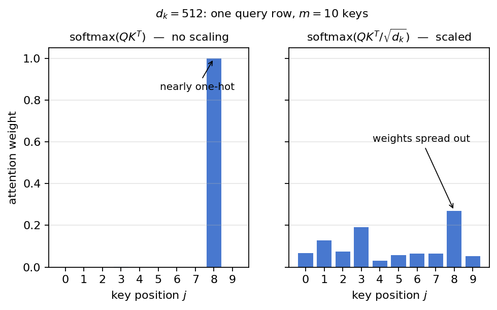
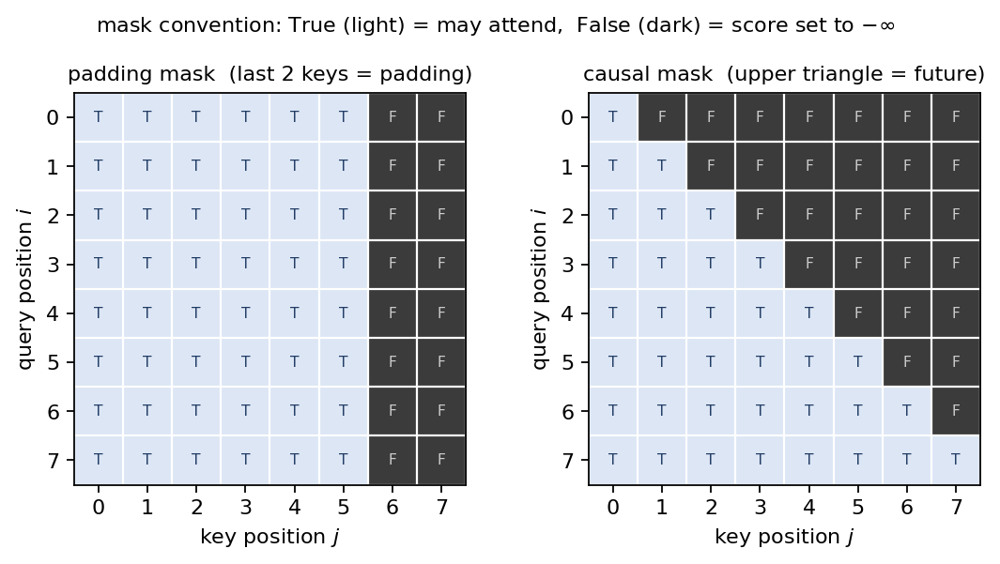

# 第3章 3.2.1 Scaled Dot-Product Attention — 式(1)の実装

> [目次](../TOC.md) ・ [← 前の章](02-stacks.md) ・ [次の章 →](04-multi-head.md)

この章でシリーズは合流点に着きます。第1巻の序章で初めて式(1)を見たとき、$Q$ も $K^T$ も softmax も読めませんでした。あれから6巻かけて部品を拾ってきました——行列と転置と行列積(第1巻)、softmax と $\sqrt{d_k}$(第4巻)、query / key / value という言葉(第6巻)。第2章では encoder と decoder の骨組みを、中身が恒等写像のダミー Sublayer で組みました。その中心の空洞を、この章で埋めます。

やることは2つです。**式(1)を原文の段落ごと1行残らず読み切り、読んだとおりに実装してテストで固定します。** ここで書く `attention` 関数は、第4章の multi-head がくるんで使い、第8巻が import して Transformer の心臓部に据える、シリーズの最重要部品です。

## 3.1 原文逐行 — query / key / value、"compatibility function" の意味

式(1)に入る前に、論文は Section 3.2 の冒頭で「attention とは何か」を2文で定義しています。

> *"An attention function can be described as mapping a query and a set of key-value pairs to an output, where the query, keys, values, and output are all vectors. The output is computed as a weighted sum of the values, where the weight assigned to each value is computed by a compatibility function of the query with the corresponding key."*
> — Vaswani et al., "Attention Is All You Need", Section 3.2
>
> 訳: attention 関数とは、1つの query と key-value ペアの集合を、1つの出力へ写す関数として記述できる。query、key、value、出力はすべてベクトルである。出力は value の重み付き和として計算され、各 value に割り当てる重みは、query と対応する key の相性関数(compatibility function)によって計算される。

1文目の **"a query and a set of key-value pairs"** の3つの言葉は、第6巻7章で attention 付き seq2seq を作ったときに導入したものです。query は「いま知りたいこと」、key は見られる側の各位置が掲げる「見出し」、value はその位置が実際に差し出す「中身」です。key と value が対なのは、**「どこを見るかを決める材料」と「受け取る中身」を別のベクトルにしてよい**という設計だからです。

2文目が attention の動作のすべてで、3つの部品に分解できます。

1. **"a compatibility function"** —— query と各 key の「相性」を数にする関数。ここは設計上の空欄で、何を入れるかは流派が分かれます(3.3で対立候補)。この論文の選択は**内積**——「似ている度合いを数にしたもの」(第1巻2章)です
2. **"the weight assigned to each value"** —— 相性のスコアは実数の並びなので、足すと1になる重みに変えるには softmax(第4巻6章)を通します
3. **"a weighted sum of the values"** —— その重みで value を混ぜた**重み付き和**が、出力

つまり attention とは、**相性で重みを決めて value を混ぜる**機械で、第6巻7章で実装したものと寸分違いません。違うのは、論文がこの機械を「RNN の添え物」から「主役」に昇格させることだけです。

続けて Section 3.2.1 の冒頭です。

> *"We call our particular attention 'Scaled Dot-Product Attention' (Figure 2). The input consists of queries and keys of dimension $d_k$, and values of dimension $d_v$. We compute the dot products of the query with all keys, divide each by $\sqrt{d_k}$, and apply a softmax function to obtain the weights on the values."*
> — 同論文, Section 3.2.1
>
> 訳: 我々はこの attention を「Scaled Dot-Product Attention」と呼ぶ(図2)。入力は次元 $d_k$ の query と key、次元 $d_v$ の value からなる。query とすべての key の内積を計算し、それぞれを $\sqrt{d_k}$ で割り、softmax 関数を適用して value に掛ける重みを得る。

ここはもう手順書です。内積で相性を測り(dot-product)、$\sqrt{d_k}$ で割り(scaled)、softmax で重みにします。名前はこの手順の要約です。query と key が同じ次元 $d_k$ なのは内積を取るためです。value だけ別の次元 $d_v$ を許されるのは、value は内積に参加しない(混ぜられるだけの)立場だからです。

## 3.2 式(1)を shape で読む — 第1巻終章の再演、ただし今度は全部わかる

論文はこの手順を1本の式に畳みます。

> *"In practice, we compute the attention function on a set of queries simultaneously, packed together into a matrix $Q$. The keys and values are also packed together into matrices $K$ and $V$. We compute the matrix of outputs as:"*
>
> $$\mathrm{Attention}(Q, K, V) = \mathrm{softmax}\!\left(\frac{QK^T}{\sqrt{d_k}}\right)V \tag{1}$$
> — 同論文, Section 3.2.1, 式(1)
>
> 訳: 実際には、attention 関数は query の集合に対して一斉に計算する。query は1つの行列 $Q$ に詰め込む。key と value も同様に行列 $K$、$V$ に詰め込む。出力の行列は次のように計算する: (式(1))

"packed together into a matrix" ——ベクトルを行に積んで行列にし、forループを行列積1発に置き換えます。第1巻4章で「内積の総当たり」を `@` 1つに畳んだ手筋です。

shape で読みましょう。これは第1巻終章の**再演**ですが、決定的な違いが1つ——あのときは softmax を正体不明のまま素通しする「shape だけなら流せる」でしたが、いまは**全記号について shape と意味の両方が言えます**。どの巻の装備かを添えて、入口から出口まで流します。

| 読む箇所 | shape の流れ | 意味 | どの巻の装備か |
|---|---|---|---|
| $Q$ | `(n, d_k)` | query が $n$ 本。「知りたいこと」の束 | 行列=第1巻3章、言葉=第6巻7章 |
| $K^T$ | `(m, d_k)` → `(d_k, m)` | key が $m$ 本。$T$ は転置 | 第1巻3章 |
| $QK^T$ | `(n, d_k) @ (d_k, m)` → `(n, m)` | **内積の総当たり表**。$(i,j)$ マスは query $i$ と key $j$ の類似度 | 行列積=第1巻4章、内積=類似度=第1巻2章 |
| $\div \sqrt{d_k}$ | `(n, m)` のまま | スコアの分散を1に戻し、softmax の飽和(勾配死)を防ぐ | 第4巻7章 |
| $\mathrm{softmax}$ | `(n, m)` のまま | 各**行**を、和が1の確率分布(重み)に変える | 第4巻6章 |
| $\cdot\, V$ | `(n, m) @ (m, d_v)` → `(n, d_v)` | 重みで value を混ぜる(重み付き和) | 第1巻4章 |

行列は第1巻、softmax とばらつきは第4巻、言葉の意味は第6巻——**6巻分の装備が、この1行の式の上で初めて全部同時に使われます**。シリーズの設計図を1枚だけ選ぶならこの表だ、と言ってよい合流点です。

意味の側は、**$i$ 行目だけを取り出して読む**のがコツです。$QK^T$ の $i$ 行目 `(m,)` は「query $i$ から見た、$m$ 本の key それぞれとの相性スコア」。$\sqrt{d_k}$ で割って softmax を通した $i$ 行目は、「query $i$ が $m$ 個の位置を**どこをどれだけ見るか**の確率分布」。$V$ を掛けた出力の $i$ 行目 `(d_v,)` は、「その配分で $m$ 本の value を混ぜた1本のベクトル」です。

つまり出力の各行は value たちの**加重平均**で、必ず value ベクトルたちの「あいだ」に収まります。重みがほぼ one-hot なら出力はほぼ「1本の value の取り出し」(辞書引きに近い)、一様に近いなら「全 value の平均」(ぼんやりした要約)です。実際の attention は、学習を通じてこの両極の使い分けを覚えます。

注意が1つあります。式(1)には**学習されるパラメータが1つもありません**。「学習で賢くなる」のは $Q, K, V$ を作る側の射影 $W^Q, W^K, W^V$(第1巻終章で shape だけ読んだ行列)で、それは第4章の主題です。この章の `attention` は純粋な計算装置として作ります。

## 3.3 additive attention との比較 — なぜ dot-product を選ぶか

式(1)のすぐあとに、論文は「他の選択肢もあったが、こちらを選んだ」という設計判断の段落を置いています。

> *"The two most commonly used attention functions are additive attention, and dot-product (multiplicative) attention. Dot-product attention is identical to our algorithm, except for the scaling factor of $\frac{1}{\sqrt{d_k}}$. Additive attention computes the compatibility function using a feed-forward network with a single hidden layer. While the two are similar in theoretical complexity, dot-product attention is much faster and more space-efficient in practice, since it can be implemented using highly optimized matrix multiplication code."*
> — 同論文, Section 3.2.1
>
> 訳: 最もよく使われる attention 関数は、加法 attention と内積(乗法)attention の2つである。内積 attention は、スケーリング係数 $\frac{1}{\sqrt{d_k}}$ を除けば我々のアルゴリズムと同一である。加法 attention は、相性関数を隠れ層1枚のフィードフォワードネットワークで計算する。両者の理論計算量は同程度だが、内積 attention は高度に最適化された行列積のコードで実装できるため、実際にははるかに速く、メモリ効率も良い。

3.1で言った「設計上の空欄」、その二大流派の比較です。**加法 attention**(additive attention)は、query と key を小さな MLP(第5巻2章)に食わせて相性スコアを出す流派で、第6巻7章で原型を見た attention の元祖(Bahdanau らの翻訳モデル)はこちらでした。**内積 attention** は、いま読んだとおり内積で済ませる流派です。

選択の根拠は "highly optimized matrix multiplication code" の一言で、これは第1巻4章で**実測した**事実です。3重ループの行列積と `@` の速度差は約数千倍——数十年磨き込まれた BLAS が行列積1演算に最適化を注ぎ込んでいるからでした。$QK^T$ はその最速の演算1発に総当たり計算を載せられますが、加法 attention は query と key の**ペアごと**に MLP を通すため、この土俵に乗れません。第1巻4章の0.769秒と0.000130秒の間にあった答えが、論文の設計判断として回収されます。

ただし内積には欠点がありました。

> *"While for small values of $d_k$ the two mechanisms perform similarly, additive attention outperforms dot product attention without scaling for larger values of $d_k$. We suspect that for large values of $d_k$, the dot products grow large in magnitude, pushing the softmax function into regions where it has extremely small gradients. To counteract this effect, we scale the dot products by $\frac{1}{\sqrt{d_k}}$."*
> — 同論文, Section 3.2.1
>
> 訳: $d_k$ が小さければ両者の性能は同程度だが、$d_k$ が大きくなると、スケーリングなしの内積 attention は加法 attention に負ける。$d_k$ が大きいとき、内積の値が大きくなり、softmax を勾配が極端に小さい領域へ押し込んでしまうのではないかと我々は疑っている。この効果を打ち消すため、内積を $\frac{1}{\sqrt{d_k}}$ 倍する。

この2文は第4巻7章でまるごと検証済みです。内積はばらつき(標準偏差)$\sqrt{d_k}$ で育つこと(脚注4の計算)、育ったスコアが softmax を尖らせて勾配を殺すこと、$\sqrt{d_k}$ で割れば $d_k$ によらず治ること——3つとも、あなたは assert で固定しています。2段落の論理を要約すると: **速い方(内積)を選ぶ。速さの代償である欠点は、割り算1回で消せると知っているから。** "Scaled Dot-Product Attention" という名前は、この工学的判断の要約です。



図3.1: $d_k = 512$ のときの softmax の重み分布(乱数の query 1本 × key 10本)。左は $QK^T$ をそのまま softmax に通したもの——スコアの標準偏差が $\sqrt{512} \approx 22.6$ まで育ち、重みはほぼ one-hot に飽和する(勾配が死ぬ領域)。右は $\sqrt{d_k}$ で割ってから通したもの——ばらつきが1に戻り、重みが複数の key に分散する。(描画コードは `figures/generate_figures.py` 参照)

## 3.4 [コード] attention(Q, K, V, mask) の単体実装

読めたので、書きます。ここから先は第8巻がそのまま import する基盤コードです。ファイルは `code/ch03/attention.py` です。本体の核心は実質4行で、3.2の表と1行ずつ対応します。

```python
def attention(Q, K, V, mask=None):
    """Scaled Dot-Product Attention(論文 Section 3.2.1, 式(1))。"""
    d_k = Q.shape[-1]
    scores = Q @ np.swapaxes(K, -1, -2) / np.sqrt(d_k)  # QK^T / √d_k : (..., n, m)
    if mask is not None:
        scores = np.where(mask, scores, NEG_INF)        # softmax の前に −∞(相当)を置く
    weights = softmax(scores, axis=-1)                  # 行ごとに和が 1 : (..., n, m)
    return weights @ V, weights                         # 重み付き和    : (..., n, d_v)
```

補足は2点です。`K.T` でなく `np.swapaxes(K, -1, -2)`(最後の2軸だけ転置)なのは、バッチ次元への備えです——`.T` は全軸を逆順にするので `(batch, m, d_k)` ではバッチ軸まで動いて壊れます(第1巻6.4「行列の束」の作法)。また、出力に加えて**重みの表も返します**。テスト(3.6)と可視化(第4章の演習)が重みそのものを見たいからで、論文の式(1)の戻り値は1つ目だけです。先頭の `...` はバッチ次元で、`@` は最後の2軸だけを行列積に使うため、`(n, d_k)` 単体でも `(batch, h, n, d_k)` でも同じ式で動きます(第4章で使う)。

道具の `softmax` は第4巻6.2の数値安定版の **axis 対応版**です。あのときの入力はベクトル1本でしたが、今回はスコアの**表** `(n, m)` に行ごとの softmax を $n$ 回掛けます。`axis=-1` と `keepdims=True` で「行ごとに最大値を引き、行ごとに割る」と書けば $n$ 回分が一度に終わり、中身の数学は第4巻のままです。`NEG_INF = -1e9` は次節の masking 用の定数です。全文と動作確認は `code/ch03/attention.py` です(`python3` で全 assert 通過)。

学習も、パラメータも、ループもありません。式(1)が「行列積2回、割り算1回、softmax 1回」だけの計算装置であることが、コードの短さにそのまま現れています。

## 3.5 masking — softmax の前に −∞ を足すという仕掛け

残った `mask` の2行を説明します。図2(論文の Scaled Dot-Product Attention のブロック図)をよく見ると、softmax の手前に "Mask (opt.)" という小さな箱があります。論文本文がこの箱に触れるのは少し先、Section 3.2.3 のこの1文です(先取りして読みます。第5章で再会します)。

> *"We implement this inside of scaled dot-product attention by masking out (setting to $-\infty$) all values in the input of the softmax which correspond to illegal connections."*
> — 同論文, Section 3.2.3
>
> 訳: これを scaled dot-product attention の内部で実装するには、softmax への入力のうち、不正な接続に対応する値をすべてマスクする(つまり $-\infty$ に設定する)。

「見てはいけない位置」をどう実装で禁止するのでしょうか。論文の答えは「**softmax の前に、そのマスのスコアを $-\infty$ にする**」です。候補を比べると必然性がわかります。

- **スコアを0にする?** ——0は「相性ふつう」を意味するただのスコアです。softmax は平気で正の重みを配ります
- **softmax の後で重みを0に書き換える?** ——書き換えた瞬間、行の和が1でなくなります。割り直せば直りますが、工程が増えます(演習2で確かめます)
- **softmax の前に $-\infty$** ——$e^{-\infty} = 0$ なので重みは厳密に0。しかも softmax の分母が「残った位置だけ」で取られるので、**再正規化が自動で済みます**

実装では `-np.inf` の代わりに `-1e9`(`NEG_INF`)を使いました。float の世界では $e^{-10^9}$ は完全に0に丸められるので効果は同じですが、本物の $-\infty$ は1行まるごと mask されたとき分母が本当の0になって `nan` を噴き出します。`-1e9` なら一様分布が出るだけで計算は止まりません(演習3で観察します)。

「見てはいけない位置」は2種類あり、**どちらも前の巻で困った場面の回収**です。

**その1: padding mask(パディングマスク)。** 第3巻5章の演習問4で予告した話です。バッチは1つの行列で、行列は長方形——だから長さの違う文をバッチにまとめるには、**短い文を埋め草で水増しする**しかないのでした。埋め草は文の中身ではないので、attention が埋め草に重みを配ると、出力に「何もない場所の value」が混ざります。そこで**埋め草の位置(key 側)を全 query に対して一律に禁止**します。スコア表 `(n, m)` でいえば、埋め草の**列**をまるごと $-\infty$ にします。padding mask は論文に明示的な記述がありません(Section 5.1 にバッチを系列長で組む話があるだけ)。書くまでもない実装の常識として省かれた部分ですが、書かないと動かないので部品として作ります。

**その2: causal mask(因果マスク)。** 第6巻6.4の回収です。decoder は自己回帰——「これまでに出力したトークンだけを見て、次の1トークンを出す」機械でした。生成時は過去しか存在しないので問題ありませんが、**訓練**では効率のため正解の系列をまるごと並べて全位置の予測を一斉に計算します(詳細は第8巻、仕掛けはここで作る)。すると位置 $i$ の query から、位置 $i+1$ 以降の key——**カンニングの対象である未来**——が見えてしまいます。そこで $i$ 行目には $j \le i$ の列だけを許します。スコア表の**上三角(未来との接続)をすべて $-\infty$** にします。さきほどの "illegal connections" とは、この上三角のことです。



図3.2: 2種類の mask のパターン($n = m = 8$)。明るいマスが True(見てよい)、暗いマスが False(スコアを $-\infty$ にする)。左の padding mask は埋め草の**列**(末尾2本)を全 query に対して一律に禁止する。右の causal mask は**上三角**(未来との接続)を禁止し、行 $i$ には $j \le i$ の列だけが残る。(描画コードは `figures/generate_figures.py` 参照)

2種類の mask を部品にします(`attention.py` の続き)。

```python
def causal_mask(n):
    """decoder 用の causal mask (n, n)。下三角が True = 自分と過去だけ見てよい。"""
    return np.tril(np.ones((n, n), dtype=bool))


def padding_mask(is_real):
    """padding mask。is_real: (m,) の bool(True = 本物、False = 埋め草)。
    (1, m) に整形して返す(ブロードキャストで全 query に同じ禁止が掛かる)。"""
    return np.asarray(is_real, dtype=bool)[np.newaxis, :]
```

mask の規約は「**bool 配列で、True = 見てよい**」に統一します(第8巻までこの規約で通します)。padding mask は「どの query も同じ列を見ない」ので `(1, m)`、causal mask は「行ごとに見える範囲が違う」ので `(n, n)`——禁止パターンの違いが shape の違いに現れています。

## 3.6 [コード] テスト — 実装が論文の主張どおりに動くことの確認

実装は10行足らずですが、第8巻で組み上がる Transformer の心臓部です。ここで手を抜くと、第8巻で「学習がなぜか進まない」という最悪のデバッグ(全部品が容疑者)が待っています。**部品の正しさは、部品が小さいうちに固定します。** テストは `code/ch03/test_attention.py` にまとめました(`python3` で全 assert 通過)。骨子を見ます。

まず shape と確率分布です。次元はわざと全部違う値($n=4, m=6, d_k=8, d_v=5$)にしてあります。全部同じ次元のテストは、転置の向きを間違えても通ってしまうからです。

```python
output, weights = attention(Q, K, V)
assert weights.shape == (n, m)       # 類似度の総当たり表(第1巻終章)と同じ shape
assert output.shape == (n, d_v)      # 出力の行数は query の本数、列数は value の次元
assert np.all(weights > 0)
assert np.allclose(weights.sum(axis=-1), 1.0)   # 各行は和が1の確率分布
```

次が mask の2本です。どちらも「重みが0になった」で止めず、**「禁止位置が最初から存在しない世界での計算と完全一致する」**ことまで確かめます。mask の意味論そのものの検証です。

```python
# --- テスト5: padding mask — 埋め草の重みは0、本物だけの計算と完全一致 ---
out_pad, w_pad = attention(Q, K, V, mask=mask_pad)
assert np.allclose(w_pad[:, m_real:], 0.0)       # 埋め草の位置の重みは厳密に0
assert np.allclose(w_pad.sum(axis=-1), 1.0)      # 残りの位置だけで再び和が1
out_trim, _ = attention(Q, K[:m_real], V[:m_real])
assert np.allclose(out_pad, out_trim)            # 「埋め草を mask」=「埋め草が最初から無い」

# --- テスト6: causal mask — 未来(上三角)の重みは0、過去だけの計算と一致 ---
out_c, w_c = attention(Qs, Ks, Vs, mask=causal_mask(n))
assert np.allclose(w_c[np.triu_indices(n, k=1)], 0.0)   # 未来の重みはすべて0
assert np.allclose(out_c[0], Vs[0])              # 位置0は1択 → 重み1 → V の0行目そのもの
for i in range(n):                               # 各位置 i = 「i までに切り詰めた計算」と一致
    out_i, _ = attention(Qs[i:i + 1], Ks[:i + 1], Vs[:i + 1])
    assert np.allclose(out_c[i], out_i[0])
```

`out_c[0] == Vs[0]` は、3.2で見た「重みが one-hot なら出力は value の取り出し」の極端な例です。位置0に許された key は1本だけ——1択の softmax は重み1を返すしかなく、$V$ の0行目がそっくり出てきます。

最後が、乱数では絶対にできない検証——**手計算との一致**です。2×2 なら式(1)を電卓で最後まで追えます。

```python
# --- テスト7: 2×2 の手計算例と一致(演習1の答え合わせ) ---
Q2 = np.array([[1.0, 0.0], [0.0, 1.0]])
K2 = np.array([[2.0, 0.0], [0.0, 2.0]])
V2 = np.array([[10.0, 0.0], [0.0, 20.0]])
out2, w2 = attention(Q2, K2, V2)
# 手計算: QK^T=[[2,0],[0,2]], √d_k=√2 で割って [[√2,0],[0,√2]]
# 1行目の softmax: (e^√2, e^0)/(e^√2+1) = (0.80444, 0.19556)
assert np.allclose(w2, [[0.80444, 0.19556], [0.19556, 0.80444]], atol=1e-5)
# 出力 = 重み付き和: 1行目 = 0.80444*[10,0] + 0.19556*[0,20] = [8.0444, 3.9112]
assert np.allclose(out2, [[8.0444, 3.9112], [1.9556, 16.0888]], atol=1e-3)
```

この `0.80444` や `[8.0444, 3.9112]` がどこから来た数なのかは、**演習1であなた自身に計算してもらいます**(このテストが答え合わせになります)。ファイルにはこのほか、出力が value の成分ごとの min/max に挟まれること(加重平均=テスト3)、スコアを1000倍しても nan が出ないこと(数値安定性=テスト4)、全位置 True の mask は mask なしと同じこと(テスト8)、バッチ入力 `(B, n, d_k)` でも1枚ずつと一致すること(テスト9、第4章への布石)、softmax のシフト不変性(テスト10)が入っています。実行すると全 assert を通過し、式(1)の実装が論文の主張どおりに動いていることが確認できます。

式(1)は、読めただけでなく、**動いています**。

## 式(1)の記号 ↔ コードの行 対応表

この巻のゴールは「論文の式番号 ↔ 自分のコードの行」の1対1対応でした。式(1)の分を、ここで確定させます。

| 論文の記号・記述 | `attention.py` の行 | 由来の巻 |
|---|---|---|
| $Q, K, V$ "packed together into matrices" | 引数 `Q, K, V`(行にベクトルを積んだ行列) | 第1巻3章 |
| $QK^T$ | `Q @ np.swapaxes(K, -1, -2)` | 第1巻4章(中身は第1巻2章の内積) |
| $\dfrac{\;\cdot\;}{\sqrt{d_k}}$ | `/ np.sqrt(d_k)`(`d_k = Q.shape[-1]`) | 第4巻7章 |
| "masking out (setting to $-\infty$)"(3.2.3) | `np.where(mask, scores, NEG_INF)` | 第3巻5章(padding)・第6巻6.4(causal) |
| $\mathrm{softmax}(\cdot)$ | `softmax(scores, axis=-1)`(数値安定版) | 第4巻6章 |
| $(\cdot)\,V$ | `weights @ V` | 第1巻4章 |
| 図2 "Mask (opt.)" | `mask=None`(optional 引数) | — |

式(1)、完了です。

## まとめ

- attention とは「query と key の**相性**で重みを決め、value を**重み付き和**で混ぜる」機械です。相性関数に論文は**内積**を選びました——行列積1発に畳めて数千倍速いから(第1巻4章)。欠点の勾配死は $\sqrt{d_k}$ の割り算で消します(第4巻7章)
- 式(1)の shape の流れは `(n, d_k) @ (d_k, m) → (n, m) → softmax → @ (m, d_v) → (n, d_v)`。**行列=第1巻、softmax と √d_k=第4巻、言葉=第6巻——6巻分の装備の合流点**です
- 「見てはいけない位置」は **softmax の前に $-\infty$(実装は `-1e9`)を置く**ことで禁止します。重みは厳密に0になり、残りの位置の和が1である性質は自動で保たれます
- mask は2種類: **padding mask**(埋め草の列を禁止——第3巻5章の伏線回収)と **causal mask**(未来との接続=上三角を禁止——第6巻6.4の自己回帰の伏線回収)
- テストでは「重みが確率分布」「mask 位置の重みが0」に加え、**「禁止位置が最初から存在しない計算と完全一致」「2×2 の手計算と一致」**まで固定しました。この `attention` は第4章・第8巻がそのまま import します

**ラスボスとの距離**: 式(1)が読めて、実装が動き、テストで固定されました。論文の中心の式は、もうあなたのものです。次は「なぜこれを8個並走させるのか」——multi-head(第4章)へ進みます。

## 演習

**問1** 本文のテスト7と同じ 2×2 の $Q, K, V$ について、式(1)を手で(電卓は使ってよい)最後まで計算してください。$QK^T$ → $\sqrt{d_k}$ で割る → 行ごとに softmax → $V$ を掛ける、の4段階の途中結果をすべて書いてください。最後にテスト7の数値と照合してください。

<details><summary>略解</summary>

$d_k = 2$ です。(1) $QK^T = \begin{pmatrix} 2 & 0 \\ 0 & 2 \end{pmatrix}$($Q$ が単位行列なので $K^T$ がそのまま出ます)。(2) $\sqrt{2} \approx 1.4142$ で割って $\begin{pmatrix} 1.4142 & 0 \\ 0 & 1.4142 \end{pmatrix}$。(3) 1行目の softmax: $e^{1.4142} \approx 4.1133$, $e^0 = 1$ なので重みは $(4.1133, 1)/5.1133 \approx (0.80444,\ 0.19556)$。2行目はその鏡映しで $(0.19556,\ 0.80444)$。(4) 出力1行目 $= 0.80444 \times (10, 0) + 0.19556 \times (0, 20) = (8.0444,\ 3.9112)$、2行目 $= (1.9556,\ 16.0888)$。query 1 は key 1 と相性が良いので出力は value 1 に寄りますが、one-hot ではないので反対側も2割ほど混ざる——「取り出し」と「平均」の中間の動作が観察できます。

</details>

**問2** 「softmax の**後**で禁止位置の重みを0に書き換え、行の合計で割り直して再正規化する」という代替実装を書き、本文の $-\infty$ 方式と結果が一致することを `np.allclose` で確かめてください。一致するなら、なぜ論文は $-\infty$ 方式を選んだのだと思いますか。

<details><summary>略解</summary>

```python
import numpy as np
from attention import attention, softmax, causal_mask

rng = np.random.default_rng(42)
n, d = 5, 8
Q, K = rng.standard_normal((n, d)), rng.standard_normal((n, d))
V = rng.standard_normal((n, 4))
mask = causal_mask(n)

w = softmax(Q @ K.T / np.sqrt(d), axis=-1) * mask  # 後から0にする
w = w / w.sum(axis=-1, keepdims=True)              # 再正規化
out_mask, w_mask = attention(Q, K, V, mask=mask)
assert np.allclose(w @ V, out_mask) and np.allclose(w, w_mask)
print("ok: 2方式は一致")
```

数学的には同じです(softmax の分母から禁止項を抜くことと、後から抜いて割り直すことは同値)。それでも $-\infty$ 方式が選ばれるのは、スコアに `where` を1回当てるだけで済み、softmax 以降を常に無条件で確率分布として扱えるからです。再正規化の割り算は余分な工程であり、分母が0に近づく事故の温床にもなります。「禁止は softmax の入口で表現する」と決めるのが一番単純で安全な設計です。

</details>

**問3** ある行(query)の mask が**全部 False**(1つも見てはいけない)だったら、`attention` は何を返すでしょうか。予想してから、本文実装(`NEG_INF = -1e9`)と、`-np.inf` に書き換えた版の両方で実験してください。本文が有限の `-1e9` を選んだ理由を説明できますか。

<details><summary>略解</summary>

`-1e9` 版では、その行のスコアは全部 `-1e9` で**同点**になり、softmax は最大値シフト(全部0になる)の後、一様分布 $1/m$ を返します。出力は「全 value の平均」で、計算は止まりません。`-np.inf` 版では、シフトの段階で `-inf - (-inf) = nan` となり、重みも出力も `nan` に汚染されます。`nan` は以降の全計算に伝播するので、訓練(第8巻)では1つの `nan` がモデル全体を壊します。「全部禁止」は本来呼び出し側のバグですが、起きたときに静かに `nan` を撒くより、無難な一様分布で生き延びる方が事故が小さい——これが有限値を選ぶ理由です。

</details>

---

> [目次](../TOC.md) ・ [← 前の章](02-stacks.md) ・ [次の章 →](04-multi-head.md)
