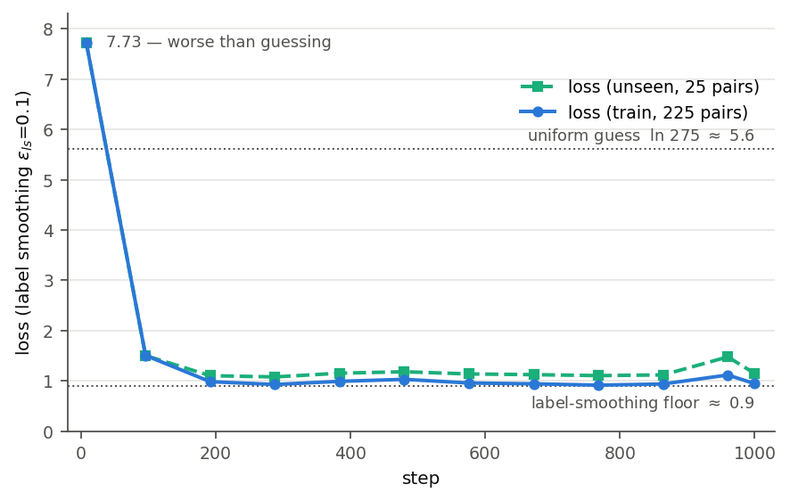
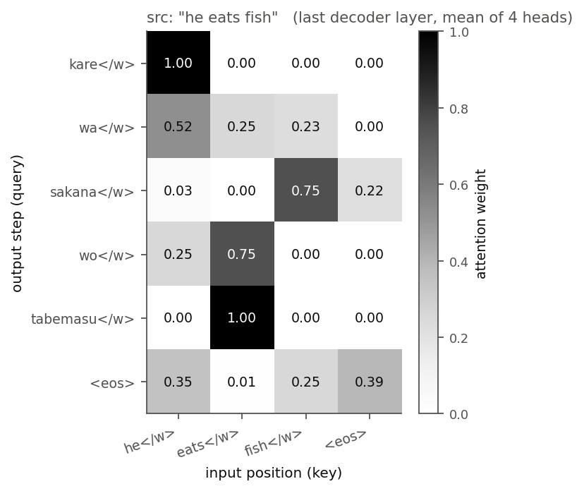

# 第5章 訓練の実際 — 小さく回して観察する

> [目次](../TOC.md) ・ [← 前の章](04-adam-warmup.md) ・ [次の章 →](06-evaluation.md)

部品は、すべて揃いました。第1章で第7巻の部品を Transformer に組み上げて PyTorch に卒業し、第2章で対訳コーパスを BPE で ID 列にしてバッチに詰め、第3章で forward → loss → backward → update の4拍子に label smoothing を組み込み、第4章で最後の道具 Adam と warmup を中身まで開けて手に入れました。

つまり、もう作るものがありません。この章でやることはひとつ——**回す**ことです。ただし、回し始めてからが本番です。訓練とは「実行したら終わるバッチ処理」ではなく、「経過を観察し、出来上がったものを動かし、おかしければ原因を探す」往復です。この章では訓練の実行(5.1)、生成(5.2)、モデルの中身の観察(5.3)、壊れた時の診察(5.4)までを一周します。シリーズ8巻ぶんの部品が初めて全部噛み合って、あなたの Transformer が「翻訳機」として動く章です。

## 5.1 [コード] 縮小版 Transformer の訓練実行: loss 曲線、学習の経過観察(数十分〜数時間スケールの設計)


### 規模の確認 — 同じ形、千分の一

いまから回す訓練の規模を、論文と並べて正直に確認しておきます。

| | 論文(base) | 私たち |
|---|---|---|
| 対訳ペア | 約450万(WMT 英独) | 250(第2章のトイ対訳) |
| 語彙 | 約37,000(BPE 共有語彙) | 275(BPE 共有語彙) |
| パラメータ | 約6,500万 | 約70万 |
| 訓練 | 10万ステップ、GPU 8枚で12時間 | 1,000ステップ、手元の1台で数十秒〜数分 |

データは1万分の一以下、モデルは100分の一です。それでも**形は同じ**です。BPE の共有語彙、長さ順のバッチ、encoder-decoder、label smoothing、Adam、warmup——どの部品も論文 Section 5 のとおりに入っています。違うのは目盛りだけです。

目盛りがここまで小さいと、目標も変わります。450万ペアで訓練するモデルは「汎化」を競いますが、250ペアしかない私たちのモデルにとって最初の関門はもっと手前にあります。**まず、訓練データを暗記できることです。** 第3巻6章の言葉で言えばこれは過学習であり本来は警戒すべきものですが、規模が千分の一の世界では話が逆になります。たった250ペアすら覚えられないモデルは、どこかが壊れています。第1章1.3で「1バッチを丸暗記できるか」をデバッグの定石として紹介しました。この章の訓練はその拡大版です。暗記が第一関門です。未見のペアに何が起きるかは、そのあとで(期待せずに)観察します。

### 訓練スクリプト

コードは `code/ch05/train.py` です。新しい部品はもう登場しません。この章のコードの大半は前章までの部品の**呼び出し**です。冒頭、在庫の搬入からです。

```python
from data import PAD, BOS, EOS, make_corpus, encode_pair, decode, \
    make_batches, vocab_size                                       # 第2章
from model import TinyTransformer, label_smoothing_loss, get_device  # 第3章

EPS_LS = 0.1      # 論文 5.4 の ε_ls
WARMUP = 400      # 総ステップ 1000 に対する warmup(論文は 4000 / 約10万ステップ)
D_MODEL = 128


def lrate(step, d_model=D_MODEL, warmup_steps=WARMUP):
    """第4章 4.6(= 論文 5.3 式(3))の learning rate スケジュール。再掲。"""
    return d_model ** -0.5 * min(step ** -0.5, step * warmup_steps ** -1.5)
```

`get_device`(第3章)は GPU(cuda)、Apple の GPU(mps)、CPU の順に使えるものへ自動で逃がす関数でした。その上に `pick_device` という薄い包みを足してあります。理由は再現性です。GPU(あるいは CPU のスレッド数が違う環境)では、**同じ seed でも実行のたびに結果がわずかに変わります**。並列計算では浮動小数点数の足し算の順序が一定せず、$10^{-16}$ 程度の誤差が混入するからです。普段なら無視できるその誤差が、1000ステップの訓練では雪だるま式に増幅され、最終的に「別の(ただし同程度に良い)モデル」に育ちます。本文の実行例は誰でもビット単位で追試できるよう `FABLE_DEVICE=cpu` で採取しました。あなたの環境では細部の数値や「どのペアを暗記し損ねるか」が変わりますが、これから観察する**現象はすべて同じ**です。

ひとつだけ、この章で新しく決めた数字があります。`WARMUP = 400` です。論文は10万ステップに対して warmup 4000、比率にして4%でした。同じ比率なら私たちは40のはずですが、実測すると規模の小さい世界では比率が保存しませんでした(warmup を短くしすぎるとピークの learning rate が高くなりすぎ、訓練が壊れ気味になります。実測の表は章末演習の問1で扱います)。**規模を変えたら、ハイパーパラメータは測り直す**——この章で何度も出てくる教訓の最初の一例です。

続いて、データの準備と「1トークンずらし」です。250ペアのうち25ペアを抜いて「未見」の箱に隔離します(`load_data`)。第3章3.1の急所は `shift` の `[:, :-1]` と `[:, 1:]` の対です。

```python
def shift(tgt, device):
    """第3章 3.1 の1トークンずらし。tgt (B, L) → (tgt_in, tgt_out)。
    tgt_in = [BOS, y1..yn, ...] / tgt_out = [y1..yn, EOS, ...](PAD は損失で無視)。
    """
    tgt = torch.from_numpy(tgt).to(device)
    return tgt[:, :-1], tgt[:, 1:]
```

この2つの添字を5.4でわざと壊しますから、いまのうちに正しい形を目に焼き付けておいてください。

観察用の物差しを2つ用意します(`mean_loss`・`token_accuracy`)。どちらも teacher forcing(第6巻6章)下、つまり「正解の続きを見せながら次の1トークンを当てさせる」測り方です。`mean_loss` は訓練と同じ label smoothing 付きの平均 loss、`token_accuracy` は PAD を除いた次トークン正解率(暗記の進み具合の物差し)です。

そして訓練本体。第3巻4章以来ずっと同じ4拍子に、第4章のスケジュールを毎ステップ重ねるだけです。

```python
def train_model(epochs=125, batch_size=32, seed=42, device=None, log=True):
    ...
    model = TinyTransformer(vocab_size, d_model=D_MODEL, h=4, N=2,
                            d_ff=256, p_drop=0.1, max_len=64).to(device)
    # 論文 5.3 と同じ Adam。lr は毎ステップ式から上書きするので初期値はダミー
    opt = torch.optim.Adam(model.parameters(), lr=1.0, betas=(0.9, 0.98), eps=1e-9)
    ...
    for epoch in range(1, epochs + 1):
        batches, _ = make_batches(train_pairs, batch_size, rng=rng)  # 長さ順(2.3節)
        for src, tgt in batches:
            step += 1
            lr = lrate(step)
            for group in opt.param_groups:
                group["lr"] = lr
            src = torch.from_numpy(src).to(device)
            tgt_in, tgt_out = shift(tgt, device)               # ずらし(3.1)
            logits = model(src, tgt_in)                        # 1. forward
            loss = label_smoothing_loss(logits, tgt_out,       # 2. loss
                                        eps=EPS_LS, pad_id=PAD)
            opt.zero_grad()
            loss.backward()                                    # 3. backward
            opt.step()                                         # 4. update
```

訓練済みモデルを保存して使い回す入口 `load_or_train`(5.2以降の各スクリプトがここから入る — チェックポイントがあれば復元、なければ訓練して保存)も同じファイルにあります。全文と動作確認は `code/ch05/train.py` にあります(`python3` で通過。実行すると loss の数表を表示し、「loss が 1/5 以下まで下がる」「訓練データをほぼ暗記できる」ことを assert で確認します)。

### 実行と、数表の読み方

`FABLE_DEVICE=cpu python3 train.py` を実行します(環境変数なしなら GPU が自動で選ばれます)。手元では10秒で終わりました。

```
device=cpu  params=694,656  train=225 pairs  test=25 pairs

 step         lr   loss(訓練)   loss(未見)     正解率
    8   0.000088      7.726      7.728   0.001
   96   0.001061      1.504      1.501   0.896
  192   0.002121      0.982      1.101   0.982
  288   0.003182      0.927      1.077   0.999
  384   0.004243      0.989      1.151   0.979
  480   0.004034      1.029      1.180   0.970
  576   0.003683      0.956      1.136   0.995
  672   0.003410      0.940      1.122   0.999
  768   0.003189      0.913      1.103   0.998
  864   0.003007      0.937      1.117   0.995
  960   0.002853      1.115      1.475   0.944
 1000   0.002795      0.943      1.145   0.999

訓練時間: 9.6 秒
最終 loss(訓練) = 0.943 / 素の cross-entropy なら暗記でほぼ 0 になるが、
label smoothing が ε=0.1 ぶんの床を作る(3.2節・演習で見た現象の再確認)
checkpoint saved: ch05_checkpoint.pt
ok: loss 7.726 → 0.943(1/8)、訓練データの次トークン正解率 0.999
```

本書で初めて目にする、**本物の訓練ログ**です。グラフにする前に数表のまま読めるようになりましょう。見どころは5つあります。

**1行目: 当てずっぽうより悪い場所から始まる。** 語彙は275なので、一様分布で当てずっぽうに答えるときの cross-entropy は $\ln 275 \approx 5.6$ です。ところが初期 loss は 7.7 です。初期化直後のモデルの出力分布は一様ではなく、でたらめな方向に**偏っている**ので、当てずっぽうにすら負けるのです。最初の数ステップの仕事は、まず分布を平らに均すことです。

**2行目: 序盤の急降下。** わずか96ステップで 7.7 → 1.5 です。学習の進みはこの時期が最も速く、しかも `lr` の列を見ると learning rate はまだ warmup の坂を登っている途中(ピークの4分の1)です。小さな歩幅でも、坂の急なうちはどんどん下れます。

**3〜4行目以降: 床に着く。** loss(訓練)は 1.0 前後で頭打ちになります。下がらなくなったのではなく、**これ以上は下がれない**のです。正解率は 0.99、つまりほぼ暗記が完了しています。それでも loss が 0 に向かわないのは、第3章3.2の label smoothing が「正解に確率 0.9、残り 0.1 は全語彙にばら撒いた分布」を的にしているからです。モデルがその的を完璧に射抜いても、的自身の不確かさのぶん(この語彙サイズで約0.9)は決して下回れません。第3章の演習で確認した「label smoothing は perplexity を悪くする」その床を、いま実物の訓練ログとして見ています。**loss の絶対値は、何を損失にしているかを知らないと読めない**——という良い実例です。

**loss(未見)の列: 汎化の気配。** 訓練に一度も出していない25ペアの loss も 7.7 → 1.1 まで下がっています。訓練 loss との差は 0.2 程度です。第3巻6章の物差しで言えば、過学習はしているが破綻はしていない位置です。このコーパスは「型」が強い(同じ文型の組み合わせが大量にある)ので、暗記の副産物として型が汎化するのです。本当に汎化したのかは次の節で実際に翻訳させて確かめます。

**step 960 の凹み。** loss(訓練)が 1.12 に跳ね、正解率が 0.944 に落ちています。バッチの引きと歩幅の相性で、訓練はこの程度には日常的に揺れます(次の記録ではもう戻っています)。1点の悪化で慌てない。**傾向で読む**。これも訓練ログの読み方のうちです。



図5.1: 上の数表のプロット。当てずっぽうの水準($\ln 275 \approx 5.6$、上の点線)より悪い 7.7 から始まり、序盤に急降下して、label smoothing の床(約0.9、下の点線)の近くに着地する。訓練と未見の差は 0.2 程度に留まる。

いま画面を流れていったこの数字の列は、第2巻の終章では読むことすらできなかった式 $lrate = d_{model}^{-0.5}\cdot\min(step^{-0.5},\ step\cdot warmup^{-1.5})$ が毎ステップ歩幅を決め、第4章で中身まで開けた Adam がその歩幅で勾配を下り、第7巻で1部品ずつテストした attention の塊が第1巻の `X @ W + b` を数十万回繰り返しながら損失の坂を下っていった記録です。データの1ペアから mask の1マスまで、全部あなたが由来を言える機械が、いま学習しました。

## 5.2 生成: greedy / サンプリング(温度 — 第4巻6.5の回収)/ beam search(論文6.1 "beam search with a beam size of 4" を読んで実装)

### 訓練したのに、まだ翻訳できない

訓練は終わりました。では「i like apples を翻訳して」と頼めるかというと——まだできません。

モデルが出力するのは翻訳文ではなく、**次の1トークンの確率分布**です(第6巻1章で言語モデルをそう定義したそのままです)。文が欲しければ、「分布から1トークン選んでは、それを入力に足してもう一度聞く」を EOS が出るまで繰り返す手続きが必要です。これを**デコーディング(decoding)**と呼びます。訓練とは独立の選択で、同じモデルでも選び方しだいで出てくる文が変わります。この節では代表的な3方式——貪欲法(greedy decoding)、温度付きサンプリング、ビームサーチ(beam search)——を実装します。コードは `code/ch05/generate.py` です(`MAX_LEN = 20` で生成を打ち切ります)。

### 方式1: greedy — いちばん確からしい一歩を積む

最も素朴な方式です。各ステップで分布の最大値(argmax)を取ります。それだけです。

```python
@torch.no_grad()
def greedy_decode(model, src_ids, device, max_len=MAX_LEN):
    """各ステップで最大確率のトークンを選ぶ。返り値は BOS を除いた ID 列。"""
    src = torch.tensor([src_ids], dtype=torch.long, device=device)
    ys = [BOS]
    for _ in range(max_len):
        tgt_in = torch.tensor([ys], dtype=torch.long, device=device)
        logits = model(src, tgt_in)                  # (1, len(ys), vocab)
        next_id = int(logits[0, -1].argmax())        # 最後の位置の予測だけ使う
        ys.append(next_id)
        if next_id == EOS:
            break
    return ys[1:]
```

ループの1周ごとに `ys` が1トークン伸び、伸びた `ys` を decoder に入れ直します。訓練時は正解列を一括で入れました(teacher forcing)が、生成時は**自分の出力を自分で食べる**——この違いが5.4で効いてくるので覚えておいてください。なお毎周 encoder から計算し直すのは無駄(実用系では encoder 出力や K, V を使い回します)ですが、この規模では一瞬なので読みやすさを優先しています。

実行結果の前半を見てみましょう。

```
greedy 完全一致率: 訓練 0.991 / 未見 0.960

未見ペアの greedy 翻訳(左: モデル出力, 右: 正解):
  x good night                   -> こんばんは | おやすみ なさい
  o i eat dogs                   -> わたし は いぬ を たべます | わたし は いぬ を たべます
  o i see dogs                   -> わたし は いぬ を みます | わたし は いぬ を みます
  o i want apples                -> わたし は りんご が ほしい です | わたし は りんご が ほしい です
  o i want dogs                  -> わたし は いぬ が ほしい です | わたし は いぬ が ほしい です
  o you eat dogs                 -> あなた は いぬ を たべます | あなた は いぬ を たべます

greedy が外した訓練ペア(暗記し損ねた場所):
  'i am sorry' -> 'ごめん'(正解: 'ごめん なさい')
  'no' -> 'いえ'(正解: 'いいえ')
```

第一関門は通過です——訓練225ペアのうち223ペア(99%)を完全一致で再生できました(暗記達成)。そして驚くのは、未見の25ペアでも96%当たっていることです。種を明かせば、未見ペアの大半は「i eat dogs」のような**文型の組み合わせ**で、部品(i、eat、dogs、それぞれの訳語と語順)はすべて訓練中に別の組み合わせで見ています。型が汎化した——5.1の loss(未見)が下がっていた正体がこれです。

失敗の中身も観察しがいがあります。最後まで暗記できなかった2ペア(「ごめん なさい」「いいえ」)も、未見で外した「good night」も、すべて**文型の支えがない定型句**です。組み合わせの型に乗れない丸暗記項目は、コーパスに1回しか出てこないぶん最後まで覚えにくいのです。しかも「good night」への誤答が「こんばんは」——good evening の記憶に引きずられた、間違い方としては筋のよい誤答です。何ができて何ができないかが、規模千分の一でもこんなにはっきり観察できます。

greedy は速くて素朴ですが、実は構造的な弱点を抱えています。いまのモデルは暗記がほぼ完璧なのでその弱点はほとんど顔を出しません。方式3で、わざと訓練を途中で止めたモデルを使ってあぶり出します。

### 方式2: 温度サンプリング — 第4巻の予告を回収する

第4巻6章の6.5節で、softmax のスコアを定数 $T$ で割る「温度」というつまみを学びました。あのとき私たちはこう予告しています——「訓練済みの言語モデルに文章を生成させるとき、この温度つまみで堅実な出力と多彩な出力を調整します。チャットAIの設定にある temperature の正体がこれです。実物は第8巻5章で回収します」。ここがその回収地点です。

argmax の代わりに、分布から**サンプルする**ことを考えます。その際、スコア $\mathbf{z}$ を温度 $\tau$ で割ってから softmax に入れます。

$$\mathrm{softmax}_\tau(\mathbf{z}) = \mathrm{softmax}\!\left(\frac{\mathbf{z}}{\tau}\right)$$

$\tau < 1$ で分布は尖り(低温=堅実)、$\tau > 1$ でなだらかになる(高温=多彩)のでした。コードは greedy の argmax を入れ替えるだけです。

```python
@torch.no_grad()
def sample_decode(model, src_ids, tau, device, g, max_len=MAX_LEN):
    """温度 τ 付きサンプリング。softmax(z/τ) から1トークンずつ引く(第4巻6.5)。"""
    ...
        z = model(src, tgt_in)[0, -1]                # 最後の位置のスコア (vocab,)
        probs = F.softmax(z / tau, dim=-1).cpu()     # τ で割ってから softmax
        next_id = int(torch.multinomial(probs, 1, generator=g))
```

同じ入力に対して、温度を変えながら30回ずつ生成してみます。

```
温度サンプリング: src = 'i like apples'(正解: 'わたし は りんご が すき です')、各温度で30回
  tau=0.5: 正解 30/30, 異なる出力  1 種  外した例: '(なし)'
  tau=1.0: 正解 19/30, 異なる出力 12 種  外した例: 'わたし ey は りんご が すき です'
  tau=2.0: 正解  0/30, 異なる出力 30 種  外した例: 'ちree m'
```

第4巻で数表として見た温度の性質が、今度は**文の顔**をして現れました。低温($\tau=0.5$)では30回すべて同じ正解——分布が尖り、実質 greedy に近づきます($\tau \to 0$ の極限は hardmax、つまり greedy そのものです)。$\tau=1$ はモデルの素の分布で、6割は正解しつつ時々脱線します。高温($\tau=2$)では30回全部違う出力で、英日のトークンが混ざった発話未満の何かになります——分布が一様に近づき、275語彙からほぼくじ引きをしている状態です。温度はどの値でも順位を変えない(argmax 不変)のに、**引き当てる確率**だけが変わります。「堅実↔多彩」のつまみであることが、これ以上ないほど具体的に確認できました。

### 方式3: beam search — 論文 6.1 を読んで実装する

さて、この巻のラスボスの一部を討ち取りに行きます。論文 Section 6.1 にこうあります。

> *"We used beam search with a beam size of 4 and length penalty α = 0.6 [38]. These hyperparameters were chosen after experimentation on the development set. We set the maximum output length during inference to input length + 50, but terminate early when possible [38]."*
> — Vaswani et al., "Attention Is All You Need", Section 6.1
>
> 訳: ビームサーチを、ビーム幅4・長さペナルティ α = 0.6 で用いた。これらのハイパーパラメータは開発セットでの実験により選んだ。推論時の最大出力長は入力長 + 50 とし、ただし可能なら早期に打ち切る。

beam search の需要を体感するために、方式1で予告した greedy の構造的な弱点をあぶり出します。使うのは**わざと25エポックで打ち切った「訓練途中」のモデル**です(暗記が完了したモデルは滅多に詰まらないので、確信が固まる前のモデルで観察します——debug の常套手段でもあります)。たとえばこのモデルに「hello」を訳させると、greedy は「こんこんこんこん……」と繰り返し始めます。「こんにちは」と「こんばんは」はどちらも「こん」で始まるため、続きを決め切れないモデルにとって次の一歩の最有力候補がまた「こん」になってしまうのです。各ステップの選択としては毎回最善でも、**文全体として最善とは限りません**。そして greedy は**一度選んだ道を二度と戻れません**。チャットAIが同じフレーズを繰り返し始めるあの現象も、これと同族です(5.4では別の「バグ由来の繰り返し」を見ます)。

beam search はこの「一本道」をやめて、**有望な仮説を beam size 本だけ並走させる**方式です。毎ステップ、生きている各仮説を上位候補で延長し、累積の対数確率が高い上位4本(beam size 4)だけ残します。EOS に到達した仮説は完了プールに移し、最後に完了仮説の中から勝者を選びます。

勝者選びにもう1つ道具が要ります。仮説のスコアを素の $\log P$(各ステップの log 確率の和)で比べると、**長い文ほど足される負の項が多くて不利**です。これを補正するのが引用にあった length penalty で、仮説 $Y$ のスコアを

$$\mathrm{score}(Y) = \frac{\log P(Y)}{lp(Y)}, \qquad lp(Y) = \left(\frac{5 + |Y|}{6}\right)^{0.6}$$

とします($|Y|$ は出力トークン数。論文が引用 [38](GNMT)から借りた形で、$\alpha = 0.6$ はその効き具合)。実装の核心はこうです。

```python
@torch.no_grad()
def beam_search(model, src_ids, device, beam_size=4, alpha=0.6, max_len=MAX_LEN):
    """論文 6.1: beam size 4・length penalty α=0.6 の beam search。"""
    alive = [([BOS], 0.0)]                            # 各仮説は (トークン列, 累積 logP)
    finished = []
    for _ in range(max_len):
        candidates = []
        for ys, logp in alive:                        # 生きている各仮説を延長
            tgt_in = torch.tensor([ys], dtype=torch.long, device=device)
            log_probs = F.log_softmax(model(src, tgt_in)[0, -1], dim=-1).cpu()
            top = torch.topk(log_probs, beam_size)
            for lp_tok, tok in zip(top.values.tolist(), top.indices.tolist()):
                candidates.append((ys + [tok], logp + lp_tok))
        candidates.sort(key=lambda c: c[1], reverse=True)
        alive = []
        for ys, logp in candidates:                   # 上位 beam_size 本だけ残す
            (finished if ys[-1] == EOS else alive).append((ys, logp))
            if len(alive) == beam_size:
                break
        if not alive:
            break
    finished.extend(alive)
    best, best_logp = max(                            # 長さ補正付きスコアで勝者
        finished, key=lambda c: c[1] / length_penalty(len(c[0]) - 1, alpha))
    return best[1:], best_logp / length_penalty(len(best) - 1, alpha)
```

`length_penalty(n, alpha)` は `((5 + n) / 6.0) ** alpha` です。`max_len` による打ち切りは論文の「入力長 + 50、ただし早期終了」の縮小版です(私たちの文は短いので定数20で足ります)。全文と動作確認は `code/ch05/generate.py` にあります(`python3` で通過。greedy / 温度 / beam の3方式と assert が走ります)。

beam の働きどころを実行結果で確認します。

```
訓練途中(25エポック)のモデルで、greedy が外した訓練ペア(最大3件):
  src: 'hello'(正解: 'こんにちは')
    greedy: 'こんこんこんこんこんこんこんこんこんこんこんこんこんこんこんこんこんこんこんこん'
    beam  : 'こんにちは'(score -3.194)
  src: 'you are welcome'(正解: 'どう いたしまして')
    greedy: 'おう ございます'
    beam  : 'どう ございます'(score -2.990)
  src: 'see you tomorrow'(正解: 'また あした')
    greedy: 'た た た'
    beam  : 'た た た'(score -2.439)

beam(未見)完全一致率: 0.960(greedy は 0.960)
```

1例目が beam search の教科書的な勝利です。greedy は「こん」の無限ループに沈みましたが、beam は「こん」を選んだ直後には僅差で負けていた別の仮説を4本のうちに生かしておき、数歩先の累積スコアで逆転して「こんにちは」に到達しました。greedy が打ち切り長いっぱいまで暴走したのに対し、文として完結する仮説が長さ補正込みのスコアで勝った——仕組みどおりの挙動です。

ただし2例目・3例目は beam が万能でないことも正直に教えてくれます。「you are welcome」では greedy よりましな(しかし不正解の)文に留まり、「see you tomorrow」では beam も greedy と同じ「た た た」に落ちました。4本の仮説は全探索ではありません。モデル自身の確率がでたらめなら、その中の上位4本もでたらめです。**beam search は「モデルは正しいのに選び方で損をする」場面を救う道具であって、モデルの未熟さは救えない**——この区別は5.4の診察でも効いてきます。

最後の行は、暗記が完了した本来のモデルでの比較です。未見25ペアの一致率は greedy と beam で同じ 0.960。この規模では暗記が支配的で、よく訓練されたモデルなら greedy で十分なのです。論文が beam search を標準装備にしているのは、本物の翻訳では「確信が固まり切らない場面」——まさに途中モデルが見せたあの状況——が、訓練をどれだけ続けても文のどこかで必ず起きるからです。

引用した 6.1 にはもうひとつ、まだ触れていない道具が出てきます。論文は評価の際、最後に保存した5個(big は20個)のチェックポイントの**パラメータを平均した**モデルを使います(checkpoint averaging)。訓練終盤のモデルは loss の谷底のまわりを揺れ続けるので、揺れの平均を取ると谷底に近いモデルが得られる、という発想です。私たちの規模では効果が測れないため概観に留めますが、6.1 を読むのに必要な知識はこれで全部です。

## 5.3 attention マップの観察: 訓練済みモデルが「どこを見ているか」(第6巻7.3と同じ図を、今度は自作Transformerで)

第6巻7章で、attention 付き seq2seq の重み行列を眺めたときのことを覚えているでしょうか。文字列反転タスクで、誰も教えていないのに「後ろから順に写す」という手順が右上から左下への逆対角線として行列に浮かび上がりました。あの図を、今度は**自作の Transformer**で、しかも玩具の反転ではなく(ミニチュアとはいえ)本物の翻訳で描きます。観察するのは decoder の cross-attention——「出力の各トークンを書くとき、入力のどこを見たか」を握っている、第7巻5章の3種の attention の一角です。

ひとつ実装上の都合があります。第3章の `model.py` は attention の重みを保存しない設計で、本書の規約により前章のファイルには手を入れません。そこで PyTorch の **forward hook** を使います。hook はモジュールの forward が呼ばれるたびに「入力と出力を横取りして好きな処理を挟む」仕掛けで、モデルに覗き穴を開けるのにちょうどよい道具です。覗き穴の中では、横取りした入力とモジュール自身の $W^Q, W^K$ を使って式(1)の前半(内積 → スケール → mask → softmax)を計算し直します。eval モードでは dropout が何もしないので、この再計算は forward 内で実際に使われた重みと完全に一致します。コードは `code/ch05/attention_map.py` です。

```python
def probe_attention(mha):
    """MultiHeadAttention に覗き穴を開ける。forward hook で入力を横取りし、
    モジュール自身の W_q, W_k で attention 重みを計算し直す(第7巻3章の前半2拍)。"""
    store = {}

    def hook(module, inputs, output):
        q_in, k_in = inputs[0], inputs[1]
        mask = inputs[3] if len(inputs) > 3 else None
        ...
        Q = split_heads(module.W_q(q_in), q_len)
        K = split_heads(module.W_k(k_in), k_len)
        scores = Q @ K.transpose(-2, -1) / math.sqrt(module.d_k)   # 式(1)の中身
        if mask is not None:
            scores = scores + mask
        store["A"] = F.softmax(scores, dim=-1).detach().cpu()      # (B, h, q_len, k_len)

    return store, mha.register_forward_hook(hook)
```

`cross_attention_map` は greedy で翻訳し、最終 decoder 層の cross-attention をヘッド平均で取り出します(`model.dec_layers[-1].cross_attn` に覗き穴を開け、翻訳をなぞる1回の forward で重みを採取)。全文と動作確認は `code/ch05/attention_map.py` にあります(`python3` で通過)。「he eats fish」を翻訳させ、その瞬間の重みを数値表で見ます。

```
src: 'he eats fish' -> 出力: 'かれ は さかな を たべます'
最終 decoder 層の cross-attention(4ヘッドの平均):
                he</w>  eats</w>  fish</w>     <eos>
      かれ</w>      1.00      0.00      0.00      0.00
       は</w>      0.52      0.25      0.23      0.00
     さかな</w>      0.03      0.00      0.75      0.22
       を</w>      0.25      0.75      0.00      0.00
    たべます</w>      0.00      1.00      0.00      0.00
       <eos>      0.35      0.01      0.25      0.39

助詞の行だけ取り出す(を/が を書く瞬間、モデルはどこを見るか):
  'he eats fish': を</w> の行の最大重み 0.75 は eats</w> の列
  'he wants fish': が</w> の行の最大重み 0.73 は wants</w> の列
```

読み取れることが3つあります。

**第一に、単語の対応表がそのまま浮かんでいます。** 「かれ」を書く瞬間は he を(重み1.00)、「さかな」は fish を(0.75)、「たべます」は eats を(1.00)見ています。誰も単語帳を与えていません。与えたのは対訳ペアと cross-entropy だけです。

**第二に、語順の交差が模様になっています。** 英語は he・eats・fish(S-V-O)、日本語は かれ・さかな・たべます(S-O-V)の順です。表の注目の山を上から追うと、he(1列目)→ fish(3列目)→ eats(2列目)と、**一度右へ飛んでから左へ戻る**——単調な対角線になりません。第6巻の反転タスクでは「逆対角線」という手順が見えました。今度は「目的語と動詞を入れ替える」という、翻訳のもっとも翻訳らしい仕事が同じ流儀で模様になっています。

**第三に——これがこの表の白眉です——助詞「を」の行を見てください。** 「を」に対応する英単語は存在しません。ではモデルは何を見て「を」を書いたのでしょうか。eats の列に 0.75 です。観察2を見ると、動詞が wants の文では助詞「が」がやはり wants を見て(0.73)書かれています。このコーパスでは「たべます」は「〜を」、「ほしい です」は「〜が」を取ります。つまり**助詞の選択は動詞で決まる**のですが、その文法規則をモデルは誰に教わるでもなく発見し、「助詞を書く瞬間は原文の動詞を見る」という参照の形で実装していたのです。attention の重みが例外的に「どこを見たか」を公開してくれるからこそ、こういう発見を指差しで確認できます。

図にする場合のコードも、第6巻7.3の図7.1とまったく同じ形式で書けます(掲載のみ)。

```python
# 図5.2 の描画コード(掲載のみ。第6巻7.3の図7.1と同じ形式): A は上の重み行列
import matplotlib.pyplot as plt
fig, ax = plt.subplots(figsize=(6, 6))
ax.imshow(A, cmap="Greys", vmin=0.0, vmax=1.0)
ax.set_xticks(range(len(src_toks)), src_toks)
ax.set_yticks(range(len(out_toks)), out_toks)
ax.set_xlabel("input position (key)")
ax.set_ylabel("output step (query)")
plt.show()
```



図5.2: 「he eats fish」を翻訳するときの cross-attention(4ヘッド平均)。横軸が入力トークン(key)、縦軸が出力トークン(query)、マスの濃さが重み。濃いマスは対角線に並ばず、「さかな→fish」「たべます→eats」で交差する——目的語と動詞の語順の入れ替えが、模様として現れる。

2点だけ注意しておきます。表に出したのは**最終 decoder 層の4ヘッドの平均**です。ヘッドを1本ずつ見ると、ここまできれいな対応ばかりではなく、役割の分担(第7巻4章で見た「ヘッドごとの個性」)が観察できます。また、1層目の cross-attention はもっとぼやけています——層を重ねるほど参照が研ぎ澄まされていく、というのも自分のモデルならいくらでも観察できます。`probe_attention` の引数を `model.dec_layers[0].cross_attn` に変えるだけです。

## 5.4 うまくいかない時の手引き: loss が下がらない・発散する・同じ語を繰り返す、の典型原因(mask漏れ、lr、ずらし忘れ)

ここまでは、すべてが上手くいく世界線でした。最後の節はその逆——**壊れた訓練の顔**を見ます。

Transformer の訓練でつまずく原因は、経験的に少数の定番に集中しています。causal mask の漏れ、learning rate の不調、1トークンずらしの忘れです。ただし「典型原因リスト」を暗記しても現場ではあまり役に立ちません。バグは原因の顔をして現れず、**症状**の顔をして現れるからです。そこで本書流の手引きはこうです——3つのバグを今から**実際に仕込み**、健常な訓練と同一条件(同じデータ・同じ初期値・同じ1000ステップ)で走らせ、それぞれの症状を観察します。一度でも症状の顔を見ておけば、次に自分のコードで同じ顔を見たとき容疑者リストが頭に浮かびます。コードは `code/ch05/failure_modes.py` です。

まず、バグを仕込む装置を2つ用意します。1つめは causal mask を「足し忘れた」モデルです。第3章のファイルは変更せず、`forward` だけを差し替えた子クラスを作ります。

```python
class LeakyTransformer(TinyTransformer):
    """第3章の forward から causal_mask を「足し忘れた」状態を再現する。"""

    def forward(self, src_ids, tgt_in_ids):
        src_mask = pad_mask(src_ids)
        tgt_mask = pad_mask(tgt_in_ids)          # バグ: + causal_mask(...) を忘れた
        memory = self.encode(src_ids, src_mask)
        y = self.decode(tgt_in_ids, memory, tgt_mask, src_mask)
        return y @ self.embed.weight.T
```

2つめは、ずらし忘れと learning rate の異常を注入できる訓練ループ `run` です。5.1の `train_model` の縮約版で、`lr_mode` に定数を渡すとスケジュールを切り、`shift_bug=True` で添字を1文字ぶん書き間違えます。

```python
def run(name, model_cls=TinyTransformer, lr_mode="schedule", shift_bug=False, ...):
    ...
            lr = lrate(step) if lr_mode == "schedule" else lr_mode   # 定数で warmup を切る
            ...
            tgt_in = tgt[:, :-1]
            if shift_bug:
                tgt_out = tgt[:, :-1]            # バグ: [:, 1:] と書くべき所のずらし忘れ
            else:
                tgt_out = tgt[:, 1:]             # 正しい1トークンずらし(3.1)
```

実行部は健常な基準を1本走らせたあと、バグを1つずつ仕込みます。全文と動作確認は `code/ch05/failure_modes.py` にあります(`python3` で通過。各実験の最後の assert が「症状の再現」そのものになっています)。実行結果がこの節の本体です。1ブロックずつ診察します。

```
[健常(基準)]
  loss: step8 7.897  step200 1.006  step400 1.007  step600 0.997  step800 0.946  step1000 1.001
  teacher forcing 正解率 0.999 / greedy 完全一致 1.000

[バグ1: causal mask 漏れ]
  loss: step8 8.100  step200 1.007  step400 1.148  step600 0.930  step800 0.946  step1000 1.070
  teacher forcing 正解率 0.968 / greedy 完全一致 0.000
  例: 'he eats fish' -> 'が ほしい です'

[バグ2a: lr 大きすぎ(定数 0.5)]
  loss: step8 28.672  step200 65.648  step400 92.897  step600 150.778  step800 114.219  step1000 126.880

[バグ2b: lr 小さすぎ(定数 1e-6)]
  loss: step8 8.125  step200 7.776  step400 7.273  step600 6.811  step800 6.500  step1000 6.176

[バグ3: ずらし忘れ]
  loss: step8 0.997  step200 0.904  step400 0.889  step600 0.888  step800 0.888  step1000 0.886
  例: 'he eats fish' -> ids [1, 1, 1, 1, 1, 1, 1, 1]...
     (decode すると '' — 特殊トークンは読み飛ばされる)
```

**症状A(mask 漏れ)が、いちばん怖い顔をしています。** loss の行を健常版と見比べてください——どこにも異常がありません。teacher forcing の正解率も 0.968。訓練中に監視できる指標はすべて「順調」と言っています。それなのに、いざ生成させると「が ほしい です」と文の残骸のようなものを返し、完全一致率は 0.000——1ペアも訳せません。からくりはこうです。causal mask がないと、decoder の self-attention は位置 $t$ の予測時に `tgt_in` の位置 $t+1$ 以降——`shift` の定義により、それは**いま当てるべき正解そのもの**——を読めてしまいます。訓練(teacher forcing)では正解列が入力に入っているのでカンニングし放題です。しかし生成時の入力は自分の出力だけで、カンニングペーパーは存在しません。教訓を2つ挙げます。**訓練の指標がきれいすぎる時ほど疑うこと。そして、生成のテストを訓練の最後ではなく最初から回すこと。** 予防としては、第7巻5章で書いた causal mask の単体テスト、第1章1.3の「未来の入力を変えても出力が変わらない」結合テストが、まさにこのバグの検出器です。

**症状B(lr 大きすぎ)は、いちばん分かりやすい顔です。** 1エポック目から loss が 29 と桁違いで、その後も 66、93、151 と**登って**いきます。発散です。歩幅が大きすぎて、谷を飛び越えて反対側の壁に当たることを繰り返しています。Adam でも歩幅の暴力は救えません。第4章4.6で「warmup を切ると訓練が壊れる」ことを実験済みですが、これはその極端版です。**症状B'(lr 小さすぎ)は地味な顔です。** 発散はせず、loss は確かに毎エポック下がっています——1000ステップかけて 8.1 から 6.2 へ。当てずっぽうの 5.6 にすら届いていません。この歩幅で床(約0.9)に着くには何十倍ものステップが要るでしょう。「下がってはいるが、いつまでも終わらない」。処方はどちらも同じで、まずスケジュール(warmup)が入っているか確認し、次に learning rate を桁で(10倍・10分の1)振って挙動を見ることです。

**症状C(ずらし忘れ)の見分けポイントは、loss の最初の値です。** step 8 で早くも 0.997——健常版が125エポックかけて到達する床の値に、1エポック目で着いています。**最初から良すぎる loss は、難しい問題が簡単な問題にすり替わっているサイン**です。`tgt_out` に `tgt_in` と同じ列を渡すと、課題は「次のトークンを予測せよ」ではなく「いま読んだトークンをそのまま書き写せ」になります。コピーは causal mask があっても解ける自明な課題なので、loss は一瞬で床に着きます。そして生成すると、`<bos>` を見せられたモデルは学んだとおり `<bos>` を書き写し、それを見てまた `<bos>` を……と、ID 1 が `max_len` まで並びます。`decode` が特殊トークンを読み飛ばすので画面上は空文字列という間抜けな結末です。翻訳機を訓練していたつもりが、オウムを訓練していました。実物のバグでは「同じ語(実トークン)の繰り返し」として現れることも多く、5.2で見た訓練途中モデルの「こんこんこん……」(確信が持てない局所ループ)とは**loss が最初から不自然に低かったか**で見分けられます。あちらは訓練を続ければ消えますが、こちらは何エポック回しても直りません。

最後に、症状から引ける診察表にまとめておきます。

| 症状 | まず疑う | 確認の一手 |
|---|---|---|
| loss が最初から桁違いに大きく、登っていく | learning rate 大・warmup なし | スケジュールの有無。lr を 1/10 に |
| loss が下がるが、いつまでも当てずっぽう未満 | learning rate 小 | lr を10倍に。スケジュールの式の step の単位 |
| loss は快調なのに、生成だけ壊滅 | causal mask 漏れ | mask の単体テスト(第7巻5章)。未来の入力を変えて出力が不変か |
| loss が最初から良すぎる + 同じ語の繰り返し | 1トークンずらしの忘れ | `tgt_in` と `tgt_out` を1バッチ印字して目視 |
| そもそも何も学ばない(上のどれでもない) | データ側(語彙・PAD・encode) | 第1章1.3の「1バッチ丸暗記」テストに戻る |

最後の行が、結局いちばん大事です。どの症状か判別がつかないときは、第1章1.3の定石——1バッチだけ渡して丸暗記できるか——まで戻ります。暗記できなければモデルか loss が壊れており、暗記できるのにフルデータで学ばなければデータかスケジュールが怪しいです。容疑者が半分に割れます。

## まとめ

- 論文と**同じ形・千分の一の規模**(250ペア・70万パラメータ)の訓練を回した。loss は 7.7 → 0.94(1/8)、訓練データの暗記(トークン正解率 0.999、文の完全一致 0.991)を達成。規模が小さい世界では「まず暗記できること」が第一関門で、第1章1.3の丸暗記テストの拡大版にあたる
- loss の数表は「初期値は当てずっぽう(ln 275 ≈ 5.6)より悪い」「序盤に急降下」「label smoothing の床(約0.9)に着地」「多少は揺れる」という文法で読む。loss の絶対値は損失の定義を知らないと読めない
- 生成は訓練と独立の手続き。**greedy** は速いが局所最適(繰り返しの罠)、**温度サンプリング**は $\mathrm{softmax}(\mathbf{z}/\tau)$ で堅実↔多彩を連続調整(第4巻6章の温度の回収)、**beam search**(幅4・$\alpha=0.6$ の長さ補正 — 論文6.1そのまま)は並走する仮説で greedy の脱線を救う
- cross-attention の重み行列には、単語対応・語順の交差(S-V-O → S-O-V)・「助詞は動詞を見て書く」という文法の発見までが模様として浮かぶ。第6巻7.3の図の、本物の翻訳版
- 壊れ方には顔がある: **指標が良すぎて生成が壊滅= mask 漏れ**、**発散= lr 大/停滞= lr 小**、**最初から低い loss と繰り返し=ずらし忘れ**。判別不能なら1バッチ丸暗記テストへ戻る

**ラスボスとの距離**: 論文 Section 5(Training)は、5.1〜5.4のすべてを自分の訓練ログの上で再現済みです。Section 6.1 の "beam search with a beam size of 4 and length penalty α = 0.6" は、読めるどころか実装して動かしました。残るは BLEU と Table 2・3——数字で論文と向き合う最終章(の手前)、第6章です。

## 演習

**問1(自分のアブレーション — 本章のメイン演習)** ハイパーパラメータを1つ選び、それ**だけ**を動かして 5.1 の訓練を繰り返し、結果を表にしてください——これをアブレーション(ablation)と呼びます。候補: `WARMUP`(80 / 200 / 400 / 1200)、`d_model`(64 / 128 / 256)、ヘッド数 `h`(1 / 4)、`EPS_LS`(0 / 0.1 / 0.3)、`p_drop`(0 / 0.1 / 0.5)。守ること: 変えるのは1つだけ、seed は 42 に固定、表には最終 loss(訓練)・トークン正解率・greedy 完全一致率(訓練/未見)を並べてください。表ができたら「なぜそうなったか」を1〜2文で仮説にしてください。論文の Table 3 はこの作業の本家版で、第6章で読みます。

**問2(温度の極限)** `sample_decode` を $\tau = 0.1$ と $\tau = 10$ で30回ずつ走らせ、出力を観察してください。$\tau = 0.1$ の出力は greedy と何回一致しますか。温度は argmax を変えない(第4巻6章)のに、なぜ $\tau \to 0$ でサンプリングが greedy に一致するのか、1文で説明してください。

**問3(beam の対照実験)** `beam_search` の `beam_size=1` が greedy と完全に同じ出力になることを、未見25ペア全部で assert してください。また `alpha` を 0(長さ補正なし)にすると、この章のコーパスで結果はどれくらい変わるか観察し、理由を考えてください。

<details>
<summary>略解</summary>

**問1** 例として `WARMUP` のアブレーションの手元の実測(他はすべて 5.1 と同じ、1000ステップ)を載せます。

| WARMUP | ピーク lr | 最終 loss(訓練) | トークン正解率 |
|---|---|---|---|
| 80 | 0.0099 | 1.254 | 0.849 |
| 200 | 0.0063 | 1.034 | 0.960 |
| 400 | 0.0044 | 0.966 | 0.999 |
| 1200 | 0.0026 | 0.899 | 0.999 |

このスケジュールでは、warmup を短くするほどピークの learning rate が高くなります($lrate$ の2候補が交わる step = warmup での値は $d_{model}^{-0.5} \cdot warmup^{-0.5}$)。WARMUP=80 はピークの約0.01が高すぎて表現を壊し、1000ステップ後も正解率 0.85 止まり——5.4の症状B(lr 大)の軽症版です。逆に長すぎる側(1200)は、この規模では単に「ゆっくり安全運転」になり問題が出ません——本文で「論文の比率4%が保存しなかった」と述べた背景がこの表です。どのパラメータを選んだ場合も、結論より「1変数だけ動かして表にする」手続きそのものが収穫です。第6章で Table 3 を読むとき、各行がこの作業の(運転資金が数百万ドルの)同型だと分かります。

**問2** 手元では $\tau = 0.1$ の30回は**すべて greedy と一致**しました。温度はスコアの順位を変えませんが、確率の**比**を変えます。$\tau \to 0$ では最大スコアとそれ以外の差が $e^{(z_1 - z_2)/\tau}$ 倍と無限に開き、サンプリングしても事実上 argmax しか引かれなくなる——第4巻6.5の言葉なら、hardmax の極限です。$\tau = 10$ は反対にほぼ一様なくじ引きで、出力は語彙の寄せ集めになります。

**問3** `beam_size=1` では、毎ステップ「生きている仮説1本を top-1 で延長する」ことになり、これは greedy の定義そのものです(手元の25ペアで assert 通過)。`alpha=0` は長さ補正を切る操作ですが、この章のコーパスでは出力がほぼ変わりません。文がせいぜい数トークンと短く、しかも暗記済みの本命仮説の確率が圧倒的なので、補正の出番がないからです。長さ補正が効いてくるのは、本物の翻訳のように「短く切り上げた文」と「長い忠実な文」がスコアで競る場面です——論文が開発セットで $\alpha$ を調整したのは、まさにその競り合いのためでした。

</details>

---

本章のコードは `code/ch05/` に4本あります。`train.py`(5.1: 訓練と loss の数表)、`generate.py`(5.2: 生成3方式)、`attention_map.py`(5.3: cross-attention の数値表)、`failure_modes.py`(5.4: バグ3種の再現)。いずれも `python3 ファイル名.py` で実行でき、本文の主張(loss が 1/5 以下に下がる・訓練ペアの大半を翻訳できる・温度とビームが仕様どおり振る舞う・3つのバグが本文の症状を再現する)が assert で検算されます。`train.py` 以外はチェックポイント `ch05_checkpoint.pt` を自動で読み込み(なければその場で訓練し)ます。第2章 `data.py`・第3章 `model.py` を import して使っており、それらのファイルには手を入れていません。

---

> [目次](../TOC.md) ・ [← 前の章](04-adam-warmup.md) ・ [次の章 →](06-evaluation.md)
